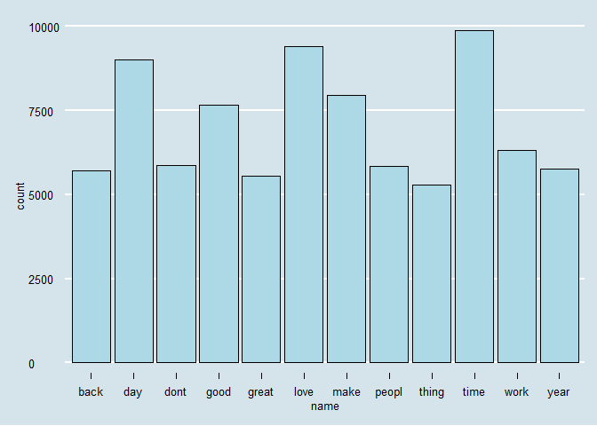
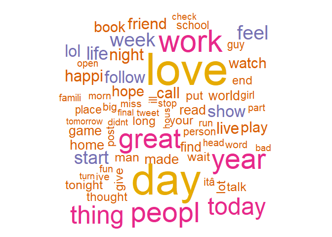
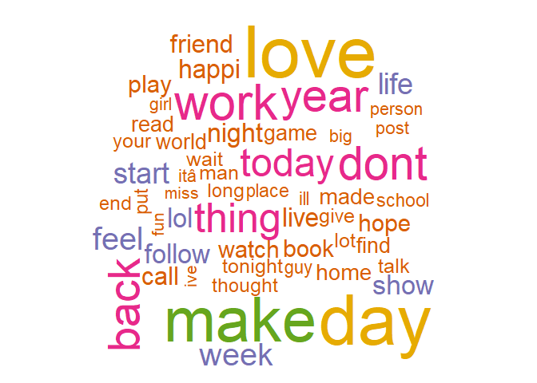

Task 1: Getting and Cleaning the Data
================
Mark Blackmore
2017-10-16

``` r
library(downloader)
library(tm)
```

    ## Loading required package: NLP

``` r
library(knitr)
library(tidyverse)
```

    ## Loading tidyverse: ggplot2
    ## Loading tidyverse: tibble
    ## Loading tidyverse: tidyr
    ## Loading tidyverse: readr
    ## Loading tidyverse: purrr
    ## Loading tidyverse: dplyr

    ## Conflicts with tidy packages ----------------------------------------------

    ## annotate(): ggplot2, NLP
    ## filter():   dplyr, stats
    ## lag():      dplyr, stats

``` r
library(dplyr)
library(data.table)
```

    ## -------------------------------------------------------------------------

    ## data.table + dplyr code now lives in dtplyr.
    ## Please library(dtplyr)!

    ## -------------------------------------------------------------------------

    ## 
    ## Attaching package: 'data.table'

    ## The following objects are masked from 'package:dplyr':
    ## 
    ##     between, last

    ## The following object is masked from 'package:purrr':
    ## 
    ##     transpose

``` r
library(ggthemes)
```

1. Download and explore the data
--------------------------------

Create a data directory

``` r
if (!file.exists("data")) {
  dir.create("data")
}
```

Download the data

``` r
# url <- "https://d396qusza40orc.cloudfront.net/dsscapstone/dataset/Coursera-SwiftKey.zip"
# download(url, dest="dataset.zip", mode="wb") 
# unzip ("dataset.zip", exdir = "./data")
```

English Repository Files

``` r
blogs_file   <- "./data/final/en_US/en_US.blogs.txt"
news_file    <- "./data/final/en_US/en_US.news.txt"
twitter_file <- "./data/final/en_US/en_US.twitter.txt"  
```

File Sizes (Mb)

``` r
blogs_size   <- file.size(blogs_file) / (2^20)
news_size    <- file.size(news_file) / (2^20)
twitter_size <- file.size(twitter_file) / (2^20)
```

Read the data files

``` r
blogs   <- readLines(blogs_file, skipNul = TRUE)
news    <- readLines(news_file, skipNul = TRUE)
```

    ## Warning in readLines(news_file, skipNul = TRUE): incomplete final line
    ## found on './data/final/en_US/en_US.news.txt'

``` r
twitter <- readLines(twitter_file, skipNul = TRUE) 
```

Number of Lines per file

``` r
blogs_lines   <- length(blogs)
news_lines    <- length(news)
twitter_lines <- length(twitter)
total_lines   <- blogs_lines + news_lines + twitter_lines
```

Distibution of characters per line, by file

``` r
blogs_nchar   <- nchar(blogs)
news_nchar    <- nchar(news)
twitter_nchar <- nchar(twitter)

boxplot(blogs_nchar, news_nchar, twitter_nchar, log = "y",
        names = c("blogs", "news", "twitter"),
        ylab = "log(Number of Characters)", xlab = "File Name")
        title("Comparing Distributions of Chracters per Line")
```


Max characters in a line, by file (longest line)

``` r
blogs_nchar_max   <- max(blogs_nchar)
news_nchar_max    <- max(news_nchar)
twitter_nchar_max <- max(twitter_nchar)
```

Median characters per file

``` r
blogs_nchar_med   <- median(blogs_nchar)
news_nchar_med    <- median(news_nchar)
twitter_nchar_med <- median(twitter_nchar)
```

Total characters per file

``` r
blogs_nchar_sum   <- sum(blogs_nchar)
news_nchar_sum    <- sum(news_nchar)
twitter_nchar_sum <- sum(twitter_nchar)
```

Create summary of repo stats

``` r
repo_summary <- data.frame(f_names = c("blogs", "news", "twitter"),
                           f_size  = c(blogs_size, news_size, twitter_size),
                           f_lines = c(blogs_lines, news_lines, twitter_lines),
                           nchar_max  = c(blogs_nchar_max, news_nchar_max, twitter_nchar_max),
                           nchar_med =  c(blogs_nchar_med, news_nchar_med, twitter_nchar_med),
                           nchar_sum =  c(blogs_nchar_sum, news_nchar_sum, twitter_nchar_sum))


repo_summary <- repo_summary %>% mutate(pct_nchar = round(nchar_sum/sum(nchar_sum), 2))
repo_summary <- repo_summary %>% mutate(pct_lines = round(f_lines/sum(f_lines), 2))
kable(repo_summary)
```

| f\_names |   f\_size|  f\_lines|  nchar\_max|  nchar\_med|  nchar\_sum|  pct\_nchar|  pct\_lines|
|:---------|---------:|---------:|-----------:|-----------:|-----------:|-----------:|-----------:|
| blogs    |  200.4242|    899288|       40835|         157|   208361438|        0.54|        0.27|
| news     |  196.2775|     77259|        5760|         186|    15683765|        0.04|        0.02|
| twitter  |  159.3641|   2360148|         213|          64|   162385035|        0.42|        0.71|

2. Sample the data and save the sample
--------------------------------------

Compute sample sizes in terms of lines

``` r
sample_pct = 0.05
set.seed(1001)
blogs_size <- blogs_lines * sample_pct
news_size  <- news_lines * sample_pct
twitter_size <- twitter_lines * sample_pct
```

Create samples

``` r
blogs_sample <- sample(blogs, blogs_size)
news_sample  <- sample(news, news_size)
twitter_sample <- sample(twitter, twitter_size)
repo_sample = c(blogs_sample, news_sample, twitter_sample)
```

Save sample

``` r
writeLines(repo_sample, "./data/final/en_US/en_US.repo_sample.txt")
saveRDS(repo_sample, file = "./data/final/en_US/repo_sample.RData" )

########################## START HERE ############### SEE LAST TAB
```

[Test Mining Tutorial](%22https://www.hackerearth.com/fr/practice/machine-learning/advanced-techniques/text-mining-feature-engineering-r/tutorial/%22)

3. Clean the sample data
------------------------

Use `tm` to create and clean the corpus

``` r
clean_sample <- Corpus(VectorSource(repo_sample),
                       readerControl = list(readPlain, 
                                            language = "en",
                                            load = TRUE))
print(as.character(clean_sample[[1]]))
```

    ## [1] "Love the use of onomatopoeia, and I wish they made dumplings with just scallions and cabbage. But there are plenty of places on 8th where you can buy dumplings (veggie or otherwise) for 4 for a dollar or so. Several places that look like they don't sell anything (just a white booth with a see-through window) actually sell delicious stuff to take home a cook. It's inexpensive and usually quite good. Enjoy."

Transform sample to all lower case

``` r
clean_sample <- tm_map(clean_sample, content_transformer(tolower))
```

Remove URL's
Source: [R and Data Mining](%22http://www.rdatamining.com/books/rdm/faq/removeurlsfromtext%22)

``` r
removeURL <- function(x) gsub("http[^[:space:]]*", "", x)
clean_sample <- tm_map(clean_sample, content_transformer(removeURL))

# Remove anything other than English letters or space
removeNumPunct <- function(x) gsub("[^[:alpha:][:space:]]*", "", x)
clean_sample <- tm_map(clean_sample, content_transformer(removeNumPunct))
```

Create profanity filter
Source: [List-of-Dirty-Naughty-Obscene-and-Otherwise-Bad-Words](%22List-of-Dirty-Naughty-Obscene-and-Otherwise-Bad-Words/en%22)

``` r
profanity <- read.table("./data/final/en_US/profanity.txt", header = FALSE, sep ="\n")
```

Remove profanity

``` r
clean_sample <- tm_map(clean_sample, removeWords, profanity[,1])
```

Remove stopwords

``` r
clean_sample <- tm_map(clean_sample, removeWords, stopwords("english"))
clean_sample <- tm_map(clean_sample, removeWords, stopwords("SMART"))
print(as.character(clean_sample[[1]]))
```

    ## [1] "love    onomatopoeia     made dumplings   scallions  cabbage    plenty  places      buy dumplings veggie       dollar    places     dont sell    white booth   seethrough window  sell delicious stuff   home  cook  inexpensive    good enjoy"

Remove Whitespace

``` r
clean_sample <- tm_map(clean_sample, stripWhitespace)
print(as.character(clean_sample[[1]]))
```

    ## [1] "love onomatopoeia made dumplings scallions cabbage plenty places buy dumplings veggie dollar places dont sell white booth seethrough window sell delicious stuff home cook inexpensive good enjoy"

Save clean corpus

``` r
saveRDS(clean_sample, file = "./data/final/en_US/clean_sample.RData" )


###### CONSIDER SPLIT TO 02 HERE
```

Convert to text document

``` r
text_corpus <- tm_map(clean_sample, PlainTextDocument)

#perform stemming - this should always be performed after text doc conversion
text_corpus <- tm_map(text_corpus, stemDocument,language = "english")
print(as.character(text_corpus[[1]]))
```

    ## [1] "love onomatopoeia made dumpl scallion cabbag plenti place buy dumpl veggi dollar place dont sell white booth seethrough window sell delici stuff home cook inexpens good enjoy"

``` r
text_corpus[[1]]$content
```

    ## [1] "love onomatopoeia made dumpl scallion cabbag plenti place buy dumpl veggi dollar place dont sell white booth seethrough window sell delici stuff home cook inexpens good enjoy"

``` r
#convert to document term matrix
docterm_corpus <- DocumentTermMatrix(text_corpus)
dim(docterm_corpus)
```

    ## [1] 166833  95939

``` r
new_docterm_corpus <- removeSparseTerms(docterm_corpus,sparse = 0.99)
dim(new_docterm_corpus)
```

    ## [1] 166833     73

``` r
#find frequent terms
colS <- colSums(as.matrix(new_docterm_corpus))
length(colS)
```

    ## [1] 73

``` r
doc_features <- data.table(name = attributes(colS)$names, count = colS)

#most frequent and least frequent words
doc_features[order(-count)][1:10] #top 10 most frequent words
```

    ##      name count
    ##  1:  time  9699
    ##  2:  love  9256
    ##  3:   day  9085
    ##  4:  make  7885
    ##  5:  good  7602
    ##  6:  work  6398
    ##  7:  dont  5975
    ##  8:  year  5814
    ##  9: peopl  5664
    ## 10:  back  5457

``` r
doc_features[order(count)][1:10] #least 10 frequent words
```

    ##         name count
    ##  1: tomorrow  1702
    ##  2:    enjoy  1760
    ##  3:    didnt  1778
    ##  4:    final  1782
    ##  5:    tweet  1849
    ##  6:    check  1859
    ##  7:     hous  1881
    ##  8:     open  1898
    ##  9:     stop  1901
    ## 10:   famili  1906

``` r
ggplot(doc_features[count>5000],aes(name, count)) +
  geom_bar(stat = "identity",fill='lightblue',color='black') +
  theme(axis.text.x = element_text(angle = 45, hjust = 1)) +
  theme_economist() + scale_color_economist() 
```



``` r
# #check association of terms of top features
# findAssocs(new_docterm_corpus, "time", corlimit = 0.5)
# findAssocs(new_docterm_corpus, "love", corlimit = 0.5)
# findAssocs(new_docterm_corpus, "day",  corlimit = 0.5)

library(wordcloud)
```

    ## Loading required package: RColorBrewer

``` r
wordcloud(names(colS), colS, min.freq = 500, 
          colors = brewer.pal(6, 'Dark2'), random.order = FALSE)  
```



``` r
wordcloud(names(colS), colS, min.freq = 2000, 
          colors = brewer.pal(6, 'Dark2'), random.order = FALSE)  
```


