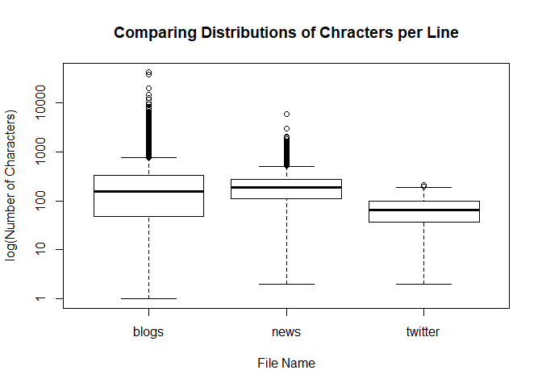

Task 1: Getting and Cleaning the Data
================
Mark Blackmore
2017-10-15

``` r
library(downloader)
library(tm)
```

    ## Loading required package: NLP

``` r
library(knitr)
library(dplyr)
```

    ## 
    ## Attaching package: 'dplyr'

    ## The following objects are masked from 'package:stats':
    ## 
    ##     filter, lag

    ## The following objects are masked from 'package:base':
    ## 
    ##     intersect, setdiff, setequal, union

1. Download and explore the data
--------------------------------

Create a data directory

``` r
if (!file.exists("data")) {
  dir.create("data")
}
```

Download the data

``` r
# url <- "https://d396qusza40orc.cloudfront.net/dsscapstone/dataset/Coursera-SwiftKey.zip"
# download(url, dest="dataset.zip", mode="wb") 
# unzip ("dataset.zip", exdir = "./data")
```

English Repository Files

``` r
blogs_file   <- "./data/final/en_US/en_US.blogs.txt"
news_file    <- "./data/final/en_US/en_US.news.txt"
twitter_file <- "./data/final/en_US/en_US.twitter.txt"  
```

File Sizes (Mb)

``` r
blogs_size <- file.size(blogs_file) / (2^20)
news_size  <- file.size(news_file) / (2^20)
twitter_size <- file.size(twitter_file) / (2^20)
```

Read the data files

``` r
blogs   <- readLines(blogs_file, skipNul = TRUE)
news    <- readLines(news_file, skipNul = TRUE)
```

    ## Warning in readLines(news_file, skipNul = TRUE): incomplete final line
    ## found on './data/final/en_US/en_US.news.txt'

``` r
twitter <- readLines(twitter_file, skipNul = TRUE) 
```

Number of Lines per file

``` r
blogs_lines <- length(blogs)
news_lines  <- length(news)
twitter_lines <- length(twitter)
total_lines  <- blogs_lines + news_lines + twitter_lines
```

Distibution of characters per line, by file

``` r
blogs_nchar <- nchar(blogs)
news_nchar  <- nchar(news)
twitter_nchar <- nchar(twitter)
boxplot(blogs_nchar, news_nchar, twitter_nchar, log = "y",
        names = c("blogs", "news", "twitter"),
        ylab = "log(Number of Characters)", xlab = "File Name")
title("Comparing Distributions of Chracters per Line")
```



Max characters in a line, by file (longest line)

``` r
blogs_nchar_max <- max(blogs_nchar)
news_nchar_max  <- max(news_nchar)
twitter_nchar_max <- max(twitter_nchar)
```

Median characters per file

``` r
blogs_nchar_med <- median(blogs_nchar)
news_nchar_med  <- median(news_nchar)
twitter_nchar_med <- median(twitter_nchar)
```

Total characters per file

``` r
blogs_nchar_sum <- sum(blogs_nchar)
news_nchar_sum  <- sum(news_nchar)
twitter_nchar_sum <- sum(twitter_nchar)
```

Create summary of repo stats

``` r
repo_summary <- data.frame(file_names = c("blogs", "news", "twitter"),
                           file_size  = c(blogs_size, news_size, twitter_size),
                           file_lines = c(blogs_lines, news_lines, twitter_lines),
                           #nchar_max  = c(blogs_nchar_max, news_nchar_max, twitter_nchar_max),
                           #nchar_med =  c(blogs_nchar_med, news_nchar_med, twitter_nchar_med),
                           nchar_sum =  c(blogs_nchar_sum, news_nchar_sum, twitter_nchar_sum))


repo_summary <- repo_summary %>% mutate(pct_nchar = round(nchar_sum/sum(nchar_sum), 2))
repo_summary <- repo_summary %>% mutate(pct_lines = round(file_lines/sum(file_lines), 2))
kable(repo_summary)
```

| file\_names |  file\_size|  file\_lines|  nchar\_sum|  pct\_nchar|  pct\_lines|
|:------------|-----------:|------------:|-----------:|-----------:|-----------:|
| blogs       |    200.4242|       899288|   208361438|        0.54|        0.27|
| news        |    196.2775|        77259|    15683765|        0.04|        0.02|
| twitter     |    159.3641|      2360148|   162385035|        0.42|        0.71|

2. Sample the data and save the sample
--------------------------------------

Compute sample sizes in terms of lines

``` r
sample_pct = 0.01
blogs_size <- blogs_lines * sample_pct
news_size  <- news_lines * sample_pct
twitter_size <- twitter_lines * sample_pct
```

Create samples

``` r
blogs_sample <- sample(blogs, blogs_size)
news_sample  <- sample(news, news_size)
twitter_sample <- sample(twitter, twitter_size)
repo_sample = c(blogs_sample, news_sample, twitter_sample)
```

Save sample

``` r
writeLines(repo_sample, "./data/final/en_US/en_US.repo_sample.txt")
```

3. Clean the sample data
------------------------

Use `tm` to create and clean the corpus

``` r
clean_sample <- Corpus(VectorSource(repo_sample),
                       readerControl = list(readPlain, 
                                            language = "en",
                                            load = TRUE))
```

Create filter for profanity... Source: [List-of-Dirty-Naughty-Obscene-and-Otherwise-Bad-Words](%22List-of-Dirty-Naughty-Obscene-and-Otherwise-Bad-Words/en%22)

``` r
profanity <- read.table("./data/final/en_US/profanity.txt", header = FALSE, sep ="\n")
```

Transform sample to all lower case

``` r
clean_sample <- tm_map(clean_sample, content_transformer(tolower))
```

Remove URL's Source: [R and Data Mining](%22http://www.rdatamining.com/books/rdm/faq/removeurlsfromtext%22)

``` r
removeURL <- function(x) gsub("http[^[:space:]]*", "", x)
clean_sample <- tm_map(clean_sample, content_transformer(removeURL))

# Remove anything other than English letters or space
removeNumPunct <- function(x) gsub("[^[:alpha:][:space:]]*", "", x)
clean_sample <- tm_map(clean_sample, content_transformer(removeNumPunct))

# #' Remove punctuaton and numbers (replaced by last call)
# clean_sample <- tm_map(clean_sample, removePunctuation)
```

clean\_sample &lt;- tm\_map(clean\_sample, removeNumbers) Remove profanity

``` r
clean_sample <- tm_map(clean_sample, removeWords, profanity[,1])
```

Remove stopwords

``` r
clean_sample <- tm_map(clean_sample, removeWords, stopwords("english"))
```

Stem the document

``` r
clean_sample <- tm_map(clean_sample, stemDocument)
```

Remove Whitespace

``` r
clean_sample <- tm_map(clean_sample, stripWhitespace)
```

Create Term-Document Matrix

``` r
dtm <- TermDocumentMatrix(clean_sample)
# m <- as.matrix(dtm)
# v <- sort(rowSums(m),decreasing=TRUE)
# d <- data.frame(word = names(v),freq=v)
# head(d, 10)
```

### Operations on Document-Term Matrices

``` r
findFreqTerms(dtm, 5)
```

    ##    [1] "âall"           "âand"           "âare"           "aaron"         
    ##    [5] "abandon"        "abbey"          "abbott"         "abc"           
    ##    [9] "abil"           "abl"            "abort"          "abq"           
    ##   [13] "abraham"        "abram"          "abroad"         "absenc"        
    ##   [17] "absolut"        "absorb"         "absurd"         "abt"           
    ##   [21] "abund"          "abus"           "âbut"           "academ"        
    ##   [25] "academi"        "accent"         "accept"         "acc"           
    ##   [29] "access"         "accessori"      "accid"          "accident"      
    ##   [33] "accommod"       "accompani"      "accomplish"     "accord"        
    ##   [37] "account"        "accumul"        "accur"          "accus"         
    ##   [41] "accustom"       "ace"            "ach"            "achiev"        
    ##   [45] "acid"           "acknowledg"     "acl"            "acoust"        
    ##   [49] "acquaint"       "acquir"         "across"         "act"           
    ##   [53] "action"         "activ"          "activist"       "actor"         
    ##   [57] "actress"        "actual"         "acut"           "adam"          
    ##   [61] "adapt"          "add"            "addict"         "addit"         
    ##   [65] "address"        "adel"           "adher"          "adject"        
    ##   [69] "adjust"         "administr"      "admir"          "admiss"        
    ##   [73] "admit"          "âdo"            "adopt"          "ador"          
    ##   [77] "adorn"          "adult"          "advanc"         "advantag"      
    ##   [81] "advent"         "adventur"       "adverb"         "advers"        
    ##   [85] "advertis"       "advic"          "advis"          "advoc"         
    ##   [89] "aesthet"        "afar"           "affair"         "affect"        
    ##   [93] "affili"         "affirm"         "afflict"        "afford"        
    ##   [97] "afghan"         "afghanistan"    "âfor"           "aforement"     
    ##  [101] "afraid"         "africa"         "african"        "afternoon"     
    ##  [105] "afterward"      "againâ"         "agenc"          "age"           
    ##  [109] "agenda"         "agent"          "aggi"           "aggress"       
    ##  [113] "ago"            "âgood"          "agre"           "agreement"     
    ##  [117] "agricultur"     "aha"            "ahaha"          "âhe"           
    ##  [121] "ahead"          "âhey"           "ahh"            "âhow"          
    ##  [125] "âiâm"           "aid"            "âif"            "aim"           
    ##  [129] "âin"            "ainât"          "aint"           "air"           
    ##  [133] "aircraft"       "airleaf"        "airlin"         "airplan"       
    ##  [137] "airport"        "âis"            "aisl"           "âit"           
    ##  [141] "âitâ"           "aka"            "ala"            "alabama"       
    ##  [145] "alan"           "alarm"          "albeit"         "albert"        
    ##  [149] "album"          "albuquerqu"     "alcohol"        "alert"         
    ##  [153] "ale"            "âlet"           "alex"           "alexand"       
    ##  [157] "alexi"          "algorithm"      "alic"           "alien"         
    ##  [161] "ali"            "alik"           "alison"         "aliv"          
    ##  [165] "allah"          "alleg"          "allen"          "allerg"        
    ##  [169] "allergi"        "alley"          "alli"           "allianc"       
    ##  [173] "allig"          "allow"          "allstar"        "almanac"       
    ##  [177] "almond"         "almost"         "alon"           "along"         
    ##  [181] "alongsid"       "âlook"          "alot"           "aloud"         
    ##  [185] "alpha"          "alphabet"       "alreadi"        "alright"       
    ##  [189] "also"           "alt"            "altar"          "alter"         
    ##  [193] "altern"         "although"       "alum"           "alumni"        
    ##  [197] "alway"          "amanda"         "amateur"        "amaz"          
    ##  [201] "amazon"         "amber"          "ambit"          "ambul"         
    ##  [205] "americaâ"       "amen"           "amend"          "america"       
    ##  [209] "american"       "âmi"            "amidst"         "ami"           
    ##  [213] "amid"           "among"          "amongst"        "amount"        
    ##  [217] "amp"            "ampl"           "amus"           "analog"        
    ##  [221] "analysi"        "analyst"        "analyt"         "analyz"        
    ##  [225] "anatomi"        "anc"            "anchor"         "ancient"       
    ##  [229] "anderson"       "andi"           "andor"          "andov"         
    ##  [233] "andr"           "andrew"         "android"        "ânew"          
    ##  [237] "angela"         "angel"          "anger"          "angi"          
    ##  [241] "angl"           "angri"          "anim"           "ankl"          
    ##  [245] "ann"            "anna"           "anni"           "anniversari"   
    ##  [249] "announc"        "annoy"          "annual"         "âno"           
    ##  [253] "ânoâ"           "anonym"         "anoth"          "answer"        
    ##  [257] "ant"            "antholog"       "anthoni"        "anticip"       
    ##  [261] "antiqu"         "antonio"        "anxieti"        "anxious"       
    ##  [265] "anybodi"        "anyhow"         "anymor"         "anyoneâ"       
    ##  [269] "anyon"          "anyth"          "anytim"         "anyway"        
    ##  [273] "anywher"        "âoh"            "âour"           "apart"         
    ##  [277] "ape"            "apocalyps"      "apolog"         "apologis"      
    ##  [281] "appar"          "apparel"        "appeal"         "appear"        
    ##  [285] "appetit"        "applaud"        "app"            "appl"          
    ##  [289] "appli"          "applianc"       "applic"         "appoint"       
    ##  [293] "appreci"        "approach"       "appropri"       "approv"        
    ##  [297] "approxim"       "april"          "apron"          "apt"           
    ##  [301] "arab"           "arbitr"         "arc"            "arch"          
    ##  [305] "architect"      "architectur"    "archiv"         "area"          
    ##  [309] "arena"          "arenât"         "arent"          "argentina"     
    ##  [313] "argu"           "arguabl"        "argument"       "ari"           
    ##  [317] "aris"           "arizona"        "arkansa"        "arm"           
    ##  [321] "armi"           "arnold"         "aroma"          "around"        
    ##  [325] "arrang"         "array"          "arrest"         "arriv"         
    ##  [329] "arrog"          "arrow"          "arsenal"        "art"           
    ##  [333] "articl"         "artifici"       "artist"         "artwork"       
    ##  [337] "asap"           "ascend"         "ash"            "asham"         
    ##  [341] "ashley"         "asia"           "asian"          "asid"          
    ##  [345] "ask"            "asleep"         "âso"            "asparagus"     
    ##  [349] "aspect"         "aspir"          "assault"        "assembl"       
    ##  [353] "assert"         "ass"            "assess"         "asset"         
    ##  [357] "asshol"         "assign"         "assist"         "associ"        
    ##  [361] "assum"          "assumpt"        "assur"          "ate"           
    ##  [365] "âthank"         "âthatâ"         "âthe"           "athen"         
    ##  [369] "âthere"         "âthey"          "âthis"          "athlet"        
    ##  [373] "atl"            "atlant"         "atlanta"        "atleast"       
    ##  [377] "atmospher"      "atom"           "atroc"          "attach"        
    ##  [381] "attack"         "attain"         "att"            "attempt"       
    ##  [385] "attend"         "attende"        "attent"         "attir"         
    ##  [389] "attitud"        "attorney"       "attract"        "attribut"      
    ##  [393] "auction"        "audienc"        "audio"          "audit"         
    ##  [397] "aug"            "august"         "aunt"           "austin"        
    ##  [401] "australia"      "australian"     "authent"        "author"        
    ##  [405] "autism"         "auto"           "autograph"      "autom"         
    ##  [409] "automat"        "autumn"         "avail"          "avatar"        
    ##  [413] "ave"            "aveng"          "avenu"          "averag"        
    ##  [417] "averi"          "avi"            "avoid"          "await"         
    ##  [421] "awak"           "awaken"         "awar"           "award"         
    ##  [425] "awayâ"          "away"           "âwe"            "âwell"         
    ##  [429] "awesom"         "awe"            "âwhat"          "âwhen"         
    ##  [433] "âwhere"         "âwhi"           "awhil"          "awkward"       
    ##  [437] "aww"            "awww"           "axe"            "âye"           
    ##  [441] "âyesâ"          "aye"            "âyou"           "babe"          
    ##  [445] "babi"           "bachelorett"    "back"           "backdrop"      
    ##  [449] "background"     "backstag"       "backtoback"     "backup"        
    ##  [453] "backward"       "backyard"       "bacon"          "badass"        
    ##  [457] "bad"            "badg"           "badger"         "bag"           
    ##  [461] "baggag"         "bail"           "bait"           "bake"          
    ##  [465] "bakeri"         "balanc"         "bald"           "ball"          
    ##  [469] "ballet"         "balloon"        "ballot"         "baltimor"      
    ##  [473] "bam"            "ban"            "banana"         "band"          
    ##  [477] "bang"           "bangla"         "bank"           "banker"        
    ##  [481] "bankruptci"     "banner"         "barack"         "bar"           
    ##  [485] "barbara"        "barbecu"        "barbi"          "barcelona"     
    ##  [489] "bare"           "barefoot"       "bargain"        "bark"          
    ##  [493] "barley"         "barn"           "baron"          "barrel"        
    ##  [497] "barrett"        "barri"          "barrier"        "barrio"        
    ##  [501] "bartend"        "base"           "basebal"        "basement"      
    ##  [505] "bash"           "basi"           "basic"          "basket"        
    ##  [509] "basketbal"      "bass"           "bastard"        "bat"           
    ##  [513] "batch"          "bath"           "bathroom"       "batman"        
    ##  [517] "batter"         "batteri"        "battl"          "baxter"        
    ##  [521] "bay"            "bball"          "bbc"            "bbq"           
    ##  [525] "bday"           "beach"          "bead"           "beam"          
    ##  [529] "bean"           "bear"           "beard"          "beast"         
    ##  [533] "beat"           "beaten"         "beauti"         "beaver"        
    ##  [537] "becam"          "becom"          "bed"            "bedroom"       
    ##  [541] "bedtim"         "beep"           "bee"            "beef"          
    ##  [545] "beer"           "beet"           "beetl"          "beg"           
    ##  [549] "began"          "begin"          "begun"          "behalf"        
    ##  [553] "behav"          "behavior"       "behaviour"      "behind"        
    ##  [557] "behold"         "belat"          "belgian"        "belgium"       
    ##  [561] "belieb"         "belief"         "believ"         "bell"          
    ##  [565] "belli"          "belong"         "belov"          "belt"          
    ##  [569] "ben"            "bench"          "bend"           "beneath"       
    ##  [573] "benedict"       "benefit"        "bengal"         "benjamin"      
    ##  [577] "bennett"        "bent"           "berkeley"       "berlin"        
    ##  [581] "berman"         "berri"          "besid"          "best"          
    ##  [585] "bestfriend"     "besti"          "beta"           "bet"           
    ##  [589] "beth"           "betray"         "better"         "betti"         
    ##  [593] "bever"          "beverag"        "bewar"          "beyond"        
    ##  [597] "bias"           "bibl"           "bicycl"         "bid"           
    ##  [601] "bieber"         "big"            "bigger"         "biggest"       
    ##  [605] "bigot"          "bike"           "bikini"         "billboard"     
    ##  [609] "billi"          "billion"        "billionair"     "bill"          
    ##  [613] "bin"            "bind"           "bing"           "bio"           
    ##  [617] "biographi"      "biolog"         "bipolar"        "bird"          
    ##  [621] "birdi"          "birkin"         "birmingham"     "birth"         
    ##  [625] "birthday"       "biscuit"        "bishop"         "bistro"        
    ##  [629] "bit"            "bite"           "bitten"         "bitter"        
    ##  [633] "bittersweet"    "biz"            "bizarr"         "bjãrk"         
    ##  [637] "black"          "blackberri"     "blade"          "blah"          
    ##  [641] "blair"          "blake"          "blame"          "blank"         
    ##  [645] "blanket"        "blast"          "blaze"          "blazer"        
    ##  [649] "bleed"          "blend"          "blender"        "bless"         
    ##  [653] "blew"           "blind"          "bling"          "bliss"         
    ##  [657] "blister"        "blizzard"       "block"          "blog"          
    ##  [661] "blogger"        "blond"          "bloodi"         "blood"         
    ##  [665] "bloom"          "bloomberg"      "blossom"        "blow"          
    ##  [669] "blown"          "blu"            "blue"           "blueberri"     
    ##  [673] "blunt"          "blur"           "blurb"          "blush"         
    ##  [677] "blvd"           "bmw"            "board"          "boast"         
    ##  [681] "boat"           "bob"            "bobbi"          "bobcat"        
    ##  [685] "bodi"           "bogus"          "boil"           "bois"          
    ##  [689] "bold"           "bolt"           "bomb"           "bon"           
    ##  [693] "bond"           "bone"           "bonus"          "boo"           
    ##  [697] "bookâ"          "book"           "bookmark"       "booksel"       
    ##  [701] "bookshelv"      "bookstor"       "boom"           "boost"         
    ##  [705] "boot"           "booth"          "booti"          "booz"          
    ##  [709] "bordello"       "border"         "bore"           "born"          
    ##  [713] "borrow"         "boss"           "boston"         "bother"        
    ##  [717] "bottl"          "bottom"         "bought"         "bounc"         
    ##  [721] "bound"          "boundari"       "bouquet"        "bourbon"       
    ##  [725] "bout"           "bow"            "bowl"           "box"           
    ##  [729] "boxer"          "boy"            "boyfriend"      "boyz"          
    ##  [733] "bra"            "brace"          "bracelet"       "bracket"       
    ##  [737] "brad"           "bradi"          "brag"           "brain"         
    ##  [741] "branch"         "brand"          "brandon"        "brass"         
    ##  [745] "brat"           "braun"          "brave"          "brazil"        
    ##  [749] "brazilian"      "bread"          "break"          "breakfast"     
    ##  [753] "breakthrough"   "breast"         "breath"         "breed"         
    ##  [757] "breez"          "brendan"        "brett"          "brew"          
    ##  [761] "brewer"         "breweri"        "brian"          "bribe"         
    ##  [765] "brick"          "bridal"         "bride"          "bridg"         
    ##  [769] "brief"          "briefli"        "bright"         "brighten"      
    ##  [773] "brighter"       "brighton"       "brilliant"      "bring"         
    ##  [777] "britain"        "british"        "britney"        "bro"           
    ##  [781] "broad"          "broadcast"      "broadway"       "brodi"         
    ##  [785] "broke"          "broken"         "broker"         "bron"          
    ##  [789] "bronco"         "brook"          "brooklyn"       "bros"          
    ##  [793] "brotha"         "brother"        "brought"        "brown"         
    ##  [797] "browni"         "brows"          "browser"        "bruce"         
    ##  [801] "bruh"           "bruin"          "bruis"          "brunch"        
    ##  [805] "bruno"          "brush"          "brutal"         "bryan"         
    ##  [809] "bryant"         "bryce"          "btw"            "bubbl"         
    ##  [813] "buck"           "bucket"         "bud"            "buddhist"      
    ##  [817] "buddi"          "budget"         "bueno"          "buff"          
    ##  [821] "buffalo"        "buffet"         "bug"            "build"         
    ##  [825] "built"          "bulb"           "bulk"           "bull"          
    ##  [829] "bullet"         "bulli"          "bullpen"        "bum"           
    ##  [833] "bummer"         "bump"           "bun"            "bunch"         
    ##  [837] "bundl"          "bunni"          "bunt"           "bureau"        
    ##  [841] "burger"         "burden"         "buri"           "burial"        
    ##  [845] "burn"           "burnt"          "burrito"        "burst"         
    ##  [849] "burton"         "bush"           "bus"            "busch"         
    ##  [853] "buse"           "busi"           "businessman"    "bust"          
    ##  [857] "butâ"           "butcher"        "butler"         "butter"        
    ##  [861] "butterfli"      "buttermilk"     "butternut"      "button"        
    ##  [865] "butt"           "buy"            "buyer"          "buzz"          
    ##  [869] "bye"            "bynum"          "cab"            "cabin"         
    ##  [873] "cabinet"        "cabl"           "cactus"         "cafã"          
    ##  [877] "cafe"           "caffein"        "cage"           "cake"          
    ##  [881] "cal"            "calcul"         "caleb"          "calendar"      
    ##  [885] "cali"           "california"     "call"           "caller"        
    ##  [889] "calm"           "calori"         "cam"            "cambridg"      
    ##  [893] "came"           "camera"         "cameron"        "campaign"      
    ##  [897] "campbel"        "campus"         "camp"           "camper"        
    ##  [901] "can"            "canada"         "canadian"       "canal"         
    ##  [905] "canât"          "cancel"         "cancer"         "candi"         
    ##  [909] "candid"         "candl"          "cane"           "cannon"        
    ##  [913] "canon"          "cant"           "canva"          "canyon"        
    ##  [917] "cap"            "capabl"         "capac"          "cape"          
    ##  [921] "capit"          "capitol"        "captain"        "caption"       
    ##  [925] "captiv"         "captur"         "caramel"        "caravan"       
    ##  [929] "carbon"         "car"            "card"           "cardboard"     
    ##  [933] "cardin"         "cardstock"      "care"           "career"        
    ##  [937] "caress"         "caribbean"      "carl"           "carlo"         
    ##  [941] "carol"          "carolina"       "carpent"        "carpet"        
    ##  [945] "carri"          "carriag"        "carrier"        "carrot"        
    ##  [949] "carson"         "cart"           "carter"         "cartoon"       
    ##  [953] "cartridg"       "carv"           "cascad"         "case"          
    ##  [957] "cash"           "casino"         "casserol"       "cassett"       
    ##  [961] "cast"           "castl"          "casual"         "cat"           
    ##  [965] "catalog"        "catalogu"       "catalyst"       "catch"         
    ##  [969] "catcher"        "categor"        "categori"       "cater"         
    ##  [973] "cathedr"        "cathol"         "caucus"         "caught"        
    ##  [977] "caus"           "caution"        "cautious"       "cav"           
    ##  [981] "cavali"         "cave"           "cbs"            "cds"           
    ##  [985] "ceas"           "ceil"           "celeb"          "celebr"        
    ##  [989] "celeri"         "cell"           "cellphon"       "celtic"        
    ##  [993] "cement"         "cemeteri"       "censor"         "center"        
    ##  [997] "centr"          "central"        "cent"           "centuri"       
    ## [1001] "ceo"            "cereal"         "ceremoni"       "certain"       
    ## [1005] "certainti"      "certif"         "certifi"        "chain"         
    ## [1009] "chairman"       "chair"          "cha"            "chalk"         
    ## [1013] "challeng"       "chamber"        "champ"          "champagn"      
    ## [1017] "champion"       "championship"   "chanc"          "chandler"      
    ## [1021] "chang"          "channel"        "chant"          "chao"          
    ## [1025] "chapel"         "chapter"        "char"           "charact"       
    ## [1029] "charg"          "charger"        "chariti"        "charl"         
    ## [1033] "charli"         "charlott"       "charm"          "chart"         
    ## [1037] "charter"        "chase"          "chat"           "cheap"         
    ## [1041] "cheaper"        "cheat"          "check"          "checkout"      
    ## [1045] "cheek"          "cheer"          "cheerlead"      "chees"         
    ## [1049] "cheesecak"      "chef"           "chelsea"        "chemic"        
    ## [1053] "cherish"        "cherri"         "cheryl"         "chess"         
    ## [1057] "chest"          "chew"           "chicago"        "chi"           
    ## [1061] "chic"           "chick"          "chicken"        "chief"         
    ## [1065] "childhood"      "childrenâ"      "children"       "child"         
    ## [1069] "chile"          "chili"          "chill"          "chilli"        
    ## [1073] "chillin"        "china"          "chinatown"      "chines"        
    ## [1077] "chineseâ"       "chin"           "chip"           "chipotl"       
    ## [1081] "chirp"          "chloe"          "chocol"         "choic"         
    ## [1085] "choir"          "choke"          "choos"          "chop"          
    ## [1089] "chore"          "chose"          "chosen"         "chris"         
    ## [1093] "christ"         "christi"        "christian"      "christina"     
    ## [1097] "christma"       "christoph"      "chrome"         "chronic"       
    ## [1101] "chronicl"       "chuck"          "chuckl"         "chunk"         
    ## [1105] "church"         "churchil"       "cia"            "cigar"         
    ## [1109] "cigarett"       "cilantro"       "cincinnati"     "cinco"         
    ## [1113] "cindi"          "cinema"         "cinematographi" "cinnamon"      
    ## [1117] "circl"          "circuit"        "circul"         "circular"      
    ## [1121] "circumst"       "circus"         "citat"          "cite"          
    ## [1125] "citizen"        "citi"           "citrus"         "cityâ"         
    ## [1129] "civic"          "civil"          "civilian"       "clair"         
    ## [1133] "claim"          "clan"           "clap"           "clarifi"       
    ## [1137] "clark"          "clash"          "class"          "classi"        
    ## [1141] "classic"        "classmat"       "classroom"      "claus"         
    ## [1145] "clay"           "clean"          "cleaner"        "clear"         
    ## [1149] "clearanc"       "clergi"         "cleveland"      "clever"        
    ## [1153] "clich"          "click"          "client"         "cliff"         
    ## [1157] "climat"         "climax"         "climb"          "cling"         
    ## [1161] "clinic"         "clinton"        "clip"           "clipper"       
    ## [1165] "cloak"          "clock"          "close"          "closer"        
    ## [1169] "closest"        "closet"         "closur"         "cloth"         
    ## [1173] "cloud"          "cloudi"         "clove"          "clown"         
    ## [1177] "club"           "clue"           "cluster"        "clutch"        
    ## [1181] "clutter"        "cmon"           "cnn"            "coach"         
    ## [1185] "coal"           "coalit"         "coast"          "coastal"       
    ## [1189] "coat"           "cocain"         "cockroach"      "cocktail"      
    ## [1193] "coco"           "cocoa"          "coconut"        "code"          
    ## [1197] "codi"           "coffe"          "cohen"          "coher"         
    ## [1201] "coin"           "coincid"        "coke"           "cole"          
    ## [1205] "collab"         "collabor"       "cold"           "collaps"       
    ## [1209] "collar"         "colleagu"       "collect"        "collector"     
    ## [1213] "colleg"         "collegi"        "collin"         "coloni"        
    ## [1217] "color"          "colorado"       "colour"         "colt"          
    ## [1221] "columbia"       "columbus"       "column"         "com"           
    ## [1225] "combat"         "combin"         "combo"          "comcast"       
    ## [1229] "comeback"       "comed"          "comedi"         "comedian"      
    ## [1233] "come"           "comfort"        "comic"          "comin"         
    ## [1237] "command"        "commemor"       "commenc"        "comment"       
    ## [1241] "commentari"     "commerc"        "commerci"       "commiss"       
    ## [1245] "commission"     "commit"         "committe"       "commod"        
    ## [1249] "common"         "commonwealth"   "communic"       "communist"     
    ## [1253] "communiti"      "commut"         "comp"           "compani"       
    ## [1257] "companion"      "companyâ"       "compar"         "comparison"    
    ## [1261] "compart"        "compass"        "compel"         "compens"       
    ## [1265] "compet"         "competit"       "competitor"     "compil"        
    ## [1269] "complain"       "complaint"      "complement"     "complet"       
    ## [1273] "complex"        "complic"        "compliment"     "complimentari" 
    ## [1277] "compon"         "compos"         "composit"       "compound"      
    ## [1281] "comprehens"     "compris"        "compromis"      "comput"        
    ## [1285] "comrad"         "con"            "conceal"        "conceiv"       
    ## [1289] "concentr"       "concept"        "concern"        "concert"       
    ## [1293] "concess"        "conclud"        "conclus"        "concret"       
    ## [1297] "condemn"        "condit"         "condition"      "condo"         
    ## [1301] "condom"         "conduct"        "cone"           "conf"          
    ## [1305] "confer"         "confess"        "confid"         "confin"        
    ## [1309] "confirm"        "confisc"        "conflict"       "confront"      
    ## [1313] "confus"         "congrat"        "congratul"      "congress"      
    ## [1317] "congression"    "connect"        "connecticut"    "connor"        
    ## [1321] "conquer"        "conscienc"      "conscious"      "consequ"       
    ## [1325] "conserv"        "conservatori"   "consid"         "consider"      
    ## [1329] "consist"        "consol"         "conspir"        "conspiraci"    
    ## [1333] "constant"       "constitut"      "construct"      "consult"       
    ## [1337] "consum"         "contact"        "contain"        "contamin"      
    ## [1341] "contempl"       "contemporari"   "content"        "contest"       
    ## [1345] "context"        "continent"      "continu"        "contract"      
    ## [1349] "contractor"     "contradict"     "contrari"       "contrast"      
    ## [1353] "contribut"      "control"        "controversi"    "conveni"       
    ## [1357] "convent"        "convers"        "convert"        "convict"       
    ## [1361] "convinc"        "convo"          "cook"           "cookbook"      
    ## [1365] "cooki"          "cool"           "cooler"         "coolest"       
    ## [1369] "coop"           "cooper"         "coor"           "coordin"       
    ## [1373] "cop"            "cope"           "copi"           "copic"         
    ## [1377] "copper"         "copyright"      "cord"           "core"          
    ## [1381] "corinthian"     "corn"           "cornel"         "corner"        
    ## [1385] "corona"         "corp"           "corpor"         "corral"        
    ## [1389] "correct"        "correl"         "correspond"     "corrupt"       
    ## [1393] "cos"            "cosmic"         "cost"           "costum"        
    ## [1397] "cotton"         "couch"          "cougar"         "cough"         
    ## [1401] "coughlin"       "coulda"         "couldnât"       "couldnt"       
    ## [1405] "council"        "councillor"     "counselor"      "count"         
    ## [1409] "countdown"      "counter"        "countercultur"  "counti"        
    ## [1413] "countless"      "countri"        "countryâ"       "countrysid"    
    ## [1417] "coupl"          "coupon"         "courag"         "cours"         
    ## [1421] "court"          "courtesi"       "couscous"       "cousin"        
    ## [1425] "cover"          "coverag"        "cow"            "cowboy"        
    ## [1429] "cowork"         "cozi"           "crab"           "crack"         
    ## [1433] "cracker"        "crackl"         "craft"          "crafter"       
    ## [1437] "crafti"         "craig"          "cramp"          "crank"         
    ## [1441] "crap"           "crappi"         "crash"          "crate"         
    ## [1445] "crave"          "crawl"          "cray"           "craze"         
    ## [1449] "crazi"          "cream"          "creami"         "creat"         
    ## [1453] "creation"       "creativ"        "creator"        "creatur"       
    ## [1457] "credibl"        "credit"         "creek"          "creep"         
    ## [1461] "creepi"         "crew"           "cri"            "crib"          
    ## [1465] "cricket"        "cricut"         "crime"          "crimin"        
    ## [1469] "crisi"          "crisp"          "crispi"         "critic"        
    ## [1473] "critiqu"        "crochet"        "crocodil"       "croni"         
    ## [1477] "crook"          "crop"           "cross"          "crossfit"      
    ## [1481] "crow"           "crowd"          "crown"          "crucial"       
    ## [1485] "cruel"          "cruis"          "crumb"          "crumbl"        
    ## [1489] "crunch"         "crusad"         "crush"          "crust"         
    ## [1493] "cruz"           "crystal"        "cub"            "cube"          
    ## [1497] "cucumb"         "cuddl"          "cue"            "culinari"      
    ## [1501] "cult"           "cultiv"         "cultur"         "cup"           
    ## [1505] "cupboard"       "cupcak"         "cur"            "cure"          
    ## [1509] "curios"         "curious"        "curl"           "currenc"       
    ## [1513] "current"        "curri"          "curriculum"     "curs"          
    ## [1517] "curtain"        "curti"          "curv"           "cushion"       
    ## [1521] "custom"         "cut"            "cute"           "cuti"          
    ## [1525] "cuz"            "cycl"           "cynic"          "dabbl"         
    ## [1529] "dad"            "daddi"          "daili"          "dairi"         
    ## [1533] "daisi"          "dale"           "dalla"          "damag"         
    ## [1537] "dam"            "dammit"         "damn"           "damnit"        
    ## [1541] "damon"          "damp"           "dan"            "dancer"        
    ## [1545] "danc"           "dang"           "danger"         "daniel"        
    ## [1549] "danni"          "dare"           "dark"           "darken"        
    ## [1553] "darker"         "darl"           "darn"           "darren"        
    ## [1557] "das"            "dash"           "dat"            "data"          
    ## [1561] "date"           "daughter"       "daunt"          "dave"          
    ## [1565] "davi"           "david"          "dawg"           "dawn"          
    ## [1569] "dayâ"           "day"            "daylight"       "dead"          
    ## [1573] "deadlin"        "deal"           "dealer"         "dean"          
    ## [1577] "dear"           "deathâ"         "death"          "debat"         
    ## [1581] "debbi"          "debit"          "debt"           "debut"         
    ## [1585] "decad"          "decemb"         "dec"            "deceiv"        
    ## [1589] "decent"         "decid"          "decis"          "deck"          
    ## [1593] "declar"         "declin"         "decor"          "decreas"       
    ## [1597] "dedic"          "dee"            "deed"           "deem"          
    ## [1601] "deep"           "deeper"         "deepest"        "deepli"        
    ## [1605] "deer"           "default"        "def"            "defeat"        
    ## [1609] "defenc"         "defend"         "defens"         "defin"         
    ## [1613] "defiant"        "deficit"        "definit"        "degre"         
    ## [1617] "del"            "delay"          "deleg"          "delet"         
    ## [1621] "deli"           "deliber"        "delic"          "delici"        
    ## [1625] "delight"        "deliv"          "deliveri"       "dell"          
    ## [1629] "delta"          "dem"            "demand"         "demo"          
    ## [1633] "democraci"      "democrat"       "demograph"      "demon"         
    ## [1637] "demonstr"       "denial"         "denim"          "den"           
    ## [1641] "deni"           "denni"          "dens"           "dent"          
    ## [1645] "dental"         "dentist"        "denver"         "depart"        
    ## [1649] "departur"       "depend"         "depict"         "deploy"        
    ## [1653] "deport"         "deposit"        "depp"           "depress"       
    ## [1657] "dept"           "depth"          "deputi"         "derail"        
    ## [1661] "derbi"          "derek"          "deriv"          "des"           
    ## [1665] "descend"        "describ"        "descript"       "desert"        
    ## [1669] "deserv"         "design"         "desir"          "desk"          
    ## [1673] "desktop"        "despair"        "desper"         "despis"        
    ## [1677] "despit"         "dessert"        "destin"         "destini"       
    ## [1681] "destroy"        "destruct"       "detail"         "detect"        
    ## [1685] "detent"         "determin"       "detour"         "detroit"       
    ## [1689] "devast"         "development"    "devic"          "develop"       
    ## [1693] "devil"          "devot"          "devour"         "dew"           
    ## [1697] "diabet"         "diagnos"        "diagnosi"       "diagram"       
    ## [1701] "dialogu"        "diamond"        "dian"           "diana"         
    ## [1705] "diaper"         "diari"          "diaz"           "dice"          
    ## [1709] "dicki"          "dictat"         "dictionari"     "didnât"        
    ## [1713] "didnt"          "die"            "diego"          "diet"          
    ## [1717] "differ"         "differenti"     "difficult"      "difficulti"    
    ## [1721] "diffus"         "dig"            "digest"         "diggin"        
    ## [1725] "digi"           "digit"          "digniti"        "dilemma"       
    ## [1729] "dim"            "dimens"         "dimension"      "diminish"      
    ## [1733] "dine"           "diner"          "ding"           "dinner"        
    ## [1737] "dint"           "dip"            "direct"         "direction"     
    ## [1741] "director"       "dirt"           "dirti"          "disabl"        
    ## [1745] "disagre"        "disappoint"     "disast"         "dis"           
    ## [1749] "disappear"      "disc"           "discard"        "discern"       
    ## [1753] "discipl"        "disciplin"      "disclos"        "discomfort"    
    ## [1757] "disconnect"     "discount"       "discourag"      "discov"        
    ## [1761] "discoveri"      "discuss"        "disdain"        "diseas"        
    ## [1765] "disguis"        "disgust"        "dish"           "dislik"        
    ## [1769] "dismay"         "dismiss"        "disney"         "disord"        
    ## [1773] "dispatch"       "display"        "dispos"         "disput"        
    ## [1777] "disregard"      "disrespect"     "disrupt"        "dissolv"       
    ## [1781] "distanc"        "distant"        "distinct"       "distinguish"   
    ## [1785] "distort"        "distract"       "distress"       "distribut"     
    ## [1789] "distributor"    "district"       "disturb"        "ditch"         
    ## [1793] "ditto"          "diva"           "dive"           "divers"        
    ## [1797] "divert"         "divid"          "divin"          "divis"         
    ## [1801] "divorc"         "dizzi"          "djing"          "djs"           
    ## [1805] "dms"            "dna"            "dnt"            "doâ"           
    ## [1809] "doabl"          "doctor"         "doc"            "document"      
    ## [1813] "documentari"    "dodg"           "dodger"         "doesnât"       
    ## [1817] "doesnt"         "dog"            "doin"           "doll"          
    ## [1821] "dollar"         "domain"         "domest"         "domin"         
    ## [1825] "domino"         "don"            "donald"         "donât"         
    ## [1829] "donat"          "done"           "donna"          "donor"         
    ## [1833] "dont"           "donut"          "doodl"          "doom"          
    ## [1837] "door"           "dope"           "dora"           "dori"          
    ## [1841] "dose"           "dot"            "doubl"          "doubt"         
    ## [1845] "doug"           "dough"          "down"           "downfal"       
    ## [1849] "download"       "downright"      "downstair"      "downtown"      
    ## [1853] "downward"       "dozen"          "dracula"        "draft"         
    ## [1857] "dragon"         "drag"           "drain"          "drake"         
    ## [1861] "drama"          "dramat"         "drank"          "drape"         
    ## [1865] "drastic"        "draw"           "drawer"         "drawn"         
    ## [1869] "dread"          "dream"          "dress"          "dresser"       
    ## [1873] "drew"           "drift"          "drill"          "dri"           
    ## [1877] "drink"          "drinker"        "drip"           "drive"         
    ## [1881] "driven"         "driver"         "driveway"       "drizzl"        
    ## [1885] "droid"          "drop"           "drove"          "drown"         
    ## [1889] "drug"           "drum"           "drummer"        "drunk"         
    ## [1893] "drunken"        "dual"           "dub"            "dublin"        
    ## [1897] "dubstep"        "duck"           "duct"           "dude"          
    ## [1901] "due"            "dug"            "duh"            "duke"          
    ## [1905] "dull"           "dumb"           "dump"           "dumpl"         
    ## [1909] "dunk"           "dunkin"         "dunno"          "duo"           
    ## [1913] "durant"         "dust"           "dusti"          "dutch"         
    ## [1917] "duti"           "dvd"            "dvds"           "dvr"           
    ## [1921] "dwell"          "dwindl"         "ðÿâ"            "ðÿðÿ"          
    ## [1925] "ðÿðÿðÿ"         "ðÿðÿðÿðÿ"       "dye"            "dylan"         
    ## [1929] "dynam"          "eager"          "eagl"           "earli"         
    ## [1933] "earlier"        "earliest"       "earn"           "ear"           
    ## [1937] "earring"        "earth"          "earthquak"      "easiest"       
    ## [1941] "easili"         "eas"            "easi"           "easier"        
    ## [1945] "east"           "easter"         "eastern"        "eaten"         
    ## [1949] "eateri"         "eat"            "ebay"           "ebook"         
    ## [1953] "echo"           "ecj"            "econom"         "economi"       
    ## [1957] "economist"      "eddi"           "eden"           "edg"           
    ## [1961] "edit"           "editor"         "editori"        "educ"          
    ## [1965] "edward"         "effici"         "effect"         "effort"        
    ## [1969] "egg"            "ego"            "egypt"          "egyptian"      
    ## [1973] "eight"          "eighteen"       "einstein"       "either"        
    ## [1977] "elabor"         "elbow"          "elder"          "elect"         
    ## [1981] "elector"        "electr"         "electron"       "eleg"          
    ## [1985] "element"        "elementari"     "eleph"          "elev"          
    ## [1989] "eleven"         "elig"           "elijah"         "elimin"        
    ## [1993] "elit"           "elizabeth"      "ella"           "ellen"         
    ## [1997] "elli"           "elmo"           "els"            "elseâ"         
    ## [2001] "elsewher"       "elvi"           "email"          "embarrass"     
    ## [2005] "embed"          "embodi"         "embrac"         "emerg"         
    ## [2009] "emili"          "emma"           "emo"            "emot"          
    ## [2013] "emphas"         "emphasi"        "empir"          "employ"        
    ## [2017] "employe"        "empow"          "empti"          "enabl"         
    ## [2021] "enchant"        "encount"        "encourag"       "end"           
    ## [2025] "endeavor"       "endless"        "endors"         "endur"         
    ## [2029] "enemi"          "energ"          "energi"         "enforc"        
    ## [2033] "engag"          "engin"          "england"        "english"       
    ## [2037] "enhanc"         "enjoy"          "enlighten"      "enorm"         
    ## [2041] "enough"         "enrich"         "enrol"          "ensembl"       
    ## [2045] "ensu"           "ensur"          "ent"            "enter"         
    ## [2049] "enterpris"      "entertain"      "enthusiasm"     "enthusiast"    
    ## [2053] "entir"          "entiti"         "entitl"         "entranc"       
    ## [2057] "entrepreneur"   "entri"          "envelop"        "envi"          
    ## [2061] "environ"        "environment"    "envis"          "epic"          
    ## [2065] "episod"         "epitom"         "equal"          "equat"         
    ## [2069] "equip"          "equival"        "era"            "erad"          
    ## [2073] "eras"           "eric"           "erin"           "errand"        
    ## [2077] "error"          "escap"          "esoter"         "especi"        
    ## [2081] "espn"           "espresso"       "essay"          "essenc"        
    ## [2085] "essenti"        "est"            "establish"      "estat"         
    ## [2089] "esteem"         "estim"          "etc"            "etch"          
    ## [2093] "etern"          "ethan"          "ethic"          "ethnic"        
    ## [2097] "etsi"           "eugen"          "euro"           "europ"         
    ## [2101] "european"       "eva"            "evacu"          "evalu"         
    ## [2105] "evan"           "event"          "eve"            "even"          
    ## [2109] "eventu"         "ever"           "everest"        "everi"         
    ## [2113] "everybodi"      "everyday"       "everyoneâ"      "everyon"       
    ## [2117] "everyth"        "everytim"       "everywher"      "evid"          
    ## [2121] "evil"           "evok"           "evolut"         "evolv"         
    ## [2125] "exact"          "exam"           "examin"         "exampl"        
    ## [2129] "exceed"         "excel"          "except"         "excess"        
    ## [2133] "exchang"        "excit"          "exclud"         "exclus"        
    ## [2137] "excus"          "execut"         "exercis"        "exhaust"       
    ## [2141] "exhibit"        "exil"           "exist"          "exit"          
    ## [2145] "exodus"         "exot"           "exp"            "expand"        
    ## [2149] "expans"         "expat"          "expect"         "expens"        
    ## [2153] "experi"         "experienc"      "experiment"     "expert"        
    ## [2157] "expertis"       "expir"          "explain"        "explan"        
    ## [2161] "explod"         "exploit"        "explor"         "explos"        
    ## [2165] "export"         "expo"           "expos"          "exposur"       
    ## [2169] "express"        "extend"         "extens"         "extent"        
    ## [2173] "extern"         "extra"          "extract"        "extraordinari" 
    ## [2177] "extrem"         "exuber"         "eye"            "eyebal"        
    ## [2181] "eyebrow"        "fab"            "fabric"         "fabul"         
    ## [2185] "face"           "facebook"       "facetofac"      "facial"        
    ## [2189] "facil"          "facilit"        "fact"           "factor"        
    ## [2193] "factori"        "faculti"        "fade"           "faeri"         
    ## [2197] "fail"           "failur"         "faint"          "fair"          
    ## [2201] "fairi"          "faith"          "fake"           "falafel"       
    ## [2205] "fall"           "fallen"         "fals"           "fam"           
    ## [2209] "fame"           "famili"         "familiar"       "famous"        
    ## [2213] "fan"            "fanat"          "fanci"          "fangirl"       
    ## [2217] "fantasi"        "fantast"        "far"            "fare"          
    ## [2221] "farm"           "farmer"         "fart"           "fashion"       
    ## [2225] "fascin"         "fast"           "faster"         "fatal"         
    ## [2229] "fate"           "father"         "fatherâ"        "fat"           
    ## [2233] "fatigu"         "fault"          "faux"           "fav"           
    ## [2237] "fave"           "favor"          "favorit"        "favour"        
    ## [2241] "favourit"       "fbi"            "fck"            "fear"          
    ## [2245] "feast"          "feat"           "feather"        "featur"        
    ## [2249] "feb"            "februari"       "fed"            "feder"         
    ## [2253] "fedex"          "fee"            "feed"           "feedback"      
    ## [2257] "feel"           "feet"           "fella"          "fell"          
    ## [2261] "fellow"         "felt"           "femal"          "femin"         
    ## [2265] "feminin"        "fenc"           "ferment"        "ferri"         
    ## [2269] "fertil"         "fest"           "festiv"         "fetch"         
    ## [2273] "fetish"         "fever"          "fewer"          "fiber"         
    ## [2277] "fiction"        "field"          "fierc"          "fiesta"        
    ## [2281] "fifteen"        "fifth"          "fifti"          "fight"         
    ## [2285] "fighter"        "figur"          "file"           "fill"          
    ## [2289] "film"           "filmmak"        "filter"         "financ"        
    ## [2293] "final"          "financi"        "find"           "fine"          
    ## [2297] "finest"         "finger"         "finish"         "finna"         
    ## [2301] "fire"           "firearm"        "firefli"        "fireplac"      
    ## [2305] "firework"       "firm"           "first"          "fiscal"        
    ## [2309] "fish"           "fisher"         "fishi"          "fist"          
    ## [2313] "fit"            "five"           "fix"            "flag"          
    ## [2317] "flair"          "flake"          "flame"          "flamingo"      
    ## [2321] "flap"           "flare"          "flash"          "flat"          
    ## [2325] "flatter"        "flavor"         "flavour"        "flaw"          
    ## [2329] "flawless"       "flea"           "fled"           "fleet"         
    ## [2333] "flesh"          "flew"           "flexibl"        "fli"           
    ## [2337] "flick"          "flight"         "fling"          "flip"          
    ## [2341] "flirt"          "float"          "flock"          "flood"         
    ## [2345] "floor"          "flop"           "floppi"         "floral"        
    ## [2349] "florenc"        "florida"        "floss"          "flour"         
    ## [2353] "flourish"       "flow"           "flower"         "floyd"         
    ## [2357] "flu"            "fluid"          "flute"          "flyer"         
    ## [2361] "foam"           "focus"          "fog"            "foil"          
    ## [2365] "folder"         "fold"           "folk"           "follow"        
    ## [2369] "followback"     "followup"       "fond"           "foo"           
    ## [2373] "food"           "fool"           "foolish"        "foot"          
    ## [2377] "footag"         "footbal"        "forc"           "ford"          
    ## [2381] "forearm"        "forecast"       "forehead"       "foreign"       
    ## [2385] "forest"         "forev"          "forg"           "forget"        
    ## [2389] "forgiv"         "forgiven"       "forgot"         "forgotten"     
    ## [2393] "fork"           "formal"         "former"         "form"          
    ## [2397] "format"         "formula"        "fort"           "forth"         
    ## [2401] "forti"          "fortun"         "forum"          "forward"       
    ## [2405] "foster"         "fought"         "foul"           "found"         
    ## [2409] "foundat"        "founder"        "fountain"       "four"          
    ## [2413] "fourth"         "fox"            "fragil"         "fragranc"      
    ## [2417] "frame"          "framework"      "franc"          "franchis"      
    ## [2421] "franci"         "francisco"      "frank"          "franki"        
    ## [2425] "franklin"       "frantic"        "fraud"          "freak"         
    ## [2429] "freakin"        "fred"           "free"           "freedom"       
    ## [2433] "freelanc"       "freeli"         "freestyl"       "freez"         
    ## [2437] "french"         "frequent"       "fresh"          "freshman"      
    ## [2441] "friday"         "fri"            "fridayread"     "fridg"         
    ## [2445] "friend"         "friendship"     "frighten"       "fring"         
    ## [2449] "frog"           "fro"            "front"          "frontier"      
    ## [2453] "frost"          "frozen"         "frugal"         "fruit"         
    ## [2457] "fruiti"         "frustrat"       "fuck"           "fucker"        
    ## [2461] "fudg"           "fuel"           "fulfil"         "full"          
    ## [2465] "fulli"          "fulltim"        "fun"            "function"      
    ## [2469] "fund"           "fundament"      "fundrais"       "funer"         
    ## [2473] "funki"          "funni"          "funniest"       "furi"          
    ## [2477] "furious"        "furnish"        "furnitur"       "furthermor"    
    ## [2481] "fusion"         "futur"          "fuzzi"          "fwd"           
    ## [2485] "fyi"            "gabriel"        "gag"            "gaga"          
    ## [2489] "gain"           "gala"           "galaxi"         "galleri"       
    ## [2493] "gallon"         "gal"            "gambl"          "game"          
    ## [2497] "gang"           "gap"            "garden"         "garag"         
    ## [2501] "garbag"         "gari"           "garlic"         "garment"       
    ## [2505] "gas"            "gasolin"        "gasp"           "gate"          
    ## [2509] "gateway"        "gather"         "gaug"           "gave"          
    ## [2513] "gay"            "gaze"           "gear"           "gee"           
    ## [2517] "geek"           "geez"           "gem"            "gen"           
    ## [2521] "gender"         "gene"           "general"        "generat"       
    ## [2525] "generos"        "generous"       "genet"          "genius"        
    ## [2529] "genocid"        "genr"           "gentl"          "gentleman"     
    ## [2533] "gentlemen"      "genuin"         "geograph"       "georg"         
    ## [2537] "georgetown"     "georgia"        "gerald"         "german"        
    ## [2541] "germani"        "get"            "getti"          "gettin"        
    ## [2545] "ghetto"         "ghost"          "giant"          "gibson"        
    ## [2549] "giddi"          "gift"           "gig"            "giggl"         
    ## [2553] "gilbert"        "gin"            "ginger"         "gingrich"      
    ## [2557] "girlâ"          "gir"            "giraff"         "girl"          
    ## [2561] "girlfriend"     "give"           "giveaway"       "given"         
    ## [2565] "glad"           "glanc"          "glare"          "glass"         
    ## [2569] "glaze"          "glee"           "glimps"         "glitter"       
    ## [2573] "global"         "globe"          "glori"          "glorifi"       
    ## [2577] "glorious"       "glossi"         "glove"          "glow"          
    ## [2581] "glu"            "glue"           "gluten"         "gmail"         
    ## [2585] "goal"           "goat"           "goblin"         "godâ"          
    ## [2589] "god"            "goe"            "goin"           "gold"          
    ## [2593] "golden"         "golf"           "gomez"          "gone"          
    ## [2597] "gonna"          "good"           "goodby"         "goodi"         
    ## [2601] "goodnight"      "goodwil"        "googl"          "goosebump"     
    ## [2605] "gop"            "gordon"         "gorgeous"       "gosh"          
    ## [2609] "gospel"         "gossip"         "got"            "gotcha"        
    ## [2613] "goto"           "gotta"          "gotten"         "gov"           
    ## [2617] "govern"         "governor"       "govt"           "gown"          
    ## [2621] "gps"            "grab"           "grace"          "gracious"      
    ## [2625] "grad"           "grade"          "grader"         "gradual"       
    ## [2629] "graduat"        "graham"         "grain"          "grammar"       
    ## [2633] "grammi"         "grand"          "grandfath"      "grandma"       
    ## [2637] "grandmoth"      "grandpa"        "grandpar"       "grandson"      
    ## [2641] "granger"        "granni"         "grant"          "grape"         
    ## [2645] "grapefruit"     "graphic"        "grasp"          "grass"         
    ## [2649] "grassi"         "grate"          "gratitud"       "grave"         
    ## [2653] "graviti"        "gray"           "greas"          "great"         
    ## [2657] "greater"        "greatest"       "greec"          "greed"         
    ## [2661] "greek"          "green"          "greenwich"      "greet"         
    ## [2665] "greg"           "grew"           "grey"           "greyhound"     
    ## [2669] "grid"           "grief"          "griffin"        "griffith"      
    ## [2673] "grill"          "grime"          "grin"           "grind"         
    ## [2677] "grip"           "grizz"          "grizzli"        "groceri"       
    ## [2681] "groom"          "groov"          "gross"          "ground"        
    ## [2685] "group"          "grove"          "grow"           "grown"         
    ## [2689] "grownup"        "growth"         "guarante"       "guard"         
    ## [2693] "guardian"       "gucci"          "gud"            "guess"         
    ## [2697] "guest"          "guid"           "guidanc"        "guidelin"      
    ## [2701] "guilti"         "guilt"          "guin"           "guis"          
    ## [2705] "guitar"         "guitarist"      "gum"            "gun"           
    ## [2709] "gunna"          "gurl"           "gut"            "guy"           
    ## [2713] "gym"            "habit"          "hack"           "hadnât"        
    ## [2717] "hadnt"          "hah"            "haha"           "hahah"         
    ## [2721] "hahaha"         "hahahaha"       "hahahahahaha"   "hail"          
    ## [2725] "hair"           "half"           "halftim"        "halfway"       
    ## [2729] "hall"           "halloween"      "hallway"        "halv"          
    ## [2733] "ham"            "hamburg"        "hamilton"       "hammer"        
    ## [2737] "hand"           "handi"          "handl"          "handmad"       
    ## [2741] "handsom"        "hang"           "hangin"         "hangov"        
    ## [2745] "hannah"         "hansen"         "happen"         "happenâ"       
    ## [2749] "happili"        "happi"          "happier"        "happiest"      
    ## [2753] "harbor"         "har"            "hard"           "harden"        
    ## [2757] "harder"         "hardest"        "hardi"          "harm"          
    ## [2761] "harmoni"        "harold"         "harper"         "harri"         
    ## [2765] "harrison"       "harsh"          "hart"           "harvest"       
    ## [2769] "harvey"         "hash"           "hashtag"        "hasnât"        
    ## [2773] "hasnt"          "hast"           "hatch"          "hat"           
    ## [2777] "hate"           "hater"          "hath"           "hatr"          
    ## [2781] "haul"           "haunt"          "havenât"        "haven"         
    ## [2785] "havent"         "havin"          "hawaii"         "hawaiian"      
    ## [2789] "hawk"           "hay"            "hazel"          "heâ"           
    ## [2793] "heâd"           "head"           "headach"        "headlin"       
    ## [2797] "headphon"       "headquart"      "heal"           "healer"        
    ## [2801] "heâll"          "health"         "healthcar"      "healthi"       
    ## [2805] "healthier"      "heap"           "hear"           "heard"         
    ## [2809] "heart"          "heartbreak"     "heartless"      "heat"          
    ## [2813] "heather"        "heaven"         "heavi"          "heavier"       
    ## [2817] "heavili"        "hebrew"         "heck"           "hectic"        
    ## [2821] "hed"            "heed"           "heel"           "heh"           
    ## [2825] "hehe"           "heheh"          "height"         "held"          
    ## [2829] "helen"          "helicopt"       "hell"           "hella"         
    ## [2833] "hello"          "helmet"         "help"           "hem"           
    ## [2837] "hemispher"      "hen"            "henc"           "henri"         
    ## [2841] "herald"         "herb"           "herbal"         "herd"          
    ## [2845] "hereâ"          "here"           "heritag"        "herm"          
    ## [2849] "hero"           "heroin"         "hes"            "hesh"          
    ## [2853] "hesit"          "hey"            "heyi"           "hibern"        
    ## [2857] "hidden"         "hide"           "high"           "higher"        
    ## [2861] "highest"        "highlight"      "highschool"     "highway"       
    ## [2865] "hijack"         "hike"           "hilari"         "hill"          
    ## [2869] "hilo"           "himâ"           "himach"         "hint"          
    ## [2873] "hip"            "hiphop"         "hire"           "hisher"        
    ## [2877] "hispan"         "histor"         "histori"        "historian"     
    ## [2881] "hit"            "hmm"            "hmmm"           "hmu"           
    ## [2885] "hobbi"          "hockey"         "hoe"            "hogan"         
    ## [2889] "hold"           "holder"         "hole"           "holi"          
    ## [2893] "holiday"        "holler"         "holli"          "holland"       
    ## [2897] "hollywood"      "hologram"       "holtz"          "home"          
    ## [2901] "homeland"       "homeless"       "homemad"        "homepag"       
    ## [2905] "homer"          "homeschool"     "hometown"       "homework"      
    ## [2909] "homi"           "homosexu"       "honda"          "honest"        
    ## [2913] "honesti"        "honey"          "honk"           "honor"         
    ## [2917] "honour"         "hoo"            "hood"           "hoodi"         
    ## [2921] "hook"           "hoop"           "hooray"         "hoot"          
    ## [2925] "hop"            "hope"           "hopeless"       "hopkin"        
    ## [2929] "horizon"        "hormon"         "horn"           "horribl"       
    ## [2933] "horrif"         "horrifi"        "horror"         "hors"          
    ## [2937] "hose"           "hospit"         "host"           "hostil"        
    ## [2941] "hot"            "hotel"          "hotter"         "hottest"       
    ## [2945] "hour"           "houseâ"         "hous"           "household"     
    ## [2949] "houston"        "hover"          "how"            "howard"        
    ## [2953] "howd"           "howe"           "howev"          "hrs"           
    ## [2957] "html"           "hub"            "hubbi"          "hudson"        
    ## [2961] "hug"            "huge"           "hugh"           "huh"           
    ## [2965] "hulk"           "hum"            "human"          "humbl"         
    ## [2969] "humid"          "humili"         "humor"          "humour"        
    ## [2973] "hump"           "hun"            "hundr"          "hunger"        
    ## [2977] "hung"           "hungri"         "hunt"           "hunter"        
    ## [2981] "hurl"           "hurri"          "hurrican"       "hurt"          
    ## [2985] "husband"        "hush"           "hustl"          "hut"           
    ## [2989] "hybrid"         "hype"           "hypocrit"       "hypothet"      
    ## [2993] "iâd"            "iâll"           "iâm"            "ian"           
    ## [2997] "iâv"            "icar"           "ice"            "iceland"       
    ## [3001] "icon"           "idaho"          "idea"           "ideal"         
    ## [3005] "ident"          "identifi"       "ideolog"        "idiot"         
    ## [3009] "idk"            "idol"           "ignor"          "îîî"           
    ## [3013] "iii"            "ikr"            "ill"            "illeg"         
    ## [3017] "illinoi"        "illuminati"     "illus"          "illustr"       
    ## [3021] "imagin"         "imaginari"      "ima"            "imag"          
    ## [3025] "imageri"        "imit"           "imma"           "immedi"        
    ## [3029] "immigr"         "immort"         "immun"          "imo"           
    ## [3033] "impact"         "impati"         "imperi"         "implant"       
    ## [3037] "implement"      "impli"          "implic"         "import"        
    ## [3041] "impos"          "imposs"         "impress"        "improv"        
    ## [3045] "improvis"       "impuls"         "inabl"          "inappropri"    
    ## [3049] "inaugur"        "inbox"          "inc"            "incarcer"      
    ## [3053] "incarn"         "incent"         "inch"           "incid"         
    ## [3057] "inclin"         "includ"         "incom"          "incomplet"     
    ## [3061] "incomprehens"   "inconsist"      "inconveni"      "incorpor"      
    ## [3065] "increas"        "incred"         "inde"           "index"         
    ## [3069] "indi"           "india"          "indian"         "indiana"       
    ## [3073] "indianapoli"    "indulg"         "independ"       "indic"         
    ## [3077] "indirect"       "individu"       "indonesia"      "indoor"        
    ## [3081] "induc"          "industri"       "ineffici"       "inequ"         
    ## [3085] "inevit"         "infant"         "infect"         "inferior"      
    ## [3089] "infield"        "infinit"        "inflat"         "influenc"      
    ## [3093] "influenti"      "info"           "inform"         "infrastructur" 
    ## [3097] "infring"        "ingredi"        "inhabit"        "inher"         
    ## [3101] "inherit"        "initi"          "inject"         "injur"         
    ## [3105] "injuri"         "injustic"       "ink"            "inki"          
    ## [3109] "inlaw"          "inn"            "inner"          "inning"        
    ## [3113] "innoc"          "innov"          "input"          "inquiri"       
    ## [3117] "insan"          "insecur"        "insert"         "insid"         
    ## [3121] "insight"        "insist"         "insomnia"       "inspect"       
    ## [3125] "inspir"         "instagram"      "instal"         "instanc"       
    ## [3129] "instant"        "instead"        "instinct"       "institut"      
    ## [3133] "instruct"       "instrument"     "insult"         "insur"         
    ## [3137] "integr"         "intellectu"     "intellig"       "intend"        
    ## [3141] "intens"         "intent"         "interact"       "interest"      
    ## [3145] "interior"       "intern"         "internet"       "internship"    
    ## [3149] "interpret"      "interrupt"      "interv"         "interview"     
    ## [3153] "intim"          "intimid"        "intrigu"        "intro"         
    ## [3157] "introduc"       "introduct"      "introvert"      "intuit"        
    ## [3161] "invad"          "invas"          "invent"         "inventori"     
    ## [3165] "invest"         "investig"       "investor"       "invis"         
    ## [3169] "invit"          "invok"          "involv"         "inward"        
    ## [3173] "iowa"           "ipa"            "ipad"           "iphon"         
    ## [3177] "ipod"           "iran"           "iraq"           "ireland"       
    ## [3181] "iren"           "irish"          "iron"           "ironi"         
    ## [3185] "irrit"          "irvin"          "isâ"            "ish"           
    ## [3189] "islam"          "islamist"       "island"         "isnât"         
    ## [3193] "isnt"           "iso"            "isol"           "isp"           
    ## [3197] "isra"           "israel"         "issu"           "itâ"           
    ## [3201] "itali"          "italian"        "itch"           "itd"           
    ## [3205] "item"           "itll"           "itun"           "ive"           
    ## [3209] "jack"           "jacket"         "jacki"          "jackson"       
    ## [3213] "jacob"          "jail"           "jake"           "jam"           
    ## [3217] "jame"           "jami"           "jan"            "jane"          
    ## [3221] "janet"          "januari"        "japan"          "japanes"       
    ## [3225] "jar"            "jason"          "java"           "jay"           
    ## [3229] "jazz"           "jealous"        "jealousi"       "jean"          
    ## [3233] "jeep"           "jeff"           "jefferson"      "jeffrey"       
    ## [3237] "jeffri"         "jelli"          "jen"            "jenni"         
    ## [3241] "jennif"         "jeremi"         "jerk"           "jerom"         
    ## [3245] "jerri"          "jersey"         "jerusalem"      "jess"          
    ## [3249] "jessica"        "jesusâ"         "jesus"          "jet"           
    ## [3253] "jew"            "jewel"          "jewelri"        "jewish"        
    ## [3257] "jill"           "jim"            "jimmi"          "joan"          
    ## [3261] "job"            "joe"            "joel"           "joey"          
    ## [3265] "jog"            "johnni"         "johnson"        "john"          
    ## [3269] "join"           "joint"          "joke"           "jolli"         
    ## [3273] "jon"            "jona"           "jonah"          "jonathan"      
    ## [3277] "jone"           "jordan"         "joseph"         "jose"          
    ## [3281] "josh"           "jot"            "journal"        "journalist"    
    ## [3285] "journey"        "joy"            "juan"           "judg"          
    ## [3289] "judgement"      "judgment"       "judi"           "judici"        
    ## [3293] "juggl"          "juic"           "juici"          "juli"          
    ## [3297] "julia"          "jumbo"          "jump"           "jumper"        
    ## [3301] "junction"       "june"           "jungl"          "junior"        
    ## [3305] "junk"           "juri"           "jurisdict"      "jus"           
    ## [3309] "juss"           "just"           "justic"         "justifi"       
    ## [3313] "justin"         "juvenil"        "kale"           "kansa"         
    ## [3317] "karaok"         "kardashian"     "karen"          "karl"          
    ## [3321] "karma"          "kate"           "kathi"          "kati"          
    ## [3325] "kay"            "keen"           "keep"           "keeper"        
    ## [3329] "keepin"         "keg"            "keith"          "kelli"         
    ## [3333] "ken"            "kennedi"        "kenni"          "kent"          
    ## [3337] "kentucki"       "kept"           "kevin"          "key"           
    ## [3341] "keyboard"       "keynot"         "keyword"        "kick"          
    ## [3345] "kicker"         "kickoff"        "kickstart"      "kid"           
    ## [3349] "kiddi"          "kiddo"          "kill"           "killer"        
    ## [3353] "kim"            "kind"           "kinda"          "kindl"         
    ## [3357] "king"           "kingdom"        "kiss"           "kit"           
    ## [3361] "kitchen"        "kitten"         "kitti"          "knee"          
    ## [3365] "knew"           "knick"          "knife"          "knight"        
    ## [3369] "knit"           "knive"          "kno"            "knock"         
    ## [3373] "knot"           "knowâ"          "know"           "knowledg"      
    ## [3377] "known"          "knuckl"         "kobe"           "kohl"          
    ## [3381] "koni"           "korea"          "korean"         "kraft"         
    ## [3385] "kurt"           "kush"           "kyle"           "labor"         
    ## [3389] "labour"         "lab"            "label"          "lace"          
    ## [3393] "lack"           "lacross"        "ladder"         "laden"         
    ## [3397] "ladi"           "lager"          "laid"           "lake"          
    ## [3401] "laker"          "lamb"           "lame"           "lanc"          
    ## [3405] "land"           "landlord"       "landmark"       "landscap"      
    ## [3409] "lane"           "languag"        "lap"            "laptop"        
    ## [3413] "larger"         "larg"           "largest"        "larri"         
    ## [3417] "las"            "last"           "late"           "later"         
    ## [3421] "latest"         "latin"          "latt"           "latter"        
    ## [3425] "laugh"          "laughter"       "launch"         "laundri"       
    ## [3429] "laura"          "laurel"         "lauren"         "lava"          
    ## [3433] "lawâ"           "law"            "lawmak"         "lawn"          
    ## [3437] "lawrenc"        "lawsuit"        "lawyer"         "lay"           
    ## [3441] "layer"          "layout"         "lazi"           "lbs"           
    ## [3445] "lead"           "leader"         "leadership"     "leaf"          
    ## [3449] "leagu"          "leak"           "lean"           "leap"          
    ## [3453] "learn"          "learner"        "learnt"         "leas"          
    ## [3457] "least"          "leather"        "leav"           "lebron"        
    ## [3461] "lectur"         "led"            "lee"            "left"          
    ## [3465] "leftov"         "leg"            "legaci"         "legal"         
    ## [3469] "legend"         "legendari"      "legisl"         "legit"         
    ## [3473] "legitim"        "leigh"          "lemon"          "lemonad"       
    ## [3477] "lend"           "length"         "lent"           "leo"           
    ## [3481] "les"            "lesbian"        "less"           "lessen"        
    ## [3485] "lesson"         "letâ"           "let"            "letter"        
    ## [3489] "level"          "levesqu"        "lever"          "levi"          
    ## [3493] "lewi"           "liam"           "liar"           "lib"           
    ## [3497] "liber"          "liberti"        "librari"        "libra"         
    ## [3501] "librarian"      "libya"          "licens"         "lick"          
    ## [3505] "lid"            "lie"            "lieu"           "lifeâ"         
    ## [3509] "life"           "lifelong"       "lifestyl"       "lifetim"       
    ## [3513] "lift"           "light"          "lighten"        "lighter"       
    ## [3517] "lightn"         "like"           "likewis"        "lil"           
    ## [3521] "lili"           "limb"           "lime"           "limit"         
    ## [3525] "lincoln"        "linda"          "lindsay"        "line"          
    ## [3529] "linen"          "liner"          "lineup"         "linger"        
    ## [3533] "link"           "linkedin"       "linux"          "lion"          
    ## [3537] "lip"            "liquid"         "liquor"         "lisa"          
    ## [3541] "list"           "listen"         "lit"            "liter"         
    ## [3545] "literari"       "lite"           "literaci"       "literatur"     
    ## [3549] "litig"          "litter"         "littl"          "live"          
    ## [3553] "liver"          "lizard"         "llc"            "lloyd"         
    ## [3557] "lmao"           "lmfao"          "load"           "loaf"          
    ## [3561] "loan"           "lobbi"          "local"          "locat"         
    ## [3565] "lock"           "lodg"           "loft"           "log"           
    ## [3569] "logan"          "logic"          "logo"           "lol"           
    ## [3573] "lola"           "loll"           "lolol"          "lololol"       
    ## [3577] "london"         "lone"           "long"           "longer"        
    ## [3581] "longest"        "longterm"       "longtim"        "look"          
    ## [3585] "lookin"         "loom"           "loop"           "loos"          
    ## [3589] "lopez"          "lord"           "lore"           "lori"          
    ## [3593] "lorrain"        "los"            "lose"           "loser"         
    ## [3597] "loss"           "lost"           "lot"            "lotion"        
    ## [3601] "lotteri"        "lotus"          "lou"            "loud"          
    ## [3605] "louder"         "loui"           "louie"          "louis"         
    ## [3609] "louisiana"      "louisvill"      "loung"          "loveâ"         
    ## [3613] "love"           "lover"          "lovin"          "low"           
    ## [3617] "lower"          "lowest"         "loyal"          "loyalti"       
    ## [3621] "lsu"            "luci"           "lucien"         "luck"          
    ## [3625] "lucki"          "luckiest"       "luckili"        "luggag"        
    ## [3629] "luke"           "lump"           "lunch"          "lunchtim"      
    ## [3633] "lung"           "lurk"           "lush"           "lust"          
    ## [3637] "luv"            "luxuri"         "lynn"           "lyric"         
    ## [3641] "maam"           "mac"            "macbook"        "machin"        
    ## [3645] "machineri"      "mad"            "made"           "madison"       
    ## [3649] "madonna"        "mae"            "magazin"        "maggi"         
    ## [3653] "mag"            "magic"          "magnet"         "magnific"      
    ## [3657] "magnum"         "mahomi"         "mahon"          "maid"          
    ## [3661] "maiden"         "mail"           "main"           "mainstream"    
    ## [3665] "maintain"       "mainten"        "major"          "make"          
    ## [3669] "makeov"         "maker"          "makeup"         "makin"         
    ## [3673] "malaysia"       "malaysian"      "malcolm"        "male"          
    ## [3677] "mall"           "malt"           "mama"           "manâ"          
    ## [3681] "man"            "manag"          "manchest"       "mandat"        
    ## [3685] "mandi"          "mane"           "mango"          "manhattan"     
    ## [3689] "mani"           "manifest"       "manipul"        "mankind"       
    ## [3693] "manner"         "mann"           "mantra"         "manual"        
    ## [3697] "manufactur"     "manuscript"     "map"            "mar"           
    ## [3701] "marathon"       "marbl"          "marc"           "march"         
    ## [3705] "marco"          "marcus"         "mardi"          "mare"          
    ## [3709] "margaret"       "margarita"      "margin"         "maria"         
    ## [3713] "mari"           "marian"         "marin"          "mario"         
    ## [3717] "mark"           "marker"         "market"         "marketplac"    
    ## [3721] "marley"         "marlin"         "marriag"        "marri"         
    ## [3725] "marshal"        "marshmallow"    "martha"         "martin"        
    ## [3729] "martini"        "marvel"         "maryland"       "masculin"      
    ## [3733] "mash"           "mask"           "mason"          "mass"          
    ## [3737] "massachusett"   "massag"         "massiv"         "master"        
    ## [3741] "masterpiec"     "masturb"        "mat"            "match"         
    ## [3745] "matchup"        "mate"           "materi"         "matern"        
    ## [3749] "math"           "matt"           "matter"         "matthew"       
    ## [3753] "mattress"       "matur"          "mauric"         "max"           
    ## [3757] "maxim"          "maximum"        "may"            "maya"          
    ## [3761] "mayb"           "mayo"           "mayor"          "mayweath"      
    ## [3765] "mcdonald"       "meâ"            "meal"           "mean"          
    ## [3769] "meaning"        "meaningless"    "meant"          "meantim"       
    ## [3773] "meanwhil"       "measur"         "meat"           "meatbal"       
    ## [3777] "mechan"         "med"            "medal"          "medallion"     
    ## [3781] "media"          "mediat"         "medic"          "medicin"       
    ## [3785] "mediev"         "mediocr"        "medit"          "medium"        
    ## [3789] "mee"            "meet"           "meetup"         "mega"          
    ## [3793] "megan"          "meghan"         "meh"            "mei"           
    ## [3797] "mel"            "melbourn"       "melissa"        "melodi"        
    ## [3801] "melon"          "melt"           "meltdown"       "member"        
    ## [3805] "membership"     "meme"           "memoir"         "memor"         
    ## [3809] "memori"         "memphi"         "menâ"           "men"           
    ## [3813] "menac"          "mend"           "mental"         "mention"       
    ## [3817] "mentor"         "menu"           "meow"           "merced"        
    ## [3821] "merchant"       "merci"          "mere"           "merg"          
    ## [3825] "merit"          "merri"          "mess"           "messag"        
    ## [3829] "messi"          "met"            "metal"          "metaphor"      
    ## [3833] "meter"          "method"         "metric"         "metro"         
    ## [3837] "mexican"        "mexico"         "meyer"          "miami"         
    ## [3841] "mia"            "mic"            "michael"        "michell"       
    ## [3845] "michigan"       "mickey"         "microsoft"      "microwav"      
    ## [3849] "mid"            "middl"          "midget"         "midnight"      
    ## [3853] "midst"          "midterm"        "midwest"        "might"         
    ## [3857] "mighti"         "migrain"        "mike"           "mikey"         
    ## [3861] "mil"            "mild"           "mildr"          "mile"          
    ## [3865] "mileston"       "milit"          "militari"       "milk"          
    ## [3869] "mill"           "miller"         "million"        "milwauke"      
    ## [3873] "min"            "minc"           "mind"           "mindset"       
    ## [3877] "mine"           "miner"          "mini"           "minim"         
    ## [3881] "minimum"        "minist"         "ministri"       "minneapoli"    
    ## [3885] "minnesota"      "minor"          "mint"           "minus"         
    ## [3889] "minut"          "miracl"         "miracul"        "mirror"        
    ## [3893] "miscarriag"     "miser"          "mislead"        "miss"          
    ## [3897] "missil"         "mission"        "mississippi"    "missouri"      
    ## [3901] "misspel"        "mist"           "mistak"         "mistaken"      
    ## [3905] "mitchel"        "mitt"           "mix"            "mixer"         
    ## [3909] "mixtap"         "mixtur"         "mke"            "mlb"           
    ## [3913] "mlk"            "moan"           "mob"            "mobi"          
    ## [3917] "mobil"          "mock"           "mode"           "model"         
    ## [3921] "moder"          "modern"         "modernday"      "modest"        
    ## [3925] "modifi"         "moe"            "mohawk"         "moistur"       
    ## [3929] "mole"           "molli"          "moment"         "mom"           
    ## [3933] "momentum"       "momma"          "mommi"          "monday"        
    ## [3937] "mon"            "monetari"       "money"          "monitor"       
    ## [3941] "monk"           "monkey"         "monster"        "montgomeri"    
    ## [3945] "month"          "monti"          "montreal"       "mood"          
    ## [3949] "moodi"          "moon"           "moor"           "mop"           
    ## [3953] "moral"          "moreov"         "morgan"         "morley"        
    ## [3957] "morningâ"       "morn"           "mornin"         "moron"         
    ## [3961] "morri"          "morrow"         "mortal"         "mortgag"       
    ## [3965] "morton"         "mose"           "moss"           "most"          
    ## [3969] "mother"         "motherâ"        "moth"           "motherhood"    
    ## [3973] "motion"         "motiv"          "motor"          "motorcycl"     
    ## [3977] "mound"          "mount"          "mountain"       "mourn"         
    ## [3981] "mous"           "mouth"          "move"           "movement"      
    ## [3985] "mover"          "movi"           "mow"            "mph"           
    ## [3989] "mri"            "mrs"            "msg"            "mtv"           
    ## [3993] "much"           "muddi"          "muffin"         "mug"           
    ## [3997] "multipl"        "multitud"       "mum"            "municip"       
    ## [4001] "murder"         "murphi"         "murray"         "muscl"         
    ## [4005] "muse"           "museum"         "mushroom"       "music"         
    ## [4009] "musician"       "muslim"         "must"           "mustach"       
    ## [4013] "mustard"        "mute"           "mutter"         "mutual"        
    ## [4017] "myspac"         "mysteri"        "myth"           "nahh"          
    ## [4021] "nah"            "nail"           "nake"           "name"          
    ## [4025] "nanci"          "nap"            "narrat"         "narrow"        
    ## [4029] "nascar"         "nash"           "nashvill"       "nasti"         
    ## [4033] "nat"            "nate"           "nathan"         "nation"        
    ## [4037] "nationâ"        "nationalist"    "nativ"          "natur"         
    ## [4041] "naval"          "navi"           "naw"            "nazi"          
    ## [4045] "nba"            "nbc"            "ncaa"           "near"          
    ## [4049] "nearbi"         "neat"           "nebraska"       "necess"        
    ## [4053] "necessari"      "necessarili"    "neck"           "necklac"       
    ## [4057] "needl"          "need"           "needless"       "negat"         
    ## [4061] "neglect"        "negoti"         "neighbor"       "neighborhood"  
    ## [4065] "neighbour"      "neither"        "nelson"         "neon"          
    ## [4069] "nephew"         "nerd"           "nerdi"          "nerv"          
    ## [4073] "nervous"        "nest"           "net"            "netflix"       
    ## [4077] "network"        "neutral"        "nevada"         "never"         
    ## [4081] "nevertheless"   "new"            "newark"         "newborn"       
    ## [4085] "newer"          "newest"         "newli"          "news"          
    ## [4089] "newslett"       "newspap"        "newt"           "newzbin"       
    ## [4093] "next"           "nfl"            "nhl"            "niall"         
    ## [4097] "nice"           "nicer"          "nicest"         "nick"          
    ## [4101] "nicki"          "nicknam"        "nicola"         "niec"          
    ## [4105] "nifti"          "nigeria"        "nigga"          "nightâ"        
    ## [4109] "night"          "nightclub"      "nightgown"      "nightmar"      
    ## [4113] "nike"           "nikki"          "nine"           "ninja"         
    ## [4117] "nintendo"       "nite"           "noah"           "nobl"          
    ## [4121] "nobodi"         "nod"            "nois"           "nomin"         
    ## [4125] "nomine"         "non"            "none"           "nonetheless"   
    ## [4129] "nonprofit"      "nonsens"        "noodl"          "noon"          
    ## [4133] "nope"           "norm"           "normal"         "norman"        
    ## [4137] "norri"          "north"          "northeast"      "northern"      
    ## [4141] "northwest"      "norwegian"      "nose"           "notabl"        
    ## [4145] "note"           "noth"           "nothin"         "notic"         
    ## [4149] "notifi"         "notion"         "notori"         "nourish"       
    ## [4153] "nov"            "novel"          "novelist"       "novelti"       
    ## [4157] "novemb"         "nowâ"           "nowaday"        "now"           
    ## [4161] "nowher"         "nowplay"        "npr"            "nuclear"       
    ## [4165] "nudg"           "nugget"         "numb"           "number"        
    ## [4169] "numer"          "nun"            "nurs"           "nurseri"       
    ## [4173] "nurtur"         "nut"            "nutrit"         "nxt"           
    ## [4177] "nyc"            "nyt"            "oak"            "oakland"       
    ## [4181] "oat"            "oatmeal"        "obamaâ"         "obama"         
    ## [4185] "obedi"          "obes"           "obey"           "object"        
    ## [4189] "oblig"          "obligatori"     "obnoxi"         "obscur"        
    ## [4193] "observ"         "obsess"         "obstacl"        "obtain"        
    ## [4197] "obvious"        "occas"          "occasion"       "occup"         
    ## [4201] "occupi"         "occur"          "ocean"          "oclock"        
    ## [4205] "oct"            "octav"          "octob"          "odd"           
    ## [4209] "ode"            "offend"         "offens"         "offer"         
    ## [4213] "offic"          "offici"         "offseason"      "often"         
    ## [4217] "ohh"            "ohio"           "oil"            "okay"          
    ## [4221] "okc"            "oklahoma"       "old"            "older"         
    ## [4225] "oldest"         "oldfashion"     "ole"            "oliv"          
    ## [4229] "olymp"          "omega"          "omg"            "omit"          
    ## [4233] "oneâ"           "one"            "oneself"        "ongo"          
    ## [4237] "onion"          "onlin"          "onto"           "onward"        
    ## [4241] "ooh"            "oomf"           "oop"            "ope"           
    ## [4245] "open"           "oper"           "opinion"        "oppon"         
    ## [4249] "opportun"       "oppos"          "opposit"        "oprah"         
    ## [4253] "opt"            "optim"          "optimist"       "option"        
    ## [4257] "oral"           "orang"          "orbit"          "orchestra"     
    ## [4261] "order"          "ordinari"       "oregon"         "organ"         
    ## [4265] "organis"        "orient"         "origin"         "oriol"         
    ## [4269] "orlando"        "orlean"         "ornament"       "orphan"        
    ## [4273] "osama"          "oscar"          "osu"            "otherâ"        
    ## [4277] "other"          "otherwis"       "ouch"           "ounc"          
    ## [4281] "outâ"           "out"            "outag"          "outcom"        
    ## [4285] "outdoor"        "outer"          "outfit"         "outlet"        
    ## [4289] "outlin"         "outlook"        "output"         "outrag"        
    ## [4293] "outsid"         "outskirt"       "outstand"       "outta"         
    ## [4297] "oval"           "oven"           "over"           "overal"        
    ## [4301] "overcom"        "overdu"         "overflow"       "overhead"      
    ## [4305] "overlook"       "overnight"      "oversea"        "overus"        
    ## [4309] "overweight"     "overwhelm"      "owe"            "owl"           
    ## [4313] "own"            "owner"          "ownership"      "oxford"        
    ## [4317] "oyster"         "ozzi"           "pac"            "pace"          
    ## [4321] "pacer"          "pacif"          "pack"           "packag"        
    ## [4325] "packer"         "packet"         "paddl"          "pad"           
    ## [4329] "page"           "paid"           "pain"           "paint"         
    ## [4333] "painter"        "pair"           "pajama"         "pakistan"      
    ## [4337] "pal"            "palac"          "pale"           "palestinian"   
    ## [4341] "palett"         "palin"          "palm"           "palmer"        
    ## [4345] "pamper"         "pam"            "pan"            "pancak"        
    ## [4349] "panda"          "pandora"        "panel"          "panic"         
    ## [4353] "pant"           "panther"        "pantri"         "papa"          
    ## [4357] "paper"          "paperwork"      "par"            "parad"         
    ## [4361] "paradis"        "paradox"        "paragraph"      "parallel"      
    ## [4365] "paramed"        "paranorm"       "parchment"      "parent"        
    ## [4369] "parenthood"     "pari"           "parker"         "park"          
    ## [4373] "parliament"     "parti"          "partial"        "particip"      
    ## [4377] "particular"     "partnership"    "part"           "partner"       
    ## [4381] "pass"           "passag"         "passeng"        "passion"       
    ## [4385] "passiv"         "passov"         "passport"       "password"      
    ## [4389] "past"           "pasta"          "pastel"         "pastor"        
    ## [4393] "pastri"         "pastur"         "patch"          "patent"        
    ## [4397] "path"           "pat"            "patern"         "pathet"        
    ## [4401] "patienc"        "patient"        "patio"          "patrick"       
    ## [4405] "patriot"        "patrol"         "patron"         "pattern"       
    ## [4409] "patti"          "paulâ"          "paul"           "paus"          
    ## [4413] "pavilion"       "paw"            "pay"            "paycheck"      
    ## [4417] "payment"        "payton"         "pdx"            "pea"           
    ## [4421] "peac"           "peach"          "peak"           "peanut"        
    ## [4425] "pear"           "pearl"          "peculiar"       "pee"           
    ## [4429] "peek"           "peel"           "peep"           "peer"          
    ## [4433] "pen"            "penalti"        "pencil"         "pend"          
    ## [4437] "penguin"        "penni"          "penn"           "pennsylvania"  
    ## [4441] "pension"        "peopleâ"        "peopl"          "pep"           
    ## [4445] "pepper"         "pepsi"          "perceiv"        "percent"       
    ## [4449] "percept"        "perch"          "perform"        "perhap"        
    ## [4453] "per"            "perfect"        "perfum"         "peril"         
    ## [4457] "perimet"        "period"         "perk"           "perman"        
    ## [4461] "permiss"        "permit"         "perpetu"        "perri"         
    ## [4465] "persecut"       "persever"       "persist"        "person"        
    ## [4469] "personâ"        "personnel"      "perspect"       "persuad"       
    ## [4473] "persuas"        "perus"          "pervert"        "pesto"         
    ## [4477] "pet"            "petal"          "pete"           "peter"         
    ## [4481] "petit"          "petti"          "peyton"         "phase"         
    ## [4485] "phd"            "phenomen"       "phew"           "phil"          
    ## [4489] "philadelphia"   "philip"         "philli"         "phillip"       
    ## [4493] "philosoph"      "philosophi"     "phoenix"        "phone"         
    ## [4497] "photo"          "photograph"     "photographi"    "photoshop"     
    ## [4501] "php"            "phrase"         "physic"         "physician"     
    ## [4505] "piano"          "pic"            "pick"           "pickl"         
    ## [4509] "pickup"         "picnic"         "pictur"         "pie"           
    ## [4513] "piec"           "pier"           "pierc"          "pig"           
    ## [4517] "pike"           "pile"           "pill"           "pillow"        
    ## [4521] "pilot"          "pimp"           "pin"            "pinch"         
    ## [4525] "pine"           "pineappl"       "pink"           "pint"          
    ## [4529] "pinterest"      "pioneer"        "pipe"           "pirat"         
    ## [4533] "piss"           "pistol"         "pit"            "pitch"         
    ## [4537] "pitcher"        "piti"           "pittsburgh"     "pius"          
    ## [4541] "pix"            "pizza"          "place"          "placement"     
    ## [4545] "plagu"          "plain"          "planet"         "plank"         
    ## [4549] "plan"           "plane"          "plant"          "plastic"       
    ## [4553] "plate"          "platform"       "platinum"       "play"          
    ## [4557] "player"         "playground"     "playin"         "playlist"      
    ## [4561] "playoff"        "pleas"          "pleasant"       "pleasur"       
    ## [4565] "pledg"          "plenti"         "plot"           "pls"           
    ## [4569] "plug"           "plum"           "plummet"        "plung"         
    ## [4573] "plus"           "plz"            "pocket"         "pod"           
    ## [4577] "podcast"        "poem"           "poet"           "poetic"        
    ## [4581] "poetri"         "point"          "pointless"      "pois"          
    ## [4585] "poison"         "poke"           "poker"          "poland"        
    ## [4589] "pole"           "polic"          "polici"         "polish"        
    ## [4593] "polit"          "politician"     "poll"           "pollut"        
    ## [4597] "pond"           "ponder"         "poni"           "pool"          
    ## [4601] "poop"           "poor"           "pop"            "popcorn"       
    ## [4605] "pope"           "popey"          "popul"          "popular"       
    ## [4609] "pork"           "pornograph"     "porcelain"      "porch"         
    ## [4613] "porter"         "portfolio"      "portion"        "port"          
    ## [4617] "portabl"        "portland"       "portrait"       "portray"       
    ## [4621] "pose"           "posit"          "possibl"        "possess"       
    ## [4625] "post"           "poster"         "postur"         "pot"           
    ## [4629] "potato"         "potenti"        "potter"         "potteri"       
    ## [4633] "pound"          "pour"           "poverti"        "pow"           
    ## [4637] "powder"         "powel"          "power"          "powerpoint"    
    ## [4641] "ppl"            "practic"        "practition"     "pragu"         
    ## [4645] "prais"          "prank"          "pray"           "prayer"        
    ## [4649] "pre"            "preach"         "preced"         "precious"      
    ## [4653] "precis"         "predat"         "predict"        "prefer"        
    ## [4657] "pregnanc"       "pregnant"       "preheat"        "prejudic"      
    ## [4661] "preliminari"    "premier"        "premis"         "premium"       
    ## [4665] "preorder"       "prep"           "prepar"         "pres"          
    ## [4669] "preschool"      "presenc"        "present"        "preserv"       
    ## [4673] "presid"         "presidenti"     "press"          "pressur"       
    ## [4677] "presum"         "pretend"        "pretti"         "prevent"       
    ## [4681] "preview"        "previous"       "price"          "priceless"     
    ## [4685] "prick"          "pride"          "priest"         "prima"         
    ## [4689] "primari"        "primarili"      "prime"          "primetim"      
    ## [4693] "princ"          "princess"       "princip"        "principl"      
    ## [4697] "print"          "printer"        "prior"          "prioriti"      
    ## [4701] "prison"         "privaci"        "privat"         "privileg"      
    ## [4705] "prize"          "pro"            "proactiv"       "prob"          
    ## [4709] "probabl"        "probe"          "problem"        "procedur"      
    ## [4713] "proceed"        "process"        "processor"      "procrastin"    
    ## [4717] "produc"         "product"        "prof"           "profess"       
    ## [4721] "profession"     "professor"      "profil"         "profit"        
    ## [4725] "profound"       "program"        "programm"       "progress"      
    ## [4729] "prohibit"       "project"        "prolli"         "promin"        
    ## [4733] "promis"         "prom"           "promo"          "promot"        
    ## [4737] "prompt"         "pronounc"       "proof"          "prop"          
    ## [4741] "proper"         "properti"       "propheci"       "prophet"       
    ## [4745] "proport"        "propos"         "proposit"       "pros"          
    ## [4749] "prose"          "prosecut"       "prosecutor"     "prospect"      
    ## [4753] "prosper"        "prostat"        "prostitut"      "protect"       
    ## [4757] "protein"        "protest"        "protocol"       "prototyp"      
    ## [4761] "proud"          "prove"          "proven"         "proverb"       
    ## [4765] "provid"         "provis"         "psalm"          "psu"           
    ## [4769] "psych"          "psychic"        "psycholog"      "public"        
    ## [4773] "pub"            "publish"        "puck"           "pud"           
    ## [4777] "puff"           "puke"           "pull"           "puls"          
    ## [4781] "pump"           "pumpkin"        "punch"          "punish"        
    ## [4785] "punk"           "punt"           "pupil"          "puppi"         
    ## [4789] "purchas"        "pure"           "purg"           "purpl"         
    ## [4793] "purpos"         "purs"           "pursu"          "pursuit"       
    ## [4797] "push"           "put"            "puzzl"          "qaeda"         
    ## [4801] "qatar"          "qualif"         "qualifi"        "qualiti"       
    ## [4805] "quantiti"       "quarter"        "queen"          "queri"         
    ## [4809] "quest"          "question"       "quick"          "quiet"         
    ## [4813] "quilt"          "quinn"          "quirki"         "quit"          
    ## [4817] "quo"            "quot"           "rabbit"         "race"          
    ## [4821] "rachel"         "racial"         "racism"         "racist"        
    ## [4825] "rack"           "rad"            "radar"          "radiat"        
    ## [4829] "radic"          "radio"          "radioact"       "radiohead"     
    ## [4833] "raffl"          "rag"            "rage"           "raid"          
    ## [4837] "railroad"       "railway"        "raider"         "rail"          
    ## [4841] "rain"           "rainbow"        "raini"          "rais"          
    ## [4845] "rake"           "ralli"          "ralph"          "ram"           
    ## [4849] "rambl"          "ramp"           "rampant"        "ran"           
    ## [4853] "ranch"          "randi"          "random"         "rang"          
    ## [4857] "ranger"         "rank"           "rant"           "rap"           
    ## [4861] "rape"           "rapid"          "rapper"         "rare"          
    ## [4865] "rash"           "rat"            "rate"           "rather"        
    ## [4869] "ratio"          "ration"         "rave"           "raven"         
    ## [4873] "raw"            "ray"            "reach"          "react"         
    ## [4877] "reaction"       "read"           "reader"         "readership"    
    ## [4881] "readi"          "readili"        "reagan"         "real"          
    ## [4885] "realis"         "realist"        "realiti"        "realiz"        
    ## [4889] "realli"         "realm"          "reap"           "rear"          
    ## [4893] "reason"         "rebel"          "rebelli"        "rebound"       
    ## [4897] "rebuild"        "rebuilt"        "rec"            "recal"         
    ## [4901] "recap"          "receiv"         "recent"         "recept"        
    ## [4905] "recess"         "recip"          "recipi"         "recit"         
    ## [4909] "reckless"       "recogn"         "recognis"       "recognit"      
    ## [4913] "recollect"      "recommend"      "reconcil"       "reconnect"     
    ## [4917] "record"         "recov"          "recoveri"       "recreat"       
    ## [4921] "recruit"        "recycl"         "red"            "redeem"        
    ## [4925] "redefin"        "redempt"        "rediscov"       "redo"          
    ## [4929] "redsox"         "reduc"          "reduct"         "reed"          
    ## [4933] "reel"           "rees"           "refer"          "ref"           
    ## [4937] "refil"          "reflect"        "reform"         "refresh"       
    ## [4941] "refriger"       "refus"          "reg"            "regain"        
    ## [4945] "regard"         "regardless"     "regim"          "region"        
    ## [4949] "regist"         "registr"        "regret"         "regul"         
    ## [4953] "regular"        "rehab"          "rehears"        "reid"          
    ## [4957] "reign"          "rein"           "reject"         "rejoic"        
    ## [4961] "relat"          "relationship"   "relax"          "relay"         
    ## [4965] "releas"         "relev"          "reli"           "reliabl"       
    ## [4969] "relief"         "reliev"         "religi"         "religion"      
    ## [4973] "relish"         "reloc"          "reluct"         "remain"        
    ## [4977] "remark"         "remedi"         "rememb"         "remind"        
    ## [4981] "remix"          "remnant"        "remodel"        "remot"         
    ## [4985] "remov"          "renaiss"        "renam"          "render"        
    ## [4989] "rene"           "renew"          "renov"          "renown"        
    ## [4993] "rent"           "rental"         "reopen"         "rep"           
    ## [4997] "repair"         "repeat"         "repel"          "repetit"       
    ## [5001] "replac"         "repli"          "report"         "repost"        
    ## [5005] "repres"         "represent"      "reproduct"      "republ"        
    ## [5009] "republican"     "reput"          "request"        "requir"        
    ## [5013] "reread"         "reschedul"      "rescu"          "research"      
    ## [5017] "resembl"        "resent"         "reserv"         "reset"         
    ## [5021] "resid"          "resign"         "resist"         "resolut"       
    ## [5025] "resolv"         "reson"          "resort"         "resourc"       
    ## [5029] "respect"        "respond"        "respons"        "rest"          
    ## [5033] "restart"        "restaur"        "restless"       "restor"        
    ## [5037] "restrict"       "result"         "resum"          "resurrect"     
    ## [5041] "retail"         "retain"         "retard"         "retir"         
    ## [5045] "retreat"        "retriev"        "retro"          "return"        
    ## [5049] "retweet"        "reunion"        "reunit"         "reus"          
    ## [5053] "reveal"         "revel"          "reveng"         "revenu"        
    ## [5057] "revers"         "review"         "revis"          "revisit"       
    ## [5061] "reviv"          "revolut"        "revolutionari"  "reward"        
    ## [5065] "rey"            "rhyme"          "rhythm"         "rib"           
    ## [5069] "ribbon"         "rice"           "rich"           "richard"       
    ## [5073] "richardson"     "richmond"       "rick"           "rid"           
    ## [5077] "riddl"          "ride"           "rider"          "ridg"          
    ## [5081] "ridicul"        "rifl"           "right"          "righteous"     
    ## [5085] "rihanna"        "rim"            "ring"           "rins"          
    ## [5089] "rio"            "riot"           "rip"            "ripe"          
    ## [5093] "rise"           "risk"           "riski"          "rite"          
    ## [5097] "ritual"         "rival"          "rivalri"        "river"         
    ## [5101] "rivet"          "roach"          "road"           "roar"          
    ## [5105] "roast"          "rob"            "robberi"        "robbi"         
    ## [5109] "robe"           "robert"         "robin"          "robinson"      
    ## [5113] "robot"          "roc"            "rochest"        "rock"          
    ## [5117] "rocki"          "rockin"         "rockstar"       "rod"           
    ## [5121] "roddi"          "rode"           "roger"          "rogu"          
    ## [5125] "role"           "roll"           "roller"         "roman"         
    ## [5129] "romanc"         "romant"         "rome"           "romney"        
    ## [5133] "ron"            "ronald"         "ronan"          "rondo"         
    ## [5137] "ronni"          "roof"           "rooftop"        "rooki"         
    ## [5141] "room"           "roommat"        "rooster"        "root"          
    ## [5145] "rope"           "rose"           "rosen"          "rosi"          
    ## [5149] "ross"           "rot"            "rotat"          "rotten"        
    ## [5153] "rough"          "round"          "rout"           "routin"        
    ## [5157] "row"            "roy"            "royal"          "rsvp"          
    ## [5161] "rts"            "rub"            "rubber"         "rubi"          
    ## [5165] "rude"           "rug"            "ruin"           "ruler"         
    ## [5169] "rule"           "rum"            "rumbl"          "rumor"         
    ## [5173] "rumour"         "run"            "runaway"        "runner"        
    ## [5177] "runway"         "rural"          "rush"           "russel"        
    ## [5181] "russia"         "russian"        "rust"           "rusti"         
    ## [5185] "rustic"         "ruth"           "ryan"           "ryann"         
    ## [5189] "rye"            "sack"           "sacr"           "sacrament"     
    ## [5193] "sacramento"     "sacrific"       "sad"            "safe"          
    ## [5197] "safeguard"      "safeti"         "saga"           "sage"          
    ## [5201] "said"           "sail"           "sailor"         "saint"         
    ## [5205] "saison"         "sake"           "salad"          "salari"        
    ## [5209] "sale"           "salli"          "salmon"         "salon"         
    ## [5213] "salsa"          "salt"           "salut"          "salvat"        
    ## [5217] "sam"            "sampl"          "samuel"         "san"           
    ## [5221] "sanchez"        "sanctuari"      "sand"           "sandwhich"     
    ## [5225] "sandwich"       "sane"           "sang"           "saniti"        
    ## [5229] "santa"          "sara"           "sarah"          "sarcast"       
    ## [5233] "sassi"          "sat"            "satan"          "satir"         
    ## [5237] "satisfact"      "satisfi"        "saturday"       "sauc"          
    ## [5241] "saudi"          "sausag"         "saut"           "savag"         
    ## [5245] "save"           "savior"         "saw"            "say"           
    ## [5249] "sayin"          "scale"          "scallop"        "scan"          
    ## [5253] "scandal"        "scanner"        "scar"           "scare"         
    ## [5257] "scari"          "scatter"        "scenario"       "scene"         
    ## [5261] "scent"          "schedul"        "scheme"         "scholar"       
    ## [5265] "scholarship"    "scholast"       "school"         "scienc"        
    ## [5269] "scientif"       "scientist"      "scissor"        "scoop"         
    ## [5273] "scooter"        "scope"          "score"          "scotland"      
    ## [5277] "scott"          "scottish"       "scout"          "scrap"         
    ## [5281] "scrapbook"      "scrape"         "scratch"        "scream"        
    ## [5285] "screen"         "screenplay"     "screw"          "scrimmag"      
    ## [5289] "script"         "scriptur"       "scroll"         "sculptur"      
    ## [5293] "sea"            "seafood"        "seahawk"        "seal"          
    ## [5297] "seam"           "sean"           "sear"           "search"        
    ## [5301] "season"         "seat"           "seattl"         "seau"          
    ## [5305] "sec"            "second"         "secondari"      "secret"        
    ## [5309] "secretari"      "section"        "sector"         "secur"         
    ## [5313] "seduct"         "see"            "seed"           "seek"          
    ## [5317] "seem"           "seen"           "segment"        "seiz"          
    ## [5321] "select"         "selectmen"      "selena"         "self"          
    ## [5325] "selfish"        "selfpublish"    "sell"           "seller"        
    ## [5329] "semant"         "semest"         "semi"           "seminar"       
    ## [5333] "senat"          "send"           "sens"           "sensat"        
    ## [5337] "sensibl"        "sensit"         "sen"            "senior"        
    ## [5341] "sent"           "sentenc"        "sentiment"      "seo"           
    ## [5345] "separ"          "sept"           "septemb"        "sequel"        
    ## [5349] "sequenc"        "seri"           "serious"        "sermon"        
    ## [5353] "servant"        "servic"         "serv"           "server"        
    ## [5357] "session"        "setback"        "set"            "settl"         
    ## [5361] "setup"          "seven"          "seventh"        "sever"         
    ## [5365] "sew"            "sexi"           "sexual"         "shade"         
    ## [5369] "shadow"         "shag"           "shake"          "shakespear"    
    ## [5373] "shall"          "shallow"        "shame"          "shannon"       
    ## [5377] "shape"          "share"          "shark"          "sharon"        
    ## [5381] "sharp"          "sharpen"        "shatter"        "shave"         
    ## [5385] "shaw"           "sheâ"           "sheâd"          "shed"          
    ## [5389] "sheen"          "sheer"          "sheet"          "shelf"         
    ## [5393] "shell"          "shelter"        "shelv"          "sheriff"       
    ## [5397] "sherri"         "shes"           "shield"         "shi"           
    ## [5401] "shift"          "shimmer"        "shin"           "shine"         
    ## [5405] "shini"          "shipment"       "ship"           "shirt"         
    ## [5409] "shock"          "shoe"           "shoot"          "shop"          
    ## [5413] "shopper"        "shore"          "short"          "shortag"       
    ## [5417] "shorten"        "shorter"        "shortterm"      "shotgun"       
    ## [5421] "shot"           "shoulda"        "shoulder"       "shouldnât"     
    ## [5425] "shouldnt"       "shouldv"        "shout"          "shoutout"      
    ## [5429] "shove"          "show"           "showcas"        "shower"        
    ## [5433] "shown"          "shred"          "shrimp"         "shrink"        
    ## [5437] "shrug"          "sht"            "shuffl"         "shut"          
    ## [5441] "shuttl"         "sibl"           "sick"           "sid"           
    ## [5445] "side"           "sidebar"        "sidelin"        "sidewalk"      
    ## [5449] "sieg"           "sierra"         "sigh"           "signal"        
    ## [5453] "sight"          "sign"           "signatur"       "signific"      
    ## [5457] "silenc"         "silent"         "silk"           "silli"         
    ## [5461] "silver"         "sim"            "similar"        "simmer"        
    ## [5465] "simon"          "simpl"          "simpler"        "simpli"        
    ## [5469] "simplic"        "simpson"        "simul"          "simultan"      
    ## [5473] "sin"            "sinc"           "sincer"         "sing"          
    ## [5477] "singer"         "singh"          "singl"          "sink"          
    ## [5481] "sip"            "sir"            "siren"          "sis"           
    ## [5485] "sista"          "sister"         "sisterinlaw"    "sit"           
    ## [5489] "site"           "sitter"         "situat"         "six"           
    ## [5493] "sixth"          "size"           "skate"          "skateboard"    
    ## [5497] "skeleton"       "skeptic"        "sketch"         "ski"           
    ## [5501] "skill"          "skillet"        "skim"           "skin"          
    ## [5505] "skinni"         "skip"           "skirt"          "skull"         
    ## [5509] "sky"            "skype"          "skyscrap"       "slack"         
    ## [5513] "slacker"        "slam"           "slap"           "slash"         
    ## [5517] "slate"          "slave"          "slaveri"        "slay"          
    ## [5521] "sleep"          "sleeper"        "sleepi"         "sleepless"     
    ## [5525] "sleev"          "slept"          "slew"           "slice"         
    ## [5529] "slick"          "slide"          "slight"         "slim"          
    ## [5533] "slime"          "slip"           "slogan"         "slope"         
    ## [5537] "slot"           "slower"         "slow"           "slowli"        
    ## [5541] "small"          "smaller"        "smart"          "smarter"       
    ## [5545] "smartphon"      "smash"          "smear"          "smell"         
    ## [5549] "smelli"         "smh"            "smile"          "smiley"        
    ## [5553] "smith"          "smoke"          "smokin"         "smooth"        
    ## [5557] "snack"          "snag"           "snake"          "snap"          
    ## [5561] "sneak"          "sneaker"        "sneez"          "snippet"       
    ## [5565] "snl"            "snooki"         "snooz"          "snow"          
    ## [5569] "snowi"          "snuggl"         "soak"           "soap"          
    ## [5573] "sob"            "sober"          "socal"          "soccer"        
    ## [5577] "social"         "socialist"      "societi"        "sock"          
    ## [5581] "soda"           "sofa"           "soft"           "softbal"       
    ## [5585] "soften"         "softwar"        "soho"           "soil"          
    ## [5589] "solar"          "sold"           "sole"           "soldier"       
    ## [5593] "solid"          "solidar"        "solo"           "solut"         
    ## [5597] "solv"           "somebodi"       "someday"        "somehow"       
    ## [5601] "someon"         "someth"         "somethin"       "sometim"       
    ## [5605] "somewhat"       "somewher"       "son"            "song"          
    ## [5609] "songwrit"       "soni"           "soo"            "soon"          
    ## [5613] "sooner"         "sooth"          "sophist"        "sophomor"      
    ## [5617] "sore"           "soro"           "sorri"          "sorrow"        
    ## [5621] "sort"           "soul"           "soulmat"        "sound"         
    ## [5625] "soundtrack"     "soup"           "sour"           "sourc"         
    ## [5629] "south"          "southern"       "southwest"      "sovereign"     
    ## [5633] "sow"            "sox"            "soy"            "spa"           
    ## [5637] "space"          "spaghetti"      "spain"          "spam"          
    ## [5641] "span"           "spanish"        "spare"          "spark"         
    ## [5645] "sparkl"         "speak"          "speaker"        "spear"         
    ## [5649] "special"        "specialist"     "speci"          "specialti"     
    ## [5653] "specif"         "spectacular"    "spectrum"       "specul"        
    ## [5657] "speech"         "speechless"     "speed"          "spell"         
    ## [5661] "spellbind"      "spend"          "spent"          "spi"           
    ## [5665] "spice"          "spici"          "spider"         "spike"         
    ## [5669] "spill"          "spin"           "spinach"        "spine"         
    ## [5673] "spirit"         "spiritu"        "spit"           "spite"         
    ## [5677] "splash"         "split"          "splurg"         "spoil"         
    ## [5681] "spoiler"        "spoke"          "spoken"         "spokesman"     
    ## [5685] "spokeswoman"    "sponsor"        "spontan"        "spoon"         
    ## [5689] "sport"          "spot"           "spous"          "spray"         
    ## [5693] "spread"         "spring"         "springsteen"    "sprinkl"       
    ## [5697] "sprint"         "sprout"         "sprung"         "spun"          
    ## [5701] "spur"           "squad"          "squar"          "squash"        
    ## [5705] "squeak"         "squeez"         "squirrel"       "stab"          
    ## [5709] "stabil"         "stabl"          "stack"          "stadium"       
    ## [5713] "staff"          "stafford"       "stage"          "stagger"       
    ## [5717] "stain"          "stair"          "staircas"       "stake"         
    ## [5721] "stalk"          "stalker"        "stall"          "stamp"         
    ## [5725] "stampin"        "stan"           "stanc"          "stand"         
    ## [5729] "standard"       "standout"       "stanford"       "stanley"       
    ## [5733] "stapl"          "star"           "starbuck"       "stare"         
    ## [5737] "start"          "starter"        "startup"        "starv"         
    ## [5741] "statement"      "stat"           "state"          "station"       
    ## [5745] "statist"        "status"         "stay"           "steadi"        
    ## [5749] "steak"          "steal"          "steam"          "steampunk"     
    ## [5753] "steel"          "steeler"        "steer"          "stellar"       
    ## [5757] "stem"           "step"           "stephani"       "stephen"       
    ## [5761] "stereo"         "stereotyp"      "stern"          "steve"         
    ## [5765] "steven"         "stevi"          "stew"           "stewart"       
    ## [5769] "stfu"           "sticker"        "sticki"         "stick"         
    ## [5773] "stickl"         "stiff"          "still"          "stimul"        
    ## [5777] "sting"          "stink"          "stir"           "stitch"        
    ## [5781] "stock"          "stoke"          "stole"          "stolen"        
    ## [5785] "stomach"        "stomp"          "stone"          "stood"         
    ## [5789] "stoog"          "stop"           "storag"         "store"         
    ## [5793] "stori"          "storia"         "storm"          "storytel"      
    ## [5797] "stout"          "stove"          "straight"       "strain"        
    ## [5801] "strait"         "strang"         "stranger"       "strap"         
    ## [5805] "strateg"        "strategi"       "straw"          "strawberri"    
    ## [5809] "streak"         "stream"         "street"         "strength"      
    ## [5813] "strengthen"     "stress"         "stretch"        "strict"        
    ## [5817] "strike"         "string"         "strip"          "stripe"        
    ## [5821] "stripper"       "strive"         "stroke"         "strong"        
    ## [5825] "stronger"       "strongest"      "struck"         "structur"      
    ## [5829] "struggl"        "stubborn"       "stuck"          "stud"          
    ## [5833] "student"        "studi"          "studio"         "stuf"          
    ## [5837] "stuff"          "stumbl"         "stun"           "stunt"         
    ## [5841] "stupid"         "style"          "stylist"        "sub"           
    ## [5845] "subject"        "submiss"        "submit"         "subscrib"      
    ## [5849] "subscript"      "subsequ"        "substanc"       "substanti"     
    ## [5853] "subtl"          "suburb"         "subvers"        "subway"        
    ## [5857] "succeed"        "success"        "suck"           "sucker"        
    ## [5861] "sudden"         "sue"            "suffer"         "suffic"        
    ## [5865] "suffici"        "sugar"          "suggest"        "suicid"        
    ## [5869] "suit"           "suitabl"        "suitcas"        "sum"           
    ## [5873] "summer"         "summit"         "summon"         "sun"           
    ## [5877] "sunday"         "sunglass"       "sunlight"       "sunni"         
    ## [5881] "sunris"         "sunset"         "sunshin"        "super"         
    ## [5885] "superbowl"      "superhero"      "superior"       "superman"      
    ## [5889] "supermarket"    "supernatur"     "superstar"      "supper"        
    ## [5893] "supplement"     "suppli"         "supplier"       "support"       
    ## [5897] "suppos"         "suppress"       "suprem"         "sure"          
    ## [5901] "surf"           "surfac"         "surgeri"        "surpris"       
    ## [5905] "surrend"        "surround"       "survey"         "surviv"        
    ## [5909] "survivor"       "susan"          "sushi"          "suspect"       
    ## [5913] "suspend"        "suspens"        "suspicion"      "sustain"       
    ## [5917] "sutton"         "swag"           "swagg"          "swallow"       
    ## [5921] "swamp"          "swap"           "sway"           "swear"         
    ## [5925] "sweat"          "sweater"        "swedish"        "sweep"         
    ## [5929] "sweet"          "sweetest"       "sweetheart"     "sweeti"        
    ## [5933] "swift"          "swim"           "swing"          "swirl"         
    ## [5937] "swiss"          "switch"         "switzerland"    "swollen"       
    ## [5941] "sword"          "sxsw"           "sydney"         "symbol"        
    ## [5945] "sympath"        "sympathi"       "symphoni"       "symptom"       
    ## [5949] "sync"           "synchron"       "syndrom"        "syrup"         
    ## [5953] "system"         "systemat"       "tab"            "tabl"          
    ## [5957] "tablespoon"     "tablet"         "tackl"          "taco"          
    ## [5961] "tactic"         "tae"            "tag"            "tail"          
    ## [5965] "tailgat"        "tailor"         "take"           "taken"         
    ## [5969] "takeov"         "taker"          "takin"          "tale"          
    ## [5973] "talent"         "taliban"        "talk"           "talkin"        
    ## [5977] "tall"           "taller"         "tame"           "tampa"         
    ## [5981] "tan"            "tandem"         "tangerin"       "tangl"         
    ## [5985] "tango"          "tank"           "tannin"         "tap"           
    ## [5989] "tape"           "tara"           "target"         "tart"          
    ## [5993] "task"           "tast"           "tasti"          "tat"           
    ## [5997] "tatt"           "tattoo"         "taught"         "taurus"        
    ## [6001] "tavern"         "tax"            "taxi"           "taxpay"        
    ## [6005] "taylor"         "tbsp"           "tea"            "teach"         
    ## [6009] "teacher"        "teamâ"          "team"           "teamfollowback"
    ## [6013] "teammat"        "teari"          "tear"           "teas"          
    ## [6017] "teaspoon"       "tebow"          "technic"        "technician"    
    ## [6021] "techniqu"       "technolog"      "tech"           "ted"           
    ## [6025] "tee"            "teen"           "teenag"         "teeth"         
    ## [6029] "telephon"       "televis"        "tell"           "temp"          
    ## [6033] "temper"         "temperatur"     "templ"          "templat"       
    ## [6037] "tempo"          "tempor"         "temporari"      "temporarili"   
    ## [6041] "tempt"          "temptat"        "tendenc"        "ten"           
    ## [6045] "tend"           "tender"         "tennesse"       "tenni"         
    ## [6049] "tens"           "tension"        "tent"           "tentacl"       
    ## [6053] "tenur"          "tequila"        "term"           "termin"        
    ## [6057] "terminolog"     "terri"          "terribl"        "terrif"        
    ## [6061] "terrifi"        "territori"      "terror"         "terrorist"     
    ## [6065] "testament"      "test"           "testimoni"      "tether"        
    ## [6069] "texa"           "text"           "textur"         "tgif"          
    ## [6073] "tha"            "thai"           "thailand"       "thang"         
    ## [6077] "thank"          "thanksgiv"      "thanx"          "thatâ"         
    ## [6081] "that"           "thatcamp"       "theater"        "theatr"        
    ## [6085] "theatric"       "thee"           "theft"          "theme"         
    ## [6089] "theolog"        "theori"         "therapi"        "therapist"     
    ## [6093] "thereâ"         "there"          "thereaft"       "therebi"       
    ## [6097] "therefor"       "thesi"          "thevoic"        "theyâll"       
    ## [6101] "theyâr"         "theyâv"         "theyd"          "theyll"        
    ## [6105] "theyr"          "theyv"          "thick"          "thicker"       
    ## [6109] "thiev"          "thi"            "thin"           "thing"         
    ## [6113] "think"          "thinker"        "third"          "thirst"        
    ## [6117] "thirsti"        "thirti"         "thisâ"          "tho"           
    ## [6121] "thoma"          "thompson"       "thong"          "thorn"         
    ## [6125] "thorough"       "though"         "thou"           "thought"       
    ## [6129] "thousand"       "thread"         "threat"         "threaten"      
    ## [6133] "three"          "threw"          "thrift"         "thrill"        
    ## [6137] "thriller"       "thrive"         "throat"         "throne"        
    ## [6141] "throughout"     "throw"          "throwback"      "thrown"        
    ## [6145] "thru"           "thrust"         "tht"            "thug"          
    ## [6149] "thumb"          "thunder"        "thur"           "thursday"      
    ## [6153] "thus"           "thx"            "thyroid"        "tibetan"       
    ## [6157] "tick"           "ticket"         "tickl"          "tide"          
    ## [6161] "tie"            "tiger"          "tight"          "tighten"       
    ## [6165] "til"            "tile"           "till"           "timber"        
    ## [6169] "timeâ"          "tim"            "time"           "timeless"      
    ## [6173] "timelin"        "tin"            "tini"           "tip"           
    ## [6177] "tire"           "tissu"          "titan"          "titl"          
    ## [6181] "tix"            "tlc"            "tmrw"           "toast"         
    ## [6185] "tobacco"        "todayâ"         "today"          "toddler"       
    ## [6189] "toe"            "tofu"           "togeth"         "toil"          
    ## [6193] "toilet"         "tokyo"          "told"           "toler"         
    ## [6197] "toll"           "tom"            "tomato"         "tommorow"      
    ## [6201] "tomorrow"       "ton"            "tone"           "tongu"         
    ## [6205] "tonight"        "toni"           "tonit"          "took"          
    ## [6209] "tool"           "tooth"          "top"            "topic"         
    ## [6213] "tori"           "torn"           "tornado"        "toronto"       
    ## [6217] "torrent"        "tortilla"       "tortur"         "toss"          
    ## [6221] "tot"            "total"          "tote"           "touch"         
    ## [6225] "touchdown"      "tough"          "tour"           "tourist"       
    ## [6229] "tournament"     "tourney"        "toward"         "towel"         
    ## [6233] "tower"          "town"           "toy"            "toya"          
    ## [6237] "toyota"         "tpb"            "trace"          "track"         
    ## [6241] "tract"          "tractor"        "trade"          "trademark"     
    ## [6245] "tradit"         "traffic"        "tragedi"        "tragic"        
    ## [6249] "trail"          "trailer"        "trainer"        "train"         
    ## [6253] "trait"          "tram"           "transcend"      "transfer"      
    ## [6257] "transform"      "transit"        "translat"       "transmiss"     
    ## [6261] "transpar"       "transport"      "trap"           "trash"         
    ## [6265] "trauma"         "travel"         "tray"           "trayvon"       
    ## [6269] "tread"          "treasur"        "treat"          "treatment"     
    ## [6273] "treeâ"          "tree"           "trek"           "tremend"       
    ## [6277] "trend"          "trendi"         "trial"          "triangl"       
    ## [6281] "tribe"          "tri"            "tribun"         "tribut"        
    ## [6285] "trick"          "tricki"         "trickl"         "trigger"       
    ## [6289] "trillion"       "trim"           "trip"           "tripl"         
    ## [6293] "trippin"        "tristan"        "triumph"        "trivia"        
    ## [6297] "troll"          "trolley"        "troop"          "trooper"       
    ## [6301] "trophi"         "tropic"         "troubl"         "trouser"       
    ## [6305] "truck"          "true"           "truli"          "trump"         
    ## [6309] "trumpet"        "trunk"          "trust"          "truth"         
    ## [6313] "tryin"          "tryna"          "tshirt"         "tsunami"       
    ## [6317] "tub"            "tube"           "tuck"           "tucker"        
    ## [6321] "tue"            "tuesday"        "tug"            "tuition"       
    ## [6325] "tulsa"          "tumbl"          "tumblr"         "tumor"         
    ## [6329] "tuna"           "tune"           "tunnel"         "turbul"        
    ## [6333] "turf"           "turkey"         "turn"           "turner"        
    ## [6337] "turnov"         "turtl"          "tutori"         "tvs"           
    ## [6341] "tweep"          "tweet"          "tweetdeck"      "tweeter"       
    ## [6345] "tweetin"        "twelv"          "twenti"         "twentieth"     
    ## [6349] "twice"          "twilight"       "twin"           "twist"         
    ## [6353] "twitter"        "twittervers"    "two"            "txt"           
    ## [6357] "tycoon"         "tyler"          "type"           "typic"         
    ## [6361] "typo"           "tyre"           "tyson"          "uber"          
    ## [6365] "ufc"            "ugh"            "ughh"           "ugli"          
    ## [6369] "ultim"          "ultra"          "ultrasound"     "umbrella"      
    ## [6373] "umm"            "umno"           "unabl"          "unaccept"      
    ## [6377] "unawar"         "unbeliev"       "uncertain"      "uncl"          
    ## [6381] "unclear"        "uncomfort"      "undead"         "undeni"        
    ## [6385] "underag"        "underground"    "underneath"     "understand"    
    ## [6389] "understat"      "understood"     "undertak"       "underway"      
    ## [6393] "underwear"      "undoubt"        "unemploy"       "uneth"         
    ## [6397] "unexpect"       "unfair"         "unfamiliar"     "unfold"        
    ## [6401] "unfollow"       "unfortun"       "unhappi"        "uniform"       
    ## [6405] "union"          "uniqu"          "unit"           "uniti"         
    ## [6409] "univers"        "unknown"        "unless"         "unlik"         
    ## [6413] "unlimit"        "unload"         "unnecessari"    "unpack"        
    ## [6417] "unpleas"        "unreal"         "unrel"          "unschool"      
    ## [6421] "unstopp"        "unto"           "unus"           "unusu"         
    ## [6425] "unwil"          "unwind"         "upâ"            "upcom"         
    ## [6429] "updat"          "upgrad"         "uplift"         "upload"        
    ## [6433] "upon"           "upper"          "upris"          "upscal"        
    ## [6437] "upset"          "upsid"          "upstair"        "upward"        
    ## [6441] "urban"          "urg"            "urin"           "url"           
    ## [6445] "usâ"            "usa"            "usag"           "usc"           
    ## [6449] "use"            "useless"        "user"           "usernam"       
    ## [6453] "usher"          "usual"          "utah"           "util"          
    ## [6457] "utter"          "vacat"          "vaccin"         "vacuum"        
    ## [6461] "vagu"           "vain"           "valentin"       "valid"         
    ## [6465] "valley"         "valuabl"        "valu"           "vampir"        
    ## [6469] "van"            "vancouv"        "vanilla"        "vanish"        
    ## [6473] "vaniti"         "vari"           "variat"         "varieti"       
    ## [6477] "various"        "vast"           "vatican"        "vault"         
    ## [6481] "vega"           "vegan"          "veget"          "vegetarian"    
    ## [6485] "veggi"          "vehicl"         "veil"           "vein"          
    ## [6489] "velvet"         "vendor"         "vent"           "ventur"        
    ## [6493] "venu"           "venus"          "verb"           "verdict"       
    ## [6497] "verifi"         "veriti"         "verizon"        "vers"          
    ## [6501] "versatil"       "version"        "versus"         "vertic"        
    ## [6505] "vertigo"        "vessel"         "vest"           "vet"           
    ## [6509] "veteran"        "via"            "viabl"          "vibe"          
    ## [6513] "vibrant"        "vibrat"         "vice"           "vicki"         
    ## [6517] "victim"         "victor"         "victori"        "victoria"      
    ## [6521] "victorian"      "vid"            "video"          "view"          
    ## [6525] "viewer"         "viewpoint"      "viggl"          "vigor"         
    ## [6529] "villag"         "villain"        "vinc"           "vincent"       
    ## [6533] "vinni"          "vintag"         "vinyl"          "violat"        
    ## [6537] "violenc"        "violent"        "vip"            "viral"         
    ## [6541] "virgin"         "virginia"       "virtu"          "virtual"       
    ## [6545] "virus"          "visibl"         "vision"         "visit"         
    ## [6549] "visitor"        "visual"         "vital"          "vitamin"       
    ## [6553] "vivid"          "vocal"          "vodka"          "voic"          
    ## [6557] "void"           "volum"          "volunt"         "vomit"         
    ## [6561] "vote"           "voter"          "voucher"        "vow"           
    ## [6565] "voyag"          "vulner"         "wack"           "wade"          
    ## [6569] "waffl"          "wag"            "wage"           "wait"          
    ## [6573] "waiter"         "waitress"       "wake"           "waldo"         
    ## [6577] "wale"           "walk"           "walker"         "walkin"        
    ## [6581] "wall"           "wallac"         "wallet"         "wallpap"       
    ## [6585] "walmart"        "walnut"         "wand"           "wander"        
    ## [6589] "wane"           "wanna"          "want"           "war"           
    ## [6593] "ward"           "wardrob"        "ware"           "warehous"      
    ## [6597] "warmer"         "warm"           "warmth"         "warn"          
    ## [6601] "warner"         "warp"           "warren"         "warrior"       
    ## [6605] "wash"           "washington"     "wasnât"         "wasnt"         
    ## [6609] "wast"           "wat"            "watcher"        "watch"         
    ## [6613] "watchin"        "water"          "waterfal"       "watermelon"    
    ## [6617] "watt"           "wave"           "wayâ"           "way"           
    ## [6621] "wayn"           "weâd"           "weak"           "weakest"       
    ## [6625] "weâll"          "wealth"         "wealthi"        "weapon"        
    ## [6629] "weâr"           "wear"           "weari"          "weather"       
    ## [6633] "weâv"           "weav"           "web"            "webinar"       
    ## [6637] "websit"         "webster"        "wed"            "wedg"          
    ## [6641] "wednesday"      "wee"            "weed"           "week"          
    ## [6645] "weekend"        "weeknd"         "weighin"        "weigh"         
    ## [6649] "weight"         "weird"          "weirdo"         "welcom"        
    ## [6653] "welfar"         "well"           "wellknown"      "wen"           
    ## [6657] "went"           "wept"           "werenât"        "werent"        
    ## [6661] "west"           "western"        "westminst"      "wet"           
    ## [6665] "weve"           "whack"          "whale"          "whatâ"         
    ## [6669] "what"           "whatev"         "whatsoev"       "wheat"         
    ## [6673] "wheel"          "whenev"         "where"          "wherea"        
    ## [6677] "wherev"         "whether"        "whilst"         "whimsic"       
    ## [6681] "whine"          "whip"           "whisk"          "whiskey"       
    ## [6685] "whisper"        "white"          "whitney"        "whoâ"          
    ## [6689] "whoa"           "whoever"        "whole"          "whoop"         
    ## [6693] "whore"          "whos"           "whose"          "wick"          
    ## [6697] "wide"           "wider"          "widow"          "wife"          
    ## [6701] "wifi"           "wig"            "wiggl"          "wikipedia"     
    ## [6705] "wild"           "wilder"         "william"        "williamsburg"  
    ## [6709] "will"           "willi"          "willing"        "wilson"        
    ## [6713] "win"            "wind"           "windi"          "window"        
    ## [6717] "windshield"     "wine"           "wineri"         "wing"          
    ## [6721] "wink"           "winner"         "winston"        "winter"        
    ## [6725] "wipe"           "wire"           "wireless"       "wisconsin"     
    ## [6729] "wisdom"         "wise"           "wish"           "witch"         
    ## [6733] "wit"            "withdraw"       "within"         "without"       
    ## [6737] "witti"          "wive"           "wizard"         "wknd"          
    ## [6741] "woah"           "wobbl"          "woe"            "woke"          
    ## [6745] "wolf"           "wolv"           "womanâ"         "woman"         
    ## [6749] "womenâ"         "women"          "won"            "wonât"         
    ## [6753] "wonder"         "wonderland"     "wont"           "woo"           
    ## [6757] "wood"           "wooden"         "woohoo"         "wool"          
    ## [6761] "woot"           "word"           "wordpress"      "wore"          
    ## [6765] "work"           "worker"         "workout"        "workplac"      
    ## [6769] "workshop"       "worldâ"         "world"          "worldwid"      
    ## [6773] "worm"           "worn"           "worri"          "wors"          
    ## [6777] "worship"        "worst"          "worth"          "worthi"        
    ## [6781] "wouldnât"       "wouldnt"        "wouldv"         "wound"         
    ## [6785] "wow"            "wrap"           "wreath"         "wreck"         
    ## [6789] "wrench"         "wrestl"         "wrestler"       "wright"        
    ## [6793] "wrist"          "write"          "writer"         "written"       
    ## [6797] "wrong"          "wrote"          "wtf"            "wut"           
    ## [6801] "wwe"            "xbox"           "xfactor"        "xmas"          
    ## [6805] "xoxo"           "yacht"          "yah"            "yahoo"         
    ## [6809] "yall"           "yank"           "yanke"          "yard"          
    ## [6813] "yarn"           "yay"            "yea"            "yeah"          
    ## [6817] "yearâ"          "year"           "yearold"        "yeast"         
    ## [6821] "yell"           "yellow"         "yep"            "yer"           
    ## [6825] "yes"            "yess"           "yesterday"      "yet"           
    ## [6829] "yhu"            "yield"          "yike"           "yoga"          
    ## [6833] "yogurt"         "yolo"           "yong"           "york"          
    ## [6837] "yorker"         "youâ"           "youâd"          "youâll"        
    ## [6841] "youâr"          "youâv"          "youd"           "youll"         
    ## [6845] "younger"        "youngest"       "young"          "your"          
    ## [6849] "youth"          "youtub"         "youu"           "youv"          
    ## [6853] "yrs"            "yuhi"           "yum"            "yummi"         
    ## [6857] "yup"            "yvon"           "zach"           "zayn"          
    ## [6861] "zealand"        "zero"           "zest"           "zip"           
    ## [6865] "zipper"         "zombi"          "zone"           "zoo"           
    ## [6869] "zucchini"       "zuckerberg"     "zuma"

``` r
saveRDS(clean_sample, file = "./data/final/en_US/clean_sample.RData" )
saveRDS(dtm, file = "./data/final/en_US/dtm.RData")

#########################
# library(stringi)
# clean_sample <- stringi::stri_trans_general(clean_sample, "latin-ascii")
```
