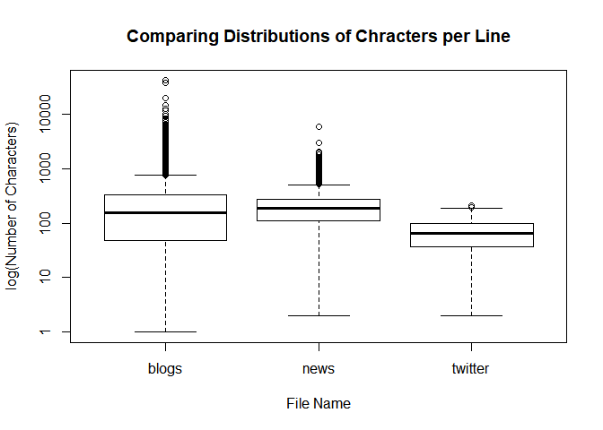
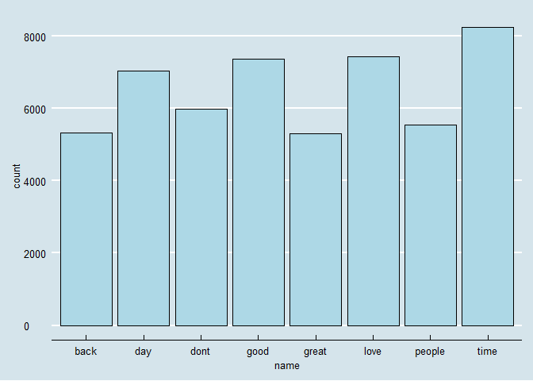

Task 1: Getting and Cleaning the Data
================
Mark Blackmore
2017-10-18

1. Download and explore the data
--------------------------------

Create a data directory

``` r
if (!file.exists("data")) {
  dir.create("data")
}
```

Download the data

``` r
# url <- "https://d396qusza40orc.cloudfront.net/dsscapstone/dataset/Coursera-SwiftKey.zip"
# download(url, dest="dataset.zip", mode="wb") 
# unzip ("dataset.zip", exdir = "./data")
```

English Repository Files

``` r
blogs_file   <- "./data/final/en_US/en_US.blogs.txt"
news_file    <- "./data/final/en_US/en_US.news.txt"
twitter_file <- "./data/final/en_US/en_US.twitter.txt"  
```

File Sizes (Mb)

``` r
blogs_size   <- file.size(blogs_file) / (2^20)
news_size    <- file.size(news_file) / (2^20)
twitter_size <- file.size(twitter_file) / (2^20)
```

Read the data files

``` r
blogs   <- readLines(blogs_file,   skipNul = TRUE)
news    <- readLines(news_file,    skipNul = TRUE)
```

    ## Warning in readLines(news_file, skipNul = TRUE): incomplete final line
    ## found on './data/final/en_US/en_US.news.txt'

``` r
twitter <- readLines(twitter_file, skipNul = TRUE) 
```

Number of Lines per file

``` r
blogs_lines   <- length(blogs)
news_lines    <- length(news)
twitter_lines <- length(twitter)
total_lines   <- blogs_lines + news_lines + twitter_lines
```

Distibution of characters per line, by file

``` r
blogs_nchar   <- nchar(blogs)
news_nchar    <- nchar(news)
twitter_nchar <- nchar(twitter)

boxplot(blogs_nchar, news_nchar, twitter_nchar, log = "y",
        names = c("blogs", "news", "twitter"),
        ylab = "log(Number of Characters)", xlab = "File Name") 
        title("Comparing Distributions of Chracters per Line")
```



Max characters in a line, by file (longest line)

``` r
blogs_nchar_max   <- max(blogs_nchar)
news_nchar_max    <- max(news_nchar)
twitter_nchar_max <- max(twitter_nchar)
```

Median characters per file

``` r
blogs_nchar_med   <- median(blogs_nchar)
news_nchar_med    <- median(news_nchar)
twitter_nchar_med <- median(twitter_nchar)
```

Total characters per file

``` r
blogs_nchar_sum   <- sum(blogs_nchar)
news_nchar_sum    <- sum(news_nchar)
twitter_nchar_sum <- sum(twitter_nchar)
```

Create summary of repo stats

``` r
repo_summary <- data.frame(f_names = c("blogs", "news", "twitter"),
                           f_size  = c(blogs_size, news_size, twitter_size),
                           f_lines = c(blogs_lines, news_lines, twitter_lines),
                           nchar_max  = c(blogs_nchar_max, news_nchar_max, twitter_nchar_max),
                           nchar_med =  c(blogs_nchar_med, news_nchar_med, twitter_nchar_med),
                           nchar_sum =  c(blogs_nchar_sum, news_nchar_sum, twitter_nchar_sum))


repo_summary <- repo_summary %>% mutate(pct_nchar = round(nchar_sum/sum(nchar_sum), 2))
repo_summary <- repo_summary %>% mutate(pct_lines = round(f_lines/sum(f_lines), 2))
kable(repo_summary)
```

| f\_names |   f\_size|  f\_lines|  nchar\_max|  nchar\_med|  nchar\_sum|  pct\_nchar|  pct\_lines|
|:---------|---------:|---------:|-----------:|-----------:|-----------:|-----------:|-----------:|
| blogs    |  200.4242|    899288|       40835|         157|   208361438|        0.54|        0.27|
| news     |  196.2775|     77259|        5760|         186|    15683765|        0.04|        0.02|
| twitter  |  159.3641|   2360148|         213|          64|   162385035|        0.42|        0.71|

2. Sample the data and save the sample
--------------------------------------

Compute sample sizes in terms of lines

``` r
sample_pct = 0.05
set.seed(1001)
blogs_size   <- blogs_lines * sample_pct
news_size    <- news_lines * sample_pct
twitter_size <- twitter_lines * sample_pct
```

Create samples

``` r
blogs_sample   <- sample(blogs, blogs_size)
news_sample    <- sample(news, news_size)
twitter_sample <- sample(twitter, twitter_size)
repo_sample    <- c(blogs_sample, news_sample, twitter_sample)
```

Save sample

``` r
writeLines(repo_sample, "./data/final/en_US/en_US.repo_sample.txt")
saveRDS(repo_sample, file = "./data/final/en_US/repo_sample.RData" )
```

3. Clean the sample data
------------------------

Use `tm` to create and clean the corpus

``` r
clean_sample <- Corpus(VectorSource(repo_sample),
                       readerControl = list(readPlain, 
                                            language = "en",
                                            load = TRUE))
print(as.character(clean_sample[[1]]))
```

    ## [1] "Love the use of onomatopoeia, and I wish they made dumplings with just scallions and cabbage. But there are plenty of places on 8th where you can buy dumplings (veggie or otherwise) for 4 for a dollar or so. Several places that look like they don't sell anything (just a white booth with a see-through window) actually sell delicious stuff to take home a cook. It's inexpensive and usually quite good. Enjoy."

Transform sample to all lower case

``` r
clean_sample <- tm_map(clean_sample, content_transformer(tolower))
```

Remove URL's
Source: [R and Data Mining](%22http://www.rdatamining.com/books/rdm/faq/removeurlsfromtext%22)

``` r
removeURL <- function(x) gsub("http[^[:space:]]*", "", x)
clean_sample <- tm_map(clean_sample, content_transformer(removeURL))

# Remove anything other than English letters or space
removeNumPunct <- function(x) gsub("[^[:alpha:][:space:]]*", "", x)
clean_sample <- tm_map(clean_sample, content_transformer(removeNumPunct))
```

Create profanity filter
Source: [List-of-Dirty-Naughty-Obscene-and-Otherwise-Bad-Words](%22List-of-Dirty-Naughty-Obscene-and-Otherwise-Bad-Words/en%22)

``` r
profanity <- read.table("./data/final/en_US/profanity.txt", header = FALSE, sep ="\n")
```

Remove profanity

``` r
clean_sample <- tm_map(clean_sample, removeWords, profanity[,1])
```

Remove stopwords

``` r
clean_sample <- tm_map(clean_sample, removeWords, stopwords("english"))
clean_sample <- tm_map(clean_sample, removeWords, stopwords("SMART"))
print(as.character(clean_sample[[1]]))
```

    ## [1] "love    onomatopoeia     made dumplings   scallions  cabbage    plenty  places      buy dumplings veggie       dollar    places     dont sell    white booth   seethrough window  sell delicious stuff   home  cook  inexpensive    good enjoy"

Remove Whitespace

``` r
clean_sample <- tm_map(clean_sample, stripWhitespace)
print(as.character(clean_sample[[1]]))
```

    ## [1] "love onomatopoeia made dumplings scallions cabbage plenty places buy dumplings veggie dollar places dont sell white booth seethrough window sell delicious stuff home cook inexpensive good enjoy"

Save clean corpus

``` r
saveRDS(clean_sample, file = "./data/final/en_US/clean_sample.RData" )
```

4. Initial Exploratory Data Analysis
------------------------------------

Convert to document term matrix

``` r
docterm_corpus <- DocumentTermMatrix(clean_sample)
dim(docterm_corpus)
```

    ## [1] 166833 122031

``` r
new_docterm_corpus <- removeSparseTerms(docterm_corpus,sparse = 0.993)
dim(new_docterm_corpus)
```

    ## [1] 166833     96

Find frequent terms

``` r
colS <- colSums(as.matrix(new_docterm_corpus))
length(colS)
```

    ## [1] 96

``` r
doc_features <- data.table(name = attributes(colS)$names, count = colS)
```

Most frequent and least frequent words

``` r
doc_features[order(-count)][1:10] #top 10 most frequent words
```

    ##       name count
    ##  1:   time  8239
    ##  2:   love  7425
    ##  3:   good  7368
    ##  4:    day  7045
    ##  5:   dont  5973
    ##  6: people  5542
    ##  7:   back  5330
    ##  8:  great  5299
    ##  9:   make  4972
    ## 10:  today  4736

``` r
doc_features[order(count)][1:10] #least 10 frequent words
```

    ##         name count
    ##  1:     hear  1219
    ##  2: watching  1230
    ##  3:     miss  1230
    ##  4:      bit  1275
    ##  5:     yeah  1278
    ##  6:    point  1281
    ##  7:     talk  1287
    ##  8:     girl  1297
    ##  9:    ready  1299
    ## 10:     post  1300

Plot most frequent terms

``` r
ggplot(doc_features[count>5000],aes(name, count)) +
  geom_bar(stat = "identity",fill='lightblue',color='black') +
  theme(axis.text.x = element_text(angle = 45, hjust = 1)) +
  theme_economist() + scale_color_economist() 
```



Create word cloud

``` r
wordcloud(names(colS), colS, min.freq = 500, 
          colors = brewer.pal(6, 'Dark2'), random.order = FALSE)  
```


``` r
wordcloud(names(colS), colS, min.freq = 2000, 
          colors = brewer.pal(6, 'Dark2'), random.order = FALSE)  
```


------------------------------------------------------------------------

#### Session info:

``` r
sessionInfo()
```

    ## R version 3.4.2 (2017-09-28)
    ## Platform: x86_64-w64-mingw32/x64 (64-bit)
    ## Running under: Windows 10 x64 (build 15063)
    ## 
    ## Matrix products: default
    ## 
    ## locale:
    ## [1] LC_COLLATE=English_United States.1252 
    ## [2] LC_CTYPE=English_United States.1252   
    ## [3] LC_MONETARY=English_United States.1252
    ## [4] LC_NUMERIC=C                          
    ## [5] LC_TIME=English_United States.1252    
    ## 
    ## attached base packages:
    ## [1] stats     graphics  grDevices utils     datasets  methods   base     
    ## 
    ## other attached packages:
    ##  [1] bindrcpp_0.2        wordcloud_2.5       RColorBrewer_1.1-2 
    ##  [4] ggthemes_3.4.0      data.table_1.10.4-2 dtplyr_0.0.2       
    ##  [7] dplyr_0.7.4         purrr_0.2.3         readr_1.1.1        
    ## [10] tidyr_0.7.1         tibble_1.3.4        ggplot2_2.2.1      
    ## [13] tidyverse_1.1.1     knitr_1.17          tm_0.7-1           
    ## [16] NLP_0.1-11          downloader_0.4     
    ## 
    ## loaded via a namespace (and not attached):
    ##  [1] slam_0.1-40      reshape2_1.4.2   haven_1.1.0      lattice_0.20-35 
    ##  [5] colorspace_1.3-2 htmltools_0.3.6  yaml_2.1.14      rlang_0.1.2     
    ##  [9] foreign_0.8-69   glue_1.1.1       modelr_0.1.1     readxl_1.0.0    
    ## [13] bindr_0.1        plyr_1.8.4       stringr_1.2.0    munsell_0.4.3   
    ## [17] gtable_0.2.0     cellranger_1.1.0 rvest_0.3.2      psych_1.7.8     
    ## [21] evaluate_0.10.1  labeling_0.3     forcats_0.2.0    parallel_3.4.2  
    ## [25] highr_0.6        broom_0.4.2      Rcpp_0.12.13     backports_1.1.1 
    ## [29] scales_0.5.0     jsonlite_1.5     mnormt_1.5-5     hms_0.3         
    ## [33] digest_0.6.12    stringi_1.1.5    grid_3.4.2       rprojroot_1.2   
    ## [37] tools_3.4.2      magrittr_1.5     lazyeval_0.2.0   pkgconfig_2.0.1 
    ## [41] xml2_1.1.1       lubridate_1.6.0  assertthat_0.2.0 rmarkdown_1.6   
    ## [45] httr_1.3.1       R6_2.2.2         nlme_3.1-131     compiler_3.4.2
