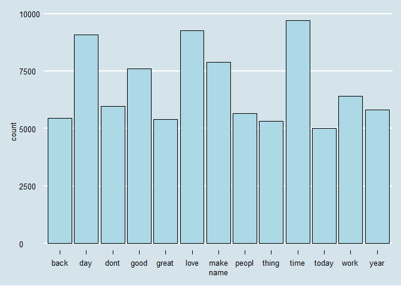

Task 1: Getting and Cleaning the Data
================
Mark Blackmore
2017-10-16

``` r
library(downloader)
library(tm)
```

    ## Loading required package: NLP

``` r
library(knitr)
library(tidyverse)
```

    ## Loading tidyverse: ggplot2
    ## Loading tidyverse: tibble
    ## Loading tidyverse: tidyr
    ## Loading tidyverse: readr
    ## Loading tidyverse: purrr
    ## Loading tidyverse: dplyr

    ## Conflicts with tidy packages ----------------------------------------------

    ## annotate(): ggplot2, NLP
    ## filter():   dplyr, stats
    ## lag():      dplyr, stats

1. Download and explore the data
--------------------------------

Create a data directory

``` r
if (!file.exists("data")) {
  dir.create("data")
}
```

Download the data

``` r
# url <- "https://d396qusza40orc.cloudfront.net/dsscapstone/dataset/Coursera-SwiftKey.zip"
# download(url, dest="dataset.zip", mode="wb") 
# unzip ("dataset.zip", exdir = "./data")
```

English Repository Files

``` r
blogs_file   <- "./data/final/en_US/en_US.blogs.txt"
news_file    <- "./data/final/en_US/en_US.news.txt"
twitter_file <- "./data/final/en_US/en_US.twitter.txt"  
```

File Sizes (Mb)

``` r
blogs_size <- file.size(blogs_file) / (2^20)
news_size  <- file.size(news_file) / (2^20)
twitter_size <- file.size(twitter_file) / (2^20)
```

Read the data files

``` r
blogs   <- readLines(blogs_file, skipNul = TRUE)
news    <- readLines(news_file, skipNul = TRUE)
```

    ## Warning in readLines(news_file, skipNul = TRUE): incomplete final line
    ## found on './data/final/en_US/en_US.news.txt'

``` r
twitter <- readLines(twitter_file, skipNul = TRUE) 
```

Number of Lines per file

``` r
blogs_lines <- length(blogs)
news_lines  <- length(news)
twitter_lines <- length(twitter)
total_lines  <- blogs_lines + news_lines + twitter_lines
```

Distibution of characters per line, by file

``` r
blogs_nchar <- nchar(blogs)
news_nchar  <- nchar(news)
twitter_nchar <- nchar(twitter)
boxplot(blogs_nchar, news_nchar, twitter_nchar, log = "y",
        names = c("blogs", "news", "twitter"),
        ylab = "log(Number of Characters)", xlab = "File Name")
title("Comparing Distributions of Chracters per Line")
```


Max characters in a line, by file (longest line)

``` r
blogs_nchar_max <- max(blogs_nchar)
news_nchar_max  <- max(news_nchar)
twitter_nchar_max <- max(twitter_nchar)
```

Median characters per file

``` r
blogs_nchar_med <- median(blogs_nchar)
news_nchar_med  <- median(news_nchar)
twitter_nchar_med <- median(twitter_nchar)
```

Total characters per file

``` r
blogs_nchar_sum <- sum(blogs_nchar)
news_nchar_sum  <- sum(news_nchar)
twitter_nchar_sum <- sum(twitter_nchar)
```

Create summary of repo stats

``` r
repo_summary <- data.frame(file_names = c("blogs", "news", "twitter"),
                           file_size  = c(blogs_size, news_size, twitter_size),
                           file_lines = c(blogs_lines, news_lines, twitter_lines),
                           #nchar_max  = c(blogs_nchar_max, news_nchar_max, twitter_nchar_max),
                           #nchar_med =  c(blogs_nchar_med, news_nchar_med, twitter_nchar_med),
                           nchar_sum =  c(blogs_nchar_sum, news_nchar_sum, twitter_nchar_sum))


repo_summary <- repo_summary %>% mutate(pct_nchar = round(nchar_sum/sum(nchar_sum), 2))
repo_summary <- repo_summary %>% mutate(pct_lines = round(file_lines/sum(file_lines), 2))
kable(repo_summary)
```

| file\_names |  file\_size|  file\_lines|  nchar\_sum|  pct\_nchar|  pct\_lines|
|:------------|-----------:|------------:|-----------:|-----------:|-----------:|
| blogs       |    200.4242|       899288|   208361438|        0.54|        0.27|
| news        |    196.2775|        77259|    15683765|        0.04|        0.02|
| twitter     |    159.3641|      2360148|   162385035|        0.42|        0.71|

2. Sample the data and save the sample
--------------------------------------

Compute sample sizes in terms of lines

``` r
sample_pct = 0.05
blogs_size <- blogs_lines * sample_pct
news_size  <- news_lines * sample_pct
twitter_size <- twitter_lines * sample_pct
```

Create samples

``` r
blogs_sample <- sample(blogs, blogs_size)
news_sample  <- sample(news, news_size)
twitter_sample <- sample(twitter, twitter_size)
repo_sample = c(blogs_sample, news_sample, twitter_sample)
```

Save sample

``` r
writeLines(repo_sample, "./data/final/en_US/en_US.repo_sample.txt")
saveRDS(repo_sample, file = "./data/final/en_US/repo_sample.RData" )

########################## START HERE ############### SEE LAST TAB
```

["Test Mining Tutorial"](%22https://www.hackerearth.com/fr/practice/machine-learning/advanced-techniques/text-mining-feature-engineering-r/tutorial/%22) \#\# 3. Clean the sample data Use `tm` to create and clean the corpus

``` r
clean_sample <- Corpus(VectorSource(repo_sample),
                       readerControl = list(readPlain, 
                                            language = "en",
                                            load = TRUE))

print(as.character(clean_sample[[1]]))
```

    ## [1] "Since Greek sports were preformed in the nude and much of cultured society revolved around the gymnasium, it was difficult for a circumcised Jew to participate without being exposing themselves to ridicule. Many Jews simply refused to participate, others either did not circumcise their children so that they could participate in Greek culture. Some chose to submit to an extremely painful procedure to reverse their circumcision."

Transform sample to all lower case

``` r
clean_sample <- tm_map(clean_sample, content_transformer(tolower))
```

Remove URL's
Source: [R and Data Mining](%22http://www.rdatamining.com/books/rdm/faq/removeurlsfromtext%22)

``` r
removeURL <- function(x) gsub("http[^[:space:]]*", "", x)
clean_sample <- tm_map(clean_sample, content_transformer(removeURL))

# Remove anything other than English letters or space
removeNumPunct <- function(x) gsub("[^[:alpha:][:space:]]*", "", x)
clean_sample <- tm_map(clean_sample, content_transformer(removeNumPunct))

# #' Remove punctuaton and numbers (replaced by last call)
# clean_sample <- tm_map(clean_sample, removePunctuation)
# clean_sample <- tm_map(clean_sample, removeNumbers)
```

Create profanity filter
Source: [List-of-Dirty-Naughty-Obscene-and-Otherwise-Bad-Words](%22List-of-Dirty-Naughty-Obscene-and-Otherwise-Bad-Words/en%22)

``` r
profanity <- read.table("./data/final/en_US/profanity.txt", header = FALSE, sep ="\n")
```

Remove profanity

``` r
clean_sample <- tm_map(clean_sample, removeWords, profanity[,1])
```

Remove stopwords

``` r
clean_sample <- tm_map(clean_sample, removeWords, stopwords("english"))
clean_sample <- tm_map(clean_sample, removeWords, stopwords("SMART"))
print(as.character(clean_sample[[1]]))
```

    ## [1] " greek sports  preformed       cultured society revolved   gymnasium   difficult   circumcised jew  participate   exposing   ridicule  jews simply refused  participate     circumcise  children     participate  greek culture  chose  submit   extremely painful procedure  reverse  circumcision"

Remove Whitespace

``` r
clean_sample <- tm_map(clean_sample, stripWhitespace)
```

Save clean corpus

``` r
saveRDS(clean_sample, file = "./data/final/en_US/clean_sample.RData" )
```

Convert to text document

``` r
text_corpus <- tm_map(clean_sample, PlainTextDocument)

#perform stemming - this should always be performed after text doc conversion
text_corpus <- tm_map(text_corpus, stemDocument,language = "english")
print(as.character(text_corpus[[1]]))
```

    ## [1] " greek sport preform cultur societi revolv gymnasium difficult circumcis jew particip expos ridicul jew simpli refus particip circumcis children particip greek cultur chose submit extrem pain procedur revers circumcis"

``` r
text_corpus[[1]]$content
```

    ## [1] " greek sport preform cultur societi revolv gymnasium difficult circumcis jew particip expos ridicul jew simpli refus particip circumcis children particip greek cultur chose submit extrem pain procedur revers circumcis"

``` r
#convert to document term matrix
docterm_corpus <- DocumentTermMatrix(text_corpus)
dim(docterm_corpus)
```

    ## [1] 166833  95978

``` r
new_docterm_corpus <- removeSparseTerms(docterm_corpus,sparse = 0.99)
dim(new_docterm_corpus)
```

    ## [1] 166833     74

``` r
#find frequent terms
library(data.table)
```

    ## -------------------------------------------------------------------------

    ## data.table + dplyr code now lives in dtplyr.
    ## Please library(dtplyr)!

    ## -------------------------------------------------------------------------

    ## 
    ## Attaching package: 'data.table'

    ## The following objects are masked from 'package:dplyr':
    ## 
    ##     between, last

    ## The following object is masked from 'package:purrr':
    ## 
    ##     transpose

``` r
colS <- colSums(as.matrix(new_docterm_corpus))
length(colS)
```

    ## [1] 74

``` r
doc_features <- data.table(name = attributes(colS)$names, count = colS)

#most frequent and least frequent words
doc_features[order(-count)][1:10] #top 10 most frequent words
```

    ##      name count
    ##  1:  time  9876
    ##  2:  love  9400
    ##  3:   day  9011
    ##  4:  make  7960
    ##  5:  good  7666
    ##  6:  work  6327
    ##  7:  dont  5867
    ##  8: peopl  5830
    ##  9:  year  5764
    ## 10:  back  5709

``` r
doc_features[order(count)][1:10] #least 10 frequent words
```

    ##         name count
    ##  1: tomorrow  1719
    ##  2:    final  1753
    ##  3:      bad  1782
    ##  4:    tweet  1817
    ##  5:    didnt  1833
    ##  6:     turn  1842
    ##  7:    check  1843
    ##  8:     hous  1867
    ##  9:     open  1896
    ## 10:   famili  1911

``` r
library(ggplot2)
library(ggthemes)

ggplot(doc_features[count>5000],aes(name, count)) +
  geom_bar(stat = "identity",fill='lightblue',color='black') +
  theme(axis.text.x = element_text(angle = 45, hjust = 1)) +
  theme_economist() + scale_color_economist() 
```



``` r
# #check association of terms of top features
# findAssocs(new_docterm_corpus, "time", corlimit = 0.5)
# findAssocs(new_docterm_corpus, "love", corlimit = 0.5)
# findAssocs(new_docterm_corpus, "day",  corlimit = 0.5)

library(wordcloud)
```

    ## Loading required package: RColorBrewer

``` r
wordcloud(names(colS), colS, min.freq = 500, scale = c(6,.1), 
          colors = brewer.pal(6, 'Dark2'))  
```

    ## Warning in wordcloud(names(colS), colS, min.freq = 500, scale = c(6,
    ## 0.1), : good could not be fit on page. It will not be plotted.

    ## Warning in wordcloud(names(colS), colS, min.freq = 500, scale = c(6,
    ## 0.1), : time could not be fit on page. It will not be plotted.

    ## Warning in wordcloud(names(colS), colS, min.freq = 500, scale = c(6,
    ## 0.1), : make could not be fit on page. It will not be plotted.

    ## Warning in wordcloud(names(colS), colS, min.freq = 500, scale = c(6,
    ## 0.1), : dont could not be fit on page. It will not be plotted.

    ## Warning in wordcloud(names(colS), colS, min.freq = 500, scale = c(6,
    ## 0.1), : back could not be fit on page. It will not be plotted.


``` r
wordcloud(names(colS), colS, min.freq = 2000, scale = c(6,.1), 
          colors = brewer.pal(6, 'Dark2'))  
```

    ## Warning in wordcloud(names(colS), colS, min.freq = 2000, scale = c(6,
    ## 0.1), : good could not be fit on page. It will not be plotted.

    ## Warning in wordcloud(names(colS), colS, min.freq = 2000, scale = c(6,
    ## 0.1), : time could not be fit on page. It will not be plotted.

    ## Warning in wordcloud(names(colS), colS, min.freq = 2000, scale = c(6,
    ## 0.1), : peopl could not be fit on page. It will not be plotted.

    ## Warning in wordcloud(names(colS), colS, min.freq = 2000, scale = c(6,
    ## 0.1), : great could not be fit on page. It will not be plotted.


' Create copy of corpus for stem completion
===========================================

clean\_sample\_copy &lt;- clean\_sample

' Stem the document
===================

clean\_sample &lt;- tm\_map(clean\_sample, stemDocument)

saveRDS(dtm, file = "./data/final/en\_US/dtm.RData")
