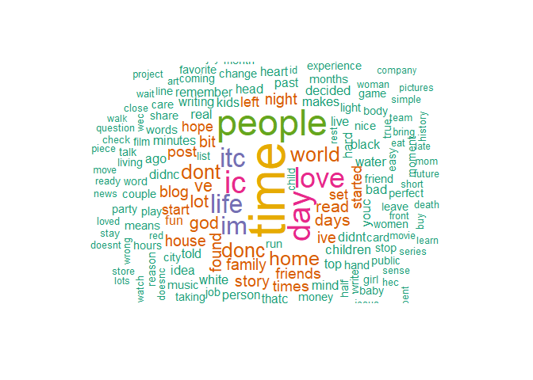
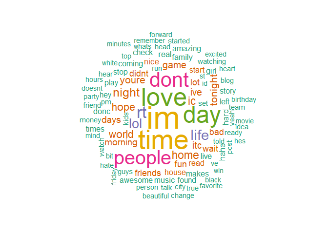
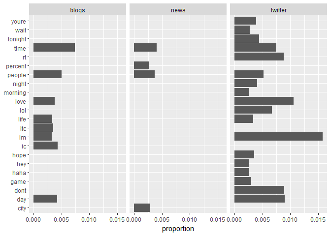

Task 2: Exploratory Data Analysis
================
Mark Blackmore
2017-10-18

1. Introduction
---------------

This script uses the tidy data principles applied to text mining, as outlined in [Text Mining with R: A Tidy Approach](http://tidytextmining.com/).

Using this approach, we are able to use the **entire data set** as opposed to data sampling approach required by the memory constraints of the `tm` package.

1. Data loading and cleaning
----------------------------

English Repository Files

``` r
blogs_file   <- "./data/final/en_US/en_US.blogs.txt"
news_file    <- "./data/final/en_US/en_US.news.txt"
twitter_file <- "./data/final/en_US/en_US.twitter.txt"  
```

Read the data files

``` r
blogs   <- readLines(blogs_file,   skipNul = TRUE)
news    <- readLines(news_file,    skipNul = TRUE)
```

    ## Warning in readLines(news_file, skipNul = TRUE): incomplete final line
    ## found on './data/final/en_US/en_US.news.txt'

``` r
twitter <- readLines(twitter_file, skipNul = TRUE) 
```

Create filters: stopwords, profanity, non-alphanumeric characters, url's, repeated letters

``` r
data("stop_words")
swear_words <- read.csv("./data/final/en_US/en_US.swearWords.csv", header = FALSE)
```

    ## Warning in read.table(file = file, header = header, sep = sep, quote =
    ## quote, : incomplete final line found by readTableHeader on './data/final/
    ## en_US/en_US.swearWords.csv'

``` r
swear_words <- gather(swear_words) %>% transmute(word = value)
```

    ## Warning: attributes are not identical across measure variables;
    ## they will be dropped

``` r
replace_reg <- "[^[:alpha:][:space:]]*"
replace_url <- "http[^[:space:]]*"
replace_aaa <- "\\b(?=\\w*(\\w)\\1)\\w+\\b"  
```

Create clean & tidy dataframes for each source and a clean & tidy repository

``` r
clean_blogs <- data_frame(text = blogs) %>%
  mutate(text = str_replace_all(text, replace_reg, "")) %>%
  mutate(text = str_replace_all(text, replace_url, "")) %>%
  mutate(text = str_replace_all(text, replace_aaa, "")) %>%  
  mutate(text = iconv(text, "ASCII//TRANSLIT"))
```

############ 

SPLIT CLEANING FROM TIDYING, this allows use of unnest\_tokens for ngrams READ MORE BEFORE DOING MORE

``` r
tidy_blogs <- clean_blogs  %>%
  unnest_tokens(word, text) %>%
  anti_join(swear_words) %>%
  anti_join(stop_words)
```

    ## Joining, by = "word"
    ## Joining, by = "word"

``` r
## ngrams
tidy_blogs_bigrams <- clean_blogs  %>%
  unnest_tokens(bigram, text, token = "ngrams", n = 2)
tidy_blogs_bigrams
```

    ## # A tibble: 33,823,399 x 1
    ##              bigram
    ##               <chr>
    ##  1           in the
    ##  2        the years
    ##  3 years thereafter
    ##  4  thereafter most
    ##  5          most of
    ##  6           of the
    ##  7          the oil
    ##  8       oil fields
    ##  9       fields and
    ## 10    and platforms
    ## # ... with 33,823,389 more rows

``` r
################

tidy_news <- data_frame(text = news) %>%
  mutate(text = str_replace_all(text, replace_reg, "")) %>%
  mutate(text = str_replace_all(text, replace_url, "")) %>%
  mutate(text = str_replace_all(text, replace_aaa, "")) %>%  
  mutate(text = iconv(text, "ASCII//TRANSLIT")) %>%
  unnest_tokens(word, text) %>%
  anti_join(swear_words) %>%
  anti_join(stop_words)
```

    ## Joining, by = "word"
    ## Joining, by = "word"

``` r
tidy_twitter <- data_frame(text = twitter) %>%
  mutate(text = str_replace_all(text, replace_reg, "")) %>%
  mutate(text = str_replace_all(text, replace_url, "")) %>%
  mutate(text = str_replace_all(text, replace_aaa, "")) %>%  
  mutate(text = iconv(text, "ASCII//TRANSLIT")) %>%
  unnest_tokens(word, text) %>%
  anti_join(swear_words) %>%
  anti_join(stop_words)
```

    ## Joining, by = "word"
    ## Joining, by = "word"

``` r
# Tidy repository with source, save to file  
tidy_repo <- bind_rows(mutate(tidy_blogs, source = "blogs"),
                       mutate(tidy_news,  source = "news"),
                       mutate(tidy_twitter, source = "twitter")) 
tidy_repo$source <- as.factor(tidy_repo$source)
saveRDS(tidy_repo, "./data/final/en_US/tidy_repo.rds")
```

2. Most frequent words and word distributions
---------------------------------------------

``` r
freq <- tidy_repo %>%
  #mutate(word = str_extract(word, "[a-z']+")) %>%
  count(source, word) %>%
  group_by(source) %>%
  mutate(proportion = n / sum(n)) %>%
  #select(-n) %>%
  spread(source, proportion) %>%
  gather(source, proportion, `blogs`:`twitter`) %>%
  arrange(desc(proportion), desc(n))
```

Most frequent words

``` r
kable(head(freq, 10))
```

| word   |       n| source  |  proportion|
|:-------|-------:|:--------|-----------:|
| im     |  157940| twitter |   0.0158269|
| love   |  105474| twitter |   0.0105694|
| day    |   89821| twitter |   0.0090008|
| dont   |   88730| twitter |   0.0088915|
| rt     |   88189| twitter |   0.0088373|
| time   |   74547| twitter |   0.0074702|
| time   |   87526| blogs   |   0.0074219|
| lol    |   66386| twitter |   0.0066524|
| people |   51422| twitter |   0.0051529|
| people |   58839| blogs   |   0.0049893|

Least frequent words

``` r
freq_low <- freq %>% 
  arrange(proportion, n)
kable(head(freq_low, 10)) 
```

| word           |    n| source |  proportion|
|:---------------|----:|:-------|-----------:|
| aaaaaaaaaaaaaa |    1| blogs  |       1e-07|
| aabb           |    1| blogs  |       1e-07|
| aaberg         |    1| blogs  |       1e-07|
| aabergc        |    1| blogs  |       1e-07|
| aac            |    1| blogs  |       1e-07|
| aack           |    1| blogs  |       1e-07|
| aadvanced      |    1| blogs  |       1e-07|
| aafaton        |    1| blogs  |       1e-07|
| aafes          |    1| blogs  |       1e-07|
| aag            |    1| blogs  |       1e-07|

Word clouds

``` r
tidy_blogs %>%
  count(word) %>%
  with(wordcloud(word, n, max.words = 100, 
                 colors = brewer.pal(6, 'Dark2'), random.order = FALSE))
```


``` r
tidy_blogs %>%
  count(word) %>%
  with(wordcloud(word, n, max.words = 200, 
                 colors = brewer.pal(6, 'Dark2'), random.order = FALSE)) 
```



Word distribution

``` r
tidy_repo %>%
  count(word, sort = TRUE) %>%
  filter(n > 40000) %>%
  mutate(word = reorder(word, n)) %>%
  ggplot(aes(word, n)) +
  geom_col() +
  xlab(NULL) +
  coord_flip()
```



Word distribution by source

``` r
freq %>%
  group_by(source) %>%
  filter(proportion > 0.0025) %>% 
  mutate(word = reorder(word, proportion)) %>% 
  ggplot(aes(word, proportion)) +
  geom_col() + 
  xlab(NULL) + 
  coord_flip() +
  facet_wrap(~source) 
```

    ## Warning in mutate_impl(.data, dots): Unequal factor levels: coercing to
    ## character

    ## Warning in mutate_impl(.data, dots): binding character and factor vector,
    ## coercing into character vector

    ## Warning in mutate_impl(.data, dots): binding character and factor vector,
    ## coercing into character vector

    ## Warning in mutate_impl(.data, dots): binding character and factor vector,
    ## coercing into character vector



------------------------------------------------------------------------

#### Session info:

``` r
sessionInfo()       
```

    ## R version 3.4.2 (2017-09-28)
    ## Platform: x86_64-w64-mingw32/x64 (64-bit)
    ## Running under: Windows 10 x64 (build 15063)
    ## 
    ## Matrix products: default
    ## 
    ## locale:
    ## [1] LC_COLLATE=English_United States.1252 
    ## [2] LC_CTYPE=English_United States.1252   
    ## [3] LC_MONETARY=English_United States.1252
    ## [4] LC_NUMERIC=C                          
    ## [5] LC_TIME=English_United States.1252    
    ## 
    ## attached base packages:
    ## [1] stats     graphics  grDevices utils     datasets  methods   base     
    ## 
    ## other attached packages:
    ##  [1] bindrcpp_0.2       wordcloud_2.5      RColorBrewer_1.1-2
    ##  [4] knitr_1.17         stringr_1.2.0      dplyr_0.7.4       
    ##  [7] purrr_0.2.3        readr_1.1.1        tidyr_0.7.1       
    ## [10] tibble_1.3.4       ggplot2_2.2.1      tidyverse_1.1.1   
    ## [13] tidytext_0.1.4    
    ## 
    ## loaded via a namespace (and not attached):
    ##  [1] tidyselect_0.2.2  slam_0.1-40       reshape2_1.4.2   
    ##  [4] haven_1.1.0       lattice_0.20-35   colorspace_1.3-2 
    ##  [7] htmltools_0.3.6   SnowballC_0.5.1   yaml_2.1.14      
    ## [10] rlang_0.1.2       foreign_0.8-69    glue_1.1.1       
    ## [13] modelr_0.1.1      readxl_1.0.0      bindr_0.1        
    ## [16] plyr_1.8.4        munsell_0.4.3     gtable_0.2.0     
    ## [19] cellranger_1.1.0  rvest_0.3.2       psych_1.7.8      
    ## [22] evaluate_0.10.1   labeling_0.3      forcats_0.2.0    
    ## [25] parallel_3.4.2    highr_0.6         broom_0.4.2      
    ## [28] tokenizers_0.1.4  Rcpp_0.12.13      backports_1.1.1  
    ## [31] scales_0.5.0      jsonlite_1.5      mnormt_1.5-5     
    ## [34] hms_0.3           digest_0.6.12     stringi_1.1.5    
    ## [37] grid_3.4.2        rprojroot_1.2     tools_3.4.2      
    ## [40] magrittr_1.5      lazyeval_0.2.0    janeaustenr_0.1.5
    ## [43] pkgconfig_2.0.1   Matrix_1.2-11     xml2_1.1.1       
    ## [46] lubridate_1.6.0   assertthat_0.2.0  rmarkdown_1.6    
    ## [49] httr_1.3.1        R6_2.2.2          nlme_3.1-131     
    ## [52] compiler_3.4.2
