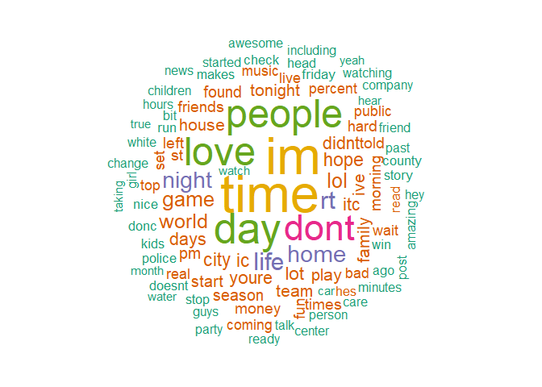
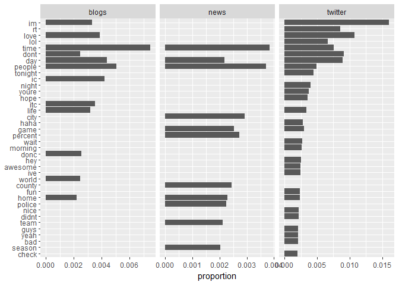
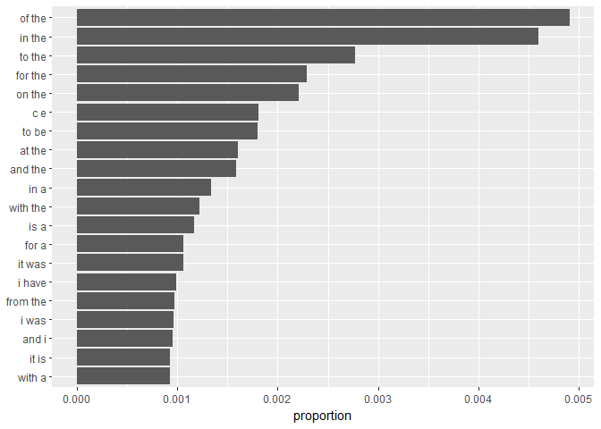
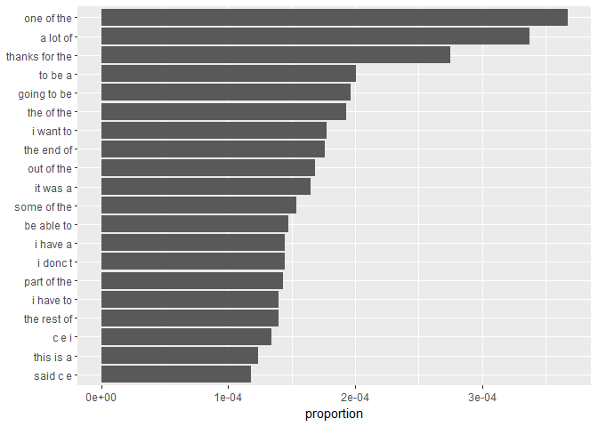
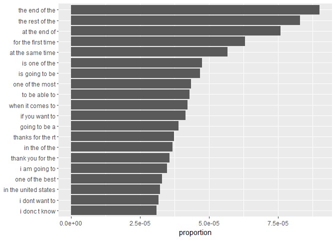

Task 2: Exploratory Data Analysis
================
Mark Blackmore
2017-10-24

1. Introduction
---------------

This script uses the tidy data principles applied to text mining, as outlined in [Text Mining with R: A Tidy Approach](http://tidytextmining.com/).

Using this approach, we are able to use the **entire data set** as opposed to data sampling approach required by the memory constraints of the `tm` package. After exploring the entire data set, we then reduce the data based on frequency.

``` r
start <- Sys.time()
```

2. Data loading and cleaning
----------------------------

English Repository Files

``` r
blogs_file   <- "./data/final/en_US/en_US.blogs.txt"
news_file    <- "./data/final/en_US/en_US.news.txt"
twitter_file <- "./data/final/en_US/en_US.twitter.txt"  
```

File Sizes (Mb)

``` r
blogs_size   <- file.size(blogs_file) / (2^20)
news_size    <- file.size(news_file) / (2^20)
twitter_size <- file.size(twitter_file) / (2^20)
```

Read the data files

``` r
blogs   <- readLines(blogs_file, skipNul = TRUE)
news    <- readLines(news_file,  skipNul = TRUE)
twitter <- readLines(twitter_file, skipNul = TRUE)
```

Number of Lines per file

``` r
blogs_lines   <- length(blogs)
news_lines    <- length(news)
twitter_lines <- length(twitter)
total_lines   <- blogs_lines + news_lines + twitter_lines
```

Distibution of characters per line, by file

``` r
blogs_nchar   <- nchar(blogs)
news_nchar    <- nchar(news)
twitter_nchar <- nchar(twitter)

boxplot(blogs_nchar, news_nchar, twitter_nchar, log = "y",
        names = c("blogs", "news", "twitter"),
        ylab = "log(Number of Characters)", xlab = "File Name") 
title("Comparing Distributions of Chracters per Line")
```


Total characters per file

``` r
blogs_nchar_sum   <- sum(blogs_nchar)
news_nchar_sum    <- sum(news_nchar)
twitter_nchar_sum <- sum(twitter_nchar)
```

Total words per file

``` r
blogs_words <- wordcount(blogs, sep = " ")
news_words  <- wordcount(news,  sep = " ")
twitter_words <- wordcount(twitter, sep = " ")
```

Create summary of repo stats

``` r
repo_summary <- data.frame(f_names = c("blogs", "news", "twitter"),
                           f_size  = c(blogs_size, news_size, twitter_size),
                           f_lines = c(blogs_lines, news_lines, twitter_lines),
                           n_char =  c(blogs_nchar_sum, news_nchar_sum, twitter_nchar_sum),
                           n_words = c(blogs_words, news_words, twitter_words))
repo_summary <- repo_summary %>% mutate(pct_n_char = round(n_char/sum(n_char), 2))
repo_summary <- repo_summary %>% mutate(pct_lines = round(f_lines/sum(f_lines), 2))
repo_summary <- repo_summary %>% mutate(pct_words = round(n_words/sum(n_words), 2))
kable(repo_summary)
```

| f\_names |   f\_size|  f\_lines|    n\_char|  n\_words|  pct\_n\_char|  pct\_lines|  pct\_words|
|:---------|---------:|---------:|----------:|---------:|-------------:|-----------:|-----------:|
| blogs    |  200.4242|    899288|  208361438|  37334131|          0.36|        0.21|        0.37|
| news     |  195.3141|   1010242|  203791390|  34372528|          0.35|        0.24|        0.34|
| twitter  |  159.3641|   2360148|  162385035|  30373583|          0.28|        0.55|        0.30|

Read the data files into dataframes

``` r
blogs   <- data_frame(text = blogs)
news    <- data_frame(text = news)
twitter <- data_frame(text = twitter)
```

Create filters: stopwords, profanity, non-alphanumeric's, url's, repeated letters(+3x)

``` r
data("stop_words")
swear_words <- read_delim("./data/final/en_US/en_US.swearWords.csv", delim = "\n", col_names = FALSE)
```

    ## Parsed with column specification:
    ## cols(
    ##   X1 = col_character()
    ## )

``` r
swear_words <- unnest_tokens(swear_words, word, X1)
replace_reg <- "[^[:alpha:][:space:]]*"
replace_url <- "http[^[:space:]]*"
replace_aaa <- "\\b(?=\\w*(\\w)\\1)\\w+\\b"  
```

Clean dataframes from each souce. Cleaning is separted from tidying so `unnest_tokens` function can be used for words, and ngrams.

``` r
clean_blogs <-  blogs %>%
  mutate(text = str_replace_all(text, replace_reg, "")) %>%
  mutate(text = str_replace_all(text, replace_url, "")) %>%
  mutate(text = str_replace_all(text, replace_aaa, "")) %>%  
  mutate(text = iconv(text, "ASCII//TRANSLIT"))

clean_news <-   news %>%
  mutate(text = str_replace_all(text, replace_reg, "")) %>%
  mutate(text = str_replace_all(text, replace_url, "")) %>%
  mutate(text = str_replace_all(text, replace_aaa, "")) %>%  
  mutate(text = iconv(text, "ASCII//TRANSLIT"))

clean_twitter <- twitter %>%
  mutate(text = str_replace_all(text, replace_reg, "")) %>%
  mutate(text = str_replace_all(text, replace_url, "")) %>%
  mutate(text = str_replace_all(text, replace_aaa, "")) %>%  
  mutate(text = iconv(text, "ASCII//TRANSLIT"))

#######
sample_pct <- 0.05

blogs_sample <- clean_blogs %>%
  sample_n(., nrow(clean_blogs)*sample_pct)
news_sample <- clean_news %>%
  sample_n(., nrow(clean_news)*sample_pct)
twitter_sample <- clean_twitter %>%
  sample_n(., nrow(clean_twitter)*sample_pct)
```

Create tidy repository

``` r
repo_sample <- bind_rows(mutate(blogs_sample, source = "blogs"),
                         mutate(news_sample,  source = "news"),
                         mutate(twitter_sample, source = "twitter")) 
repo_sample$source <- as.factor(repo_sample$source)
```

Clean up

``` r
rm(blogs, blogs_nchar, news, news_nchar, twitter, twitter_nchar, replace_reg, replace_url, replace_aaa)
x <- gc()
```

Create tidy dataframe for repo sample

``` r
tidy_repo <- repo_sample %>%
  unnest_tokens(word, text) %>%
  anti_join(swear_words) %>%
  anti_join(stop_words)
```

    ## Joining, by = "word"
    ## Joining, by = "word"

3. Most frequent words and word distributions
---------------------------------------------

Word counts: Number of unique words in repo

``` r
(repo_count <- tidy_repo %>%
    summarise(keys = n_distinct(word)))
```

    ## # A tibble: 1 x 1
    ##     keys
    ##    <int>
    ## 1 111162

Number of words to attain 50% and 90% coverage of all words in repo

``` r
cover_50 <- tidy_repo %>%
  count(word) %>%  
  mutate(proportion = n / sum(n)) %>%
  arrange(desc(proportion)) %>%  
  mutate(coverage = cumsum(proportion)) %>%
  filter(coverage <= 0.5)
nrow(cover_50)
```

    ## [1] 1318

``` r
cover_90 <- tidy_repo %>%
  count(word) %>%  
  mutate(proportion = n / sum(n)) %>%
  arrange(desc(proportion)) %>%  
  mutate(coverage = cumsum(proportion)) %>%
  filter(coverage <= 0.9)
nrow(cover_90)
```

    ## [1] 17853

4. Word distributions
---------------------

Most frequent words by proportion, with source

``` r
freq <- tidy_repo %>%
  count(source, word) %>%
  group_by(source) %>%
  mutate(proportion = n / sum(n)) %>%
  spread(source, proportion) %>%
  gather(source, proportion, `blogs`:`twitter`) %>%
  arrange(desc(proportion), desc(n))
kable(head(freq, 10))
```

| word   |     n| source  |  proportion|
|:-------|-----:|:--------|-----------:|
| im     |  7980| twitter |   0.0160675|
| love   |  5352| twitter |   0.0107761|
| dont   |  4509| twitter |   0.0090787|
| day    |  4417| twitter |   0.0088935|
| rt     |  4252| twitter |   0.0085613|
| time   |  3755| twitter |   0.0075606|
| time   |  4397| blogs   |   0.0074816|
| lol    |  3287| twitter |   0.0066183|
| people |  2958| blogs   |   0.0050331|
| people |  2454| twitter |   0.0049410|

Words above cutoff proportion: number of unique words

``` r
cutoff <- 0.0001
(small_repo_count <- freq %>%
    filter(proportion > cutoff) %>%
    summarise(keys = n_distinct(word)))
```

    ## # A tibble: 1 x 1
    ##    keys
    ##   <int>
    ## 1  2938

Word distribution by count

``` r
cover_90 %>%
  #count(word, sort = TRUE) %>%
  filter(n > 35000) %>%
  mutate(word = reorder(word, n)) %>%
  ggplot(aes(word, n)) +
  geom_col() +
  xlab(NULL) +
  coord_flip()
```



Word distribution by source

``` r
freq %>%
  filter(proportion > 0.002) %>% 
  mutate(word = reorder(word, proportion)) %>% 
  ggplot(aes(word, proportion)) +
  geom_col() + 
  xlab(NULL) + 
  coord_flip() +
  facet_grid(~source, scales = "free")
```



Word cloud

``` r
cover_90 %>%
  #count(word) %>%
  with(wordcloud(word, n, max.words = 100, 
                 colors = brewer.pal(6, 'Dark2'), random.order = FALSE))
```



5. Bigrams
----------

Create bigrams by source using `unnest_tokens`

``` r
rm(tidy_repo)
x <- gc()

bigram_repo <- repo_sample  %>%
  unnest_tokens(bigram, text, token = "ngrams", n = 2)
```

Number of bigrams to attain 90% coverage of all bigrams in repo

``` r
bigram_cover_90 <- bigram_repo %>%
  count(bigram) %>%  
  mutate(proportion = n / sum(n)) %>%
  arrange(desc(proportion)) %>%  
  mutate(coverage = cumsum(proportion)) %>%
  filter(coverage <= 0.9)
nrow(bigram_cover_90)
```

    ## [1] 932860

Bigram distribution

``` r
bigram_cover_90 %>%
  top_n(10, proportion) %>%
  mutate(bigram = reorder(bigram, proportion)) %>%
  ggplot(aes(bigram, proportion)) +
  geom_col() +
  xlab(NULL) +
  coord_flip()
```



``` r
##############
```

6. Trigrams
-----------

Create Trigrams by source using `unnest_tokens`

``` r
trigram_repo <- repo_sample  %>%
  unnest_tokens(trigram, text, token = "ngrams", n = 3)
```

Number of trigrams to attain 90% coverage of all trigrams in repo

``` r
trigram_cover_90 <- trigram_repo %>%
  count(trigram) %>%  
  mutate(proportion = n / sum(n)) %>%
  arrange(desc(proportion)) %>%  
  mutate(coverage = cumsum(proportion)) %>%
  filter(coverage <= 0.9)
nrow(trigram_cover_90)
```

    ## [1] 2827476

trigram distribution

``` r
trigram_cover_90 %>%
  top_n(10, proportion) %>%
  mutate(trigram = reorder(trigram, proportion)) %>%
  ggplot(aes(trigram, proportion)) +
  geom_col() +
  xlab(NULL) +
  coord_flip()
```



7. Quadgrams
------------

Create quadgrams by source using `unnest_tokens`

``` r
quadgram_repo <- repo_sample  %>%
  unnest_tokens(quadgram, text, token = "ngrams", n = 4)
```

Number of quadgrams to attain 90% coverage of all quadgrams in repo

``` r
quadgram_cover_90 <- quadgram_repo %>%
  count(quadgram) %>%  
  mutate(proportion = n / sum(n)) %>%
  arrange(desc(proportion)) %>%  
  mutate(coverage = cumsum(proportion)) %>%
  filter(coverage <= 0.9)
nrow(quadgram_cover_90)
```

    ## [1] 3766212

quadgram distribution

``` r
quadgram_cover_90 %>%
  top_n(10, proportion) %>%
  mutate(quadgram = reorder(quadgram, proportion)) %>%
  ggplot(aes(quadgram, proportion)) +
  geom_col() +
  xlab(NULL) +
  coord_flip()
```


``` r
quadgrams_separated <- quadgram_cover_90 %>%
  separate(quadgram, c("word1", "word2", "word3", "word4"), sep = " ")
quadgrams_separated
```

    ## # A tibble: 3,766,212 x 7
    ##    word1 word2 word3 word4     n   proportion     coverage
    ##  * <chr> <chr> <chr> <chr> <int>        <dbl>        <dbl>
    ##  1   the   end    of   the   430 9.543749e-05 9.543749e-05
    ##  2    at   the   end    of   366 8.123284e-05 1.766703e-04
    ##  3   the  rest    of   the   348 7.723778e-05 2.539081e-04
    ##  4   for   the first  time   316 7.013546e-05 3.240436e-04
    ##  5    at   the  same  time   240 5.326744e-05 3.773110e-04
    ##  6    is going    to    be   224 4.971627e-05 4.270273e-04
    ##  7    is   one    of   the   217 4.816264e-05 4.751899e-04
    ##  8   one    of   the  most   210 4.660901e-05 5.217989e-04
    ##  9 going    to    be     a   195 4.327979e-05 5.650787e-04
    ## 10  when    it comes    to   190 4.217005e-05 6.072488e-04
    ## # ... with 3,766,202 more rows

``` r
end <- Sys.time()

(run_time <- end - start)
```

    ## Time difference of 9.07025 mins

``` r
###############
```

------------------------------------------------------------------------

#### Session info:

``` r
sessionInfo()       
```

    ## R version 3.4.2 (2017-09-28)
    ## Platform: x86_64-w64-mingw32/x64 (64-bit)
    ## Running under: Windows 10 x64 (build 15063)
    ## 
    ## Matrix products: default
    ## 
    ## locale:
    ## [1] LC_COLLATE=English_United States.1252 
    ## [2] LC_CTYPE=English_United States.1252   
    ## [3] LC_MONETARY=English_United States.1252
    ## [4] LC_NUMERIC=C                          
    ## [5] LC_TIME=English_United States.1252    
    ## 
    ## attached base packages:
    ## [1] stats     graphics  grDevices utils     datasets  methods   base     
    ## 
    ## other attached packages:
    ##  [1] bindrcpp_0.2       ngram_3.0.3        wordcloud_2.5     
    ##  [4] RColorBrewer_1.1-2 knitr_1.17         stringr_1.2.0     
    ##  [7] dplyr_0.7.4        purrr_0.2.3        readr_1.1.1       
    ## [10] tidyr_0.7.1        tibble_1.3.4       ggplot2_2.2.1     
    ## [13] tidyverse_1.1.1    tidytext_0.1.4    
    ## 
    ## loaded via a namespace (and not attached):
    ##  [1] tidyselect_0.2.2  slam_0.1-40       reshape2_1.4.2   
    ##  [4] haven_1.1.0       lattice_0.20-35   colorspace_1.3-2 
    ##  [7] htmltools_0.3.6   SnowballC_0.5.1   yaml_2.1.14      
    ## [10] rlang_0.1.2       foreign_0.8-69    glue_1.1.1       
    ## [13] modelr_0.1.1      readxl_1.0.0      bindr_0.1        
    ## [16] plyr_1.8.4        munsell_0.4.3     gtable_0.2.0     
    ## [19] cellranger_1.1.0  rvest_0.3.2       psych_1.7.8      
    ## [22] evaluate_0.10.1   labeling_0.3      forcats_0.2.0    
    ## [25] parallel_3.4.2    highr_0.6         broom_0.4.2      
    ## [28] tokenizers_0.1.4  Rcpp_0.12.13      backports_1.1.1  
    ## [31] scales_0.5.0      jsonlite_1.5      mnormt_1.5-5     
    ## [34] hms_0.3           digest_0.6.12     stringi_1.1.5    
    ## [37] grid_3.4.2        rprojroot_1.2     tools_3.4.2      
    ## [40] magrittr_1.5      lazyeval_0.2.0    janeaustenr_0.1.5
    ## [43] pkgconfig_2.0.1   Matrix_1.2-11     xml2_1.1.1       
    ## [46] lubridate_1.6.0   assertthat_0.2.0  rmarkdown_1.6    
    ## [49] httr_1.3.1        R6_2.2.2          nlme_3.1-131     
    ## [52] compiler_3.4.2
