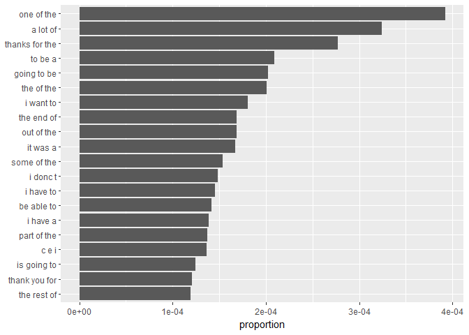
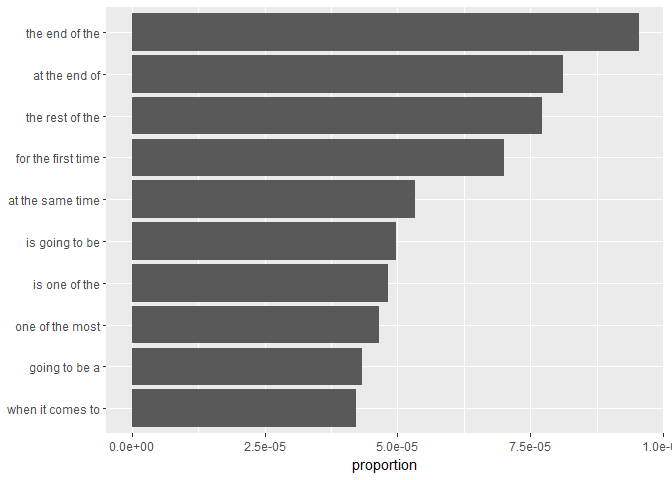

Task 2: Exploratory Data Analysis
================
Mark Blackmore
2017-10-23

1. Introduction
---------------

This script uses the tidy data principles applied to text mining, as outlined in [Text Mining with R: A Tidy Approach](http://tidytextmining.com/).

Using this approach, we are able to use the **entire data set** as opposed to data sampling approach required by the memory constraints of the `tm` package. After exploring the entire data set, we then reduce the data based on frequency.

``` r
start <- Sys.time()
```

2. Data loading and cleaning
----------------------------

English Repository Files

``` r
blogs_file   <- "./data/final/en_US/en_US.blogs.txt"
news_file    <- "./data/final/en_US/en_US.news.txt"
twitter_file <- "./data/final/en_US/en_US.twitter.txt"  
```

File Sizes (Mb)

``` r
blogs_size   <- file.size(blogs_file) / (2^20)
news_size    <- file.size(news_file) / (2^20)
twitter_size <- file.size(twitter_file) / (2^20)
```

Read the data files

``` r
blogs   <- read_lines(blogs_file)
news    <- read_lines(news_file)
twitter <- read_lines(twitter_file)
```

Number of Lines per file

``` r
blogs_lines   <- length(blogs)
news_lines    <- length(news)
twitter_lines <- length(twitter)
total_lines   <- blogs_lines + news_lines + twitter_lines
```

Distibution of characters per line, by file

``` r
blogs_nchar   <- nchar(blogs)
news_nchar    <- nchar(news)
twitter_nchar <- nchar(twitter)

boxplot(blogs_nchar, news_nchar, twitter_nchar, log = "y",
        names = c("blogs", "news", "twitter"),
        ylab = "log(Number of Characters)", xlab = "File Name") 
title("Comparing Distributions of Chracters per Line")
```


Total characters per file

``` r
blogs_nchar_sum   <- sum(blogs_nchar)
news_nchar_sum    <- sum(news_nchar)
twitter_nchar_sum <- sum(twitter_nchar)
```

Total words per file

``` r
blogs_words <- wordcount(blogs, sep = " ")
news_words  <- wordcount(news,  sep = " ")
twitter_words <- wordcount(news, sep = " ")
```

Create summary of repo stats

``` r
repo_summary <- data.frame(f_names = c("blogs", "news", "twitter"),
                           f_size  = c(blogs_size, news_size, twitter_size),
                           f_lines = c(blogs_lines, news_lines, twitter_lines),
                           n_char =  c(blogs_nchar_sum, news_nchar_sum, twitter_nchar_sum),
                           n_words = c(blogs_words, news_words, twitter_words))
repo_summary <- repo_summary %>% mutate(pct_n_char = round(n_char/sum(n_char), 2))
repo_summary <- repo_summary %>% mutate(pct_lines = round(f_lines/sum(f_lines), 2))
repo_summary <- repo_summary %>% mutate(pct_words = round(n_words/sum(n_words), 2))
kable(repo_summary)
```

| f\_names |   f\_size|  f\_lines|    n\_char|  n\_words|  pct\_n\_char|  pct\_lines|  pct\_words|
|:---------|---------:|---------:|----------:|---------:|-------------:|-----------:|-----------:|
| blogs    |  200.4242|    899288|  206824505|  37334131|          0.36|        0.21|        0.35|
| news     |  196.2775|   1010242|  203223159|  34372530|          0.36|        0.24|        0.32|
| twitter  |  159.3641|   2360148|  162096031|  34372530|          0.28|        0.55|        0.32|

Read the data files into dataframes

``` r
blogs   <- data_frame(text = readLines(blogs_file, skipNul = TRUE, warn = FALSE))
news    <- data_frame(text = readLines(news_file,  skipNul = TRUE, warn = FALSE))
twitter <- data_frame(text = readLines(twitter_file, skipNul = TRUE, warn = FALSE))
#########
```

Create filters: stopwords, profanity, non-alphanumeric's, url's, repeated letters(+3x)

``` r
data("stop_words")
swear_words <- read_delim("./data/final/en_US/en_US.swearWords.csv", delim = "\n", col_names = FALSE)
```

    ## Parsed with column specification:
    ## cols(
    ##   X1 = col_character()
    ## )

``` r
swear_words <- unnest_tokens(swear_words, word, X1)
replace_reg <- "[^[:alpha:][:space:]]*"
replace_url <- "http[^[:space:]]*"
replace_aaa <- "\\b(?=\\w*(\\w)\\1)\\w+\\b"  
```

Clean dataframes from each souce. Cleaning is separted from tidying so `unnest_tokens` function can be used for words, and ngrams.

``` r
clean_blogs <-  blogs %>%
  mutate(text = str_replace_all(text, replace_reg, "")) %>%
  mutate(text = str_replace_all(text, replace_url, "")) %>%
  mutate(text = str_replace_all(text, replace_aaa, "")) %>%  
  mutate(text = iconv(text, "ASCII//TRANSLIT"))

clean_news <-   news %>%
  mutate(text = str_replace_all(text, replace_reg, "")) %>%
  mutate(text = str_replace_all(text, replace_url, "")) %>%
  mutate(text = str_replace_all(text, replace_aaa, "")) %>%  
  mutate(text = iconv(text, "ASCII//TRANSLIT"))

clean_twitter <- twitter%>%
  mutate(text = str_replace_all(text, replace_reg, "")) %>%
  mutate(text = str_replace_all(text, replace_url, "")) %>%
  mutate(text = str_replace_all(text, replace_aaa, "")) %>%  
  mutate(text = iconv(text, "ASCII//TRANSLIT"))
```

Clean up

``` r
rm(blogs, news, twitter, replace_reg, replace_url, replace_aaa)
x <- gc()
```

Create tidy dataframes for each source

``` r
tidy_blogs <- clean_blogs %>%
  unnest_tokens(word, text) %>%
  anti_join(swear_words) %>%
  anti_join(stop_words)
```

    ## Joining, by = "word"
    ## Joining, by = "word"

``` r
tidy_news <- clean_news %>%
  unnest_tokens(word, text) %>%
  anti_join(swear_words) %>%
  anti_join(stop_words)
```

    ## Joining, by = "word"
    ## Joining, by = "word"

``` r
tidy_twitter <- clean_twitter %>%  
  unnest_tokens(word, text) %>%
  anti_join(swear_words) %>%
  anti_join(stop_words)
```

    ## Joining, by = "word"
    ## Joining, by = "word"

Create tidy repository

``` r
tidy_repo <- bind_rows(mutate(tidy_blogs, source = "blogs"),
                       mutate(tidy_news,  source = "news"),
                       mutate(tidy_twitter, source = "twitter")) 
tidy_repo$source <- as.factor(tidy_repo$source)
```

Save tidy repository; note repository size (MB)

``` r
saveRDS(tidy_repo, "./data/final/en_US/tidy_repo.rds")
(tidy_repo_size <- file.size("./data/final/en_US/tidy_repo.rds") / (2^20))
```

    ## [1] 82.07806

Save intermediate files for n-grams

``` r
saveRDS(clean_blogs, "./data/final/en_US/clean_blogs.rds")
saveRDS(clean_news, "./data/final/en_US/clean_news.rds")
saveRDS(clean_twitter, "./data/final/en_US/clean_twitter.rds")
```

3. Most frequent words and word distributions
---------------------------------------------

Word counts: Number of unique words in repo

``` r
(repo_count <- tidy_repo %>%
    summarise(keys = n_distinct(word)))
```

    ## # A tibble: 1 x 1
    ##     keys
    ##    <int>
    ## 1 552745

Number of words to attain 50% and 90% coverage of all words in repo

``` r
cover_50 <- tidy_repo %>%
  count(word) %>%  
  mutate(proportion = n / sum(n)) %>%
  arrange(desc(proportion)) %>%  
  mutate(coverage = cumsum(proportion)) %>%
  filter(coverage <= 0.5)
nrow(cover_50)
```

    ## [1] 1145

``` r
cover_90 <- tidy_repo %>%
  count(word) %>%  
  mutate(proportion = n / sum(n)) %>%
  arrange(desc(proportion)) %>%  
  mutate(coverage = cumsum(proportion)) %>%
  filter(coverage <= 0.9)
nrow(cover_90)
```

    ## [1] 18050

4. Word distributions
---------------------

Most frequent words by proportion, with source

``` r
freq <- tidy_repo %>%
  count(source, word) %>%
  group_by(source) %>%
  mutate(proportion = n / sum(n)) %>%
  spread(source, proportion) %>%
  gather(source, proportion, `blogs`:`twitter`) %>%
  arrange(desc(proportion), desc(n))
kable(head(freq, 10))
```

| word   |       n| source  |  proportion|
|:-------|-------:|:--------|-----------:|
| im     |  157940| twitter |   0.0158961|
| love   |  105474| twitter |   0.0106156|
| day    |   89821| twitter |   0.0090402|
| dont   |   88730| twitter |   0.0089304|
| rt     |   88189| twitter |   0.0088759|
| time   |   74547| twitter |   0.0075029|
| time   |   87526| blogs   |   0.0074466|
| lol    |   66386| twitter |   0.0066815|
| people |   51422| twitter |   0.0051754|
| people |   58839| blogs   |   0.0050059|

Words above cutoff proportion: number of unique words

``` r
cutoff <- 0.0001
(small_repo_count <- freq %>%
    filter(proportion > cutoff) %>%
    summarise(keys = n_distinct(word)))
```

    ## # A tibble: 1 x 1
    ##    keys
    ##   <int>
    ## 1  2886

Word distribution by count

``` r
cover_90 %>%
  #count(word, sort = TRUE) %>%
  filter(n > 35000) %>%
  mutate(word = reorder(word, n)) %>%
  ggplot(aes(word, n)) +
  geom_col() +
  xlab(NULL) +
  coord_flip()
```


Word distribution by source

``` r
freq %>%
  filter(proportion > 0.002) %>% 
  mutate(word = reorder(word, proportion)) %>% 
  ggplot(aes(word, proportion)) +
  geom_col() + 
  xlab(NULL) + 
  coord_flip() +
  facet_grid(~source, scales = "free")
```



Word cloud

``` r
cover_90 %>%
  #count(word) %>%
  with(wordcloud(word, n, max.words = 100, 
                 colors = brewer.pal(6, 'Dark2'), random.order = FALSE))
```


5. Bigrams
----------

Create bigrams by source using `unnest_tokens`

``` r
blogs_bigrams <- clean_blogs  %>%
  unnest_tokens(bigram, text, token = "ngrams", n = 2)

news_bigrams <- clean_news  %>%
  unnest_tokens(bigram, text, token = "ngrams", n = 2)

twitter_bigrams <- clean_twitter  %>%
  unnest_tokens(bigram, text, token = "ngrams", n = 2)
```

Create tidy bigram repository

``` r
bigram_repo <- bind_rows(mutate(blogs_bigrams, source = "blogs"),
                       mutate(news_bigrams,  source = "news"),
                       mutate(twitter_bigrams, source = "twitter"))
bigram_repo$source <- as.factor(bigram_repo$source)
```

Number of bigrams to attain 90% coverage of all bigrams in repo

``` r
bigram_cover_90 <- bigram_repo %>%
  count(bigram) %>%  
  mutate(proportion = n / sum(n)) %>%
  arrange(desc(proportion)) %>%  
  mutate(coverage = cumsum(proportion)) %>%
  filter(coverage <= 0.9)
nrow(bigram_cover_90)
```

    ## [1] 2986631

Bigram distribution

``` r
bigram_cover_90 %>%
  #count(bigram, sort = TRUE) %>%
  filter(n > 50000) %>%
  mutate(bigram = reorder(bigram, n)) %>%
  ggplot(aes(bigram, n)) +
  geom_col() +
  xlab(NULL) +
  coord_flip()
```



``` r
##############
```

6. Trigrams
-----------

Create Trigrams by source using `unnest_tokens`

``` r
set.seed(1001)
blogs_trigrams <- clean_blogs  %>%
  sample_n(., nrow(clean_blogs)*0.10) %>%
  unnest_tokens(trigram, text, token = "ngrams", n = 3)

news_trigrams <- clean_news  %>%
  sample_n(., nrow(clean_news)*0.10) %>%
  unnest_tokens(trigram, text, token = "ngrams", n = 3)

twitter_trigrams <- clean_twitter  %>%
  sample_n(., nrow(clean_twitter)*0.10) %>%
  unnest_tokens(trigram, text, token = "ngrams", n = 3)
```

Create tidy trigram repository

``` r
trigram_repo <- bind_rows(mutate(blogs_trigrams, source = "blogs"),
                         mutate(news_trigrams,  source = "news"),
                         mutate(twitter_trigrams, source = "twitter"))
trigram_repo$source <- as.factor(trigram_repo$source)
```

Number of trigrams to attain 90% coverage of all trigrams in repo

``` r
trigram_cover_90 <- trigram_repo %>%
  count(trigram) %>%  
  mutate(proportion = n / sum(n)) %>%
  arrange(desc(proportion)) %>%  
  mutate(coverage = cumsum(proportion)) %>%
  filter(coverage <= 0.9)
nrow(trigram_cover_90)
```

    ## [1] 3647182

trigram distribution

``` r
trigram_cover_90 %>%
  #count(trigram, sort = TRUE) %>%
  filter(n > 1500) %>%
  mutate(trigram = reorder(trigram, n)) %>%
  ggplot(aes(trigram, n)) +
  geom_col() +
  xlab(NULL) +
  coord_flip()
```


7. Fourgrams
------------

Create Fourgrams by source using `unnest_tokens`

``` r
set.seed(1001)
blogs_fourgrams <- clean_blogs  %>%
  sample_n(., nrow(clean_blogs)*0.10) %>%
  unnest_tokens(fourgram, text, token = "ngrams", n = 4)

news_fourgrams <- clean_news  %>%
  sample_n(., nrow(clean_news)*0.10) %>%
  unnest_tokens(fourgram, text, token = "ngrams", n = 4)

twitter_fourgrams <- clean_twitter  %>%
  sample_n(., nrow(clean_twitter)*0.10) %>%
  unnest_tokens(fourgram, text, token = "ngrams", n = 4)
```

Create tidy fourgram repository

``` r
fourgram_repo <- bind_rows(mutate(blogs_fourgrams, source = "blogs"),
                          mutate(news_fourgrams,  source = "news"),
                          mutate(twitter_fourgrams, source = "twitter"))
fourgram_repo$source <- as.factor(fourgram_repo$source)
```

Number of fourgrams to attain 90% coverage of all fourgrams in repo

``` r
fourgram_cover_90 <- fourgram_repo %>%
  count(fourgram) %>%  
  mutate(proportion = n / sum(n)) %>%
  arrange(desc(proportion)) %>%  
  mutate(coverage = cumsum(proportion)) %>%
  filter(coverage <= 0.9)
nrow(fourgram_cover_90)
```

    ## [1] 5092014

Fourgram distribution

``` r
fourgram_cover_90 %>%
  #count(trigram, sort = TRUE) %>%
  filter(n > 200) %>%
  mutate(fourgram = reorder(fourgram, n)) %>%
  ggplot(aes(fourgram, n)) +
  geom_col() +
  xlab(NULL) +
  coord_flip()
```


``` r
fourgrams_separated <- fourgram_cover_90 %>%
  separate(fourgram, c("word1", "word2", "word3", "word4"), sep = " ")
fourgrams_separated
```

    ## # A tibble: 5,092,014 x 7
    ##     word1 word2 word3 word4     n   proportion     coverage
    ##  *  <chr> <chr> <chr> <chr> <int>        <dbl>        <dbl>
    ##  1    the   end    of   the   525 8.431053e-05 8.431053e-05
    ##  2    the  rest    of   the   478 7.676273e-05 1.610733e-04
    ##  3     at   the   end    of   420 6.744843e-05 2.285217e-04
    ##  4    for   the first  time   379 6.086417e-05 2.893859e-04
    ##  5     is going    to    be   370 5.941885e-05 3.488047e-04
    ##  6 thanks   for   the    rt   359 5.765235e-05 4.064571e-04
    ##  7     at   the  same  time   356 5.717057e-05 4.636276e-04
    ##  8  thank   you   for   the   331 5.315578e-05 5.167834e-04
    ##  9     if   you  want    to   298 4.785626e-05 5.646397e-04
    ## 10     is   one    of   the   296 4.753508e-05 6.121748e-04
    ## # ... with 5,092,004 more rows

``` r
end <- Sys.time()

(run_time <- end - start)
```

    ## Time difference of 18.37144 mins

``` r
###############
```

------------------------------------------------------------------------

#### Session info:

``` r
sessionInfo()       
```

    ## R version 3.4.2 (2017-09-28)
    ## Platform: x86_64-w64-mingw32/x64 (64-bit)
    ## Running under: Windows 10 x64 (build 15063)
    ## 
    ## Matrix products: default
    ## 
    ## locale:
    ## [1] LC_COLLATE=English_United States.1252 
    ## [2] LC_CTYPE=English_United States.1252   
    ## [3] LC_MONETARY=English_United States.1252
    ## [4] LC_NUMERIC=C                          
    ## [5] LC_TIME=English_United States.1252    
    ## 
    ## attached base packages:
    ## [1] stats     graphics  grDevices utils     datasets  methods   base     
    ## 
    ## other attached packages:
    ##  [1] bindrcpp_0.2       ngram_3.0.3        wordcloud_2.5     
    ##  [4] RColorBrewer_1.1-2 knitr_1.17         stringr_1.2.0     
    ##  [7] dplyr_0.7.4        purrr_0.2.3        readr_1.1.1       
    ## [10] tidyr_0.7.1        tibble_1.3.4       ggplot2_2.2.1     
    ## [13] tidyverse_1.1.1    tidytext_0.1.4    
    ## 
    ## loaded via a namespace (and not attached):
    ##  [1] tidyselect_0.2.2  slam_0.1-40       reshape2_1.4.2   
    ##  [4] haven_1.1.0       lattice_0.20-35   colorspace_1.3-2 
    ##  [7] htmltools_0.3.6   SnowballC_0.5.1   yaml_2.1.14      
    ## [10] rlang_0.1.2       foreign_0.8-69    glue_1.1.1       
    ## [13] modelr_0.1.1      readxl_1.0.0      bindr_0.1        
    ## [16] plyr_1.8.4        munsell_0.4.3     gtable_0.2.0     
    ## [19] cellranger_1.1.0  rvest_0.3.2       psych_1.7.8      
    ## [22] evaluate_0.10.1   labeling_0.3      forcats_0.2.0    
    ## [25] parallel_3.4.2    highr_0.6         broom_0.4.2      
    ## [28] tokenizers_0.1.4  Rcpp_0.12.13      backports_1.1.1  
    ## [31] scales_0.5.0      jsonlite_1.5      mnormt_1.5-5     
    ## [34] hms_0.3           digest_0.6.12     stringi_1.1.5    
    ## [37] grid_3.4.2        rprojroot_1.2     tools_3.4.2      
    ## [40] magrittr_1.5      lazyeval_0.2.0    janeaustenr_0.1.5
    ## [43] pkgconfig_2.0.1   Matrix_1.2-11     xml2_1.1.1       
    ## [46] lubridate_1.6.0   assertthat_0.2.0  rmarkdown_1.6    
    ## [49] httr_1.3.1        R6_2.2.2          nlme_3.1-131     
    ## [52] compiler_3.4.2
