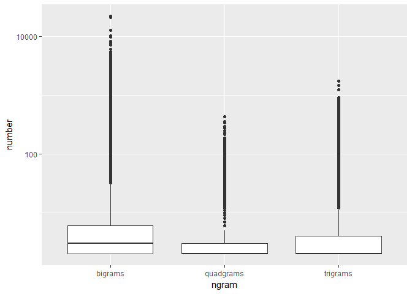

Task 04A: Fast Ngram Files
================
Mark Blackmore
2017-11-10

Load the Data
-------------

English Repository Files

``` r
blogs_file   <- "./data/final/en_US/en_US.blogs.txt"
news_file    <- "./data/final/en_US/en_US.news.txt"
twitter_file <- "./data/final/en_US/en_US.twitter.txt"  
```

Read the data files

``` r
blogs   <- readLines(blogs_file, skipNul = TRUE)
news    <- readLines(news_file,  skipNul = TRUE)
twitter <- readLines(twitter_file, skipNul = TRUE)
```

Read the data files into dataframes

``` r
blogs   <- data_frame(text = blogs)
news    <- data_frame(text = news)
twitter <- data_frame(text = twitter)
```

Sample the data
---------------

``` r
set.seed(1001)
sample_pct <- 0.05

blogs_sample <- blogs %>%
  sample_n(., nrow(blogs)*sample_pct)
news_sample <- news %>%
  sample_n(., nrow(news)*sample_pct)
twitter_sample <- twitter %>%
  sample_n(., nrow(twitter)*sample_pct)
```

Create tidy repository

``` r
repo_sample <- bind_rows(mutate(blogs_sample, source = "blogs"),
                         mutate(news_sample,  source = "news"),
                         mutate(twitter_sample, source = "twitter")) 
repo_sample$source <- as.factor(repo_sample$source)
```

Clean the data
--------------

Create filters: stopwords, profanity, non-alphanumeric's, url's, repeated letters(+3x)

``` r
data("stop_words")
swear_words <- read_delim("./data/final/en_US/en_US.swearWords.csv", delim = "\n", col_names = FALSE)
```

    ## Parsed with column specification:
    ## cols(
    ##   X1 = col_character()
    ## )

``` r
swear_words <- unnest_tokens(swear_words, word, X1)
replace_reg <- "[^[:alpha:][:space:]]*"
replace_url <- "http[^[:space:]]*"
replace_aaa <- "\\b(?=\\w*(\\w)\\1)\\w+\\b"  
```

Clean the sample. Cleaning is separted from tidying so `unnest_tokens` function can be used for words, and ngrams.

``` r
clean_sample <-  repo_sample %>%
  mutate(text = str_replace_all(text, replace_reg, "")) %>%
  mutate(text = str_replace_all(text, replace_url, "")) %>%
  mutate(text = str_replace_all(text, replace_aaa, "")) %>% 
  mutate(text = iconv(text, "ASCII//TRANSLIT"))
```

Create all n-grams
------------------

Bigrams

``` r
bigram_repo <- clean_sample  %>%
  unnest_tokens(bigram, text, token = "ngrams", n = 2)
```

Trigrams

``` r
trigram_repo <- clean_sample  %>%
  unnest_tokens(trigram, text, token = "ngrams", n = 3)
```

Quadgrams

``` r
quadgram_repo <- clean_sample  %>%
  unnest_tokens(quadgram, text, token = "ngrams", n = 4)
```

Reduce n-grams files
--------------------

Bigrams

``` r
bigram_cover <- bigram_repo %>%
  count(bigram) %>%  
  arrange(desc(n)) %>%  
  filter(n > 1)
```

Trigrams

``` r
trigram_cover <- trigram_repo %>%
  count(trigram) %>%  
  arrange(desc(n)) %>%  
  filter(n > 1)
```

Quadgrams

``` r
quadgram_cover <- quadgram_repo %>%
  count(quadgram) %>%  
  arrange(desc(n)) %>%  
  filter(n > 1)
```

What does the distribution on ngrams look like?
-----------------------------------------------

``` r
disty = data_frame(ngram = c(rep("bigrams",   nrow(bigram_cover)),
                             rep("trigrams",  nrow(trigram_cover)),
                             rep("quadgrams", nrow(quadgram_cover))), 
                   number = c(bigram_cover$n, trigram_cover$n, quadgram_cover$n))
disty
```

    ## # A tibble: 815,038 x 2
    ##      ngram number
    ##      <chr>  <int>
    ##  1 bigrams  21934
    ##  2 bigrams  20787
    ##  3 bigrams  12556
    ##  4 bigrams  10294
    ##  5 bigrams   9776
    ##  6 bigrams   8238
    ##  7 bigrams   8073
    ##  8 bigrams   7427
    ##  9 bigrams   7119
    ## 10 bigrams   6048
    ## # ... with 815,028 more rows

``` r
disty$ngram <- as.factor(disty$ngram)
ggplot(data = disty, aes(y = number, x = ngram)) + geom_boxplot() + scale_y_log10()
```



Separate words
--------------

``` r
bi_words <- bigram_cover %>%
  separate(bigram, c("word1", "word2"), sep = " ")
bi_words
```

    ## # A tibble: 334,906 x 3
    ##    word1 word2     n
    ##  * <chr> <chr> <int>
    ##  1    of   the 21934
    ##  2    in   the 20787
    ##  3    to   the 12556
    ##  4   for   the 10294
    ##  5    on   the  9776
    ##  6     c     e  8238
    ##  7    to    be  8073
    ##  8    at   the  7427
    ##  9   and   the  7119
    ## 10    in     a  6048
    ## # ... with 334,896 more rows

``` r
tri_words <- trigram_cover %>%
  separate(trigram, c("word1", "word2", "word3"), sep = " ")
tri_words
```

    ## # A tibble: 343,851 x 4
    ##     word1 word2 word3     n
    ##  *  <chr> <chr> <chr> <int>
    ##  1    one    of   the  1734
    ##  2      a   lot    of  1471
    ##  3 thanks   for   the  1247
    ##  4     to    be     a   907
    ##  5  going    to    be   855
    ##  6    the    of   the   841
    ##  7    the   end    of   782
    ##  8      i  want    to   776
    ##  9    out    of   the   742
    ## 10     it   was     a   739
    ## # ... with 343,841 more rows

``` r
quad_words <- quadgram_cover %>%
  separate(quadgram, c("word1", "word2", "word3", "word4"), sep = " ")
quad_words
```

    ## # A tibble: 136,281 x 5
    ##     word1 word2 word3 word4     n
    ##  *  <chr> <chr> <chr> <chr> <int>
    ##  1    the   end    of   the   434
    ##  2     at   the   end    of   356
    ##  3    the  rest    of   the   339
    ##  4    for   the first  time   295
    ##  5     at   the  same  time   272
    ##  6     is   one    of   the   248
    ##  7     is going    to    be   224
    ##  8    one    of   the  most   216
    ##  9   when    it comes    to   184
    ## 10 thanks   for   the    rt   182
    ## # ... with 136,271 more rows

Save separated words for prediction

``` r
# saveRDS(bi_words, "./clean_repos/bi_words_fast.rds")
# saveRDS(tri_words, "./clean_repos/tri_words_fast.rds")
# saveRDS(quad_words, "./clean_repos/quad_words_fast.rds")
```

Clear workspace, time load

``` r
# rm(list= ls())

go <- Sys.time()
library(tidyverse)
library(stringr)
bi_words <- readRDS("./clean_repos/bi_words_fast.rds")
tri_words  <- readRDS("./clean_repos/tri_words_fast.rds")
quad_words <- readRDS("./clean_repos/quad_words_fast.rds")

stop <- Sys.time()
(how_long <- stop - go)
```

    ## Time difference of 3.962325 secs

end
