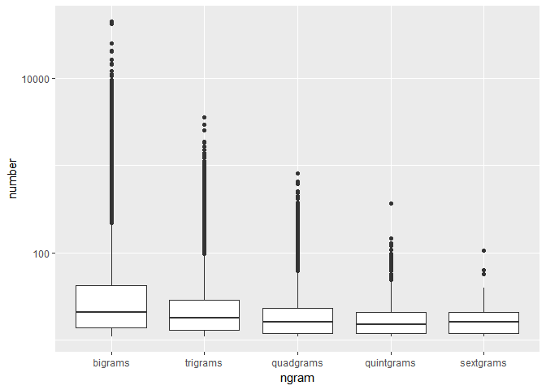
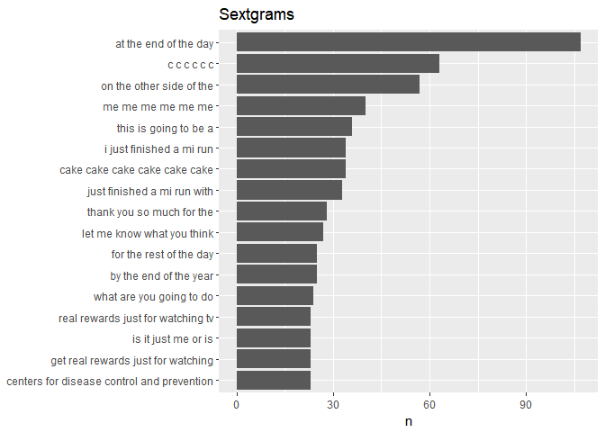
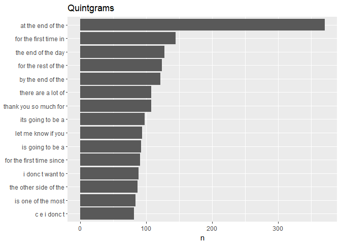

Task 04A: Fast Ngram Files
================
Mark Blackmore
2017-11-19

Load the Data
-------------

English Repository Files

``` r
blogs_file   <- "./data/final/en_US/en_US.blogs.txt"
news_file    <- "./data/final/en_US/en_US.news.txt"
twitter_file <- "./data/final/en_US/en_US.twitter.txt"  
```

Read the data files

``` r
blogs   <- readLines(blogs_file, skipNul = TRUE)
news    <- readLines(news_file,  skipNul = TRUE)
twitter <- readLines(twitter_file, skipNul = TRUE)
```

Read the data files into dataframes

``` r
blogs   <- data_frame(text = blogs)
news    <- data_frame(text = news)
twitter <- data_frame(text = twitter)
```

Sample the data
---------------

``` r
set.seed(1001)
sample_pct <- 0.10

blogs_sample <- blogs %>%
  sample_n(., nrow(blogs)*sample_pct)
news_sample <- news %>%
  sample_n(., nrow(news)*sample_pct)
twitter_sample <- twitter %>%
  sample_n(., nrow(twitter)*sample_pct)
```

Create tidy repository

``` r
repo_sample <- bind_rows(mutate(blogs_sample, source = "blogs"),
                         mutate(news_sample,  source = "news"),
                         mutate(twitter_sample, source = "twitter")) 
repo_sample$source <- as.factor(repo_sample$source)
```

Clean up

``` r
rm(list = c("blogs", "blogs_file", "blogs_sample","news", "news_file",     
            "news_sample", "sample_pct", "twitter","twitter_file", 
            "twitter_sample"))
```

Clean the data
--------------

Create filters: non-alphanumeric's, url's, repeated letters(+3x)

``` r
replace_reg <- "[^[:alpha:][:space:]]*"
replace_url <- "http[^[:space:]]*"
replace_aaa <- "\\b(?=\\w*(\\w)\\1)\\w+\\b"  
```

Clean the sample. Cleaning is separted from tidying so `unnest_tokens` function can be used for words, and ngrams.

``` r
clean_sample <-  repo_sample %>%
  mutate(text = str_replace_all(text, replace_reg, "")) %>%
  mutate(text = str_replace_all(text, replace_url, "")) %>%
  mutate(text = str_replace_all(text, replace_aaa, "")) %>% 
  mutate(text = iconv(text, "ASCII//TRANSLIT"))

rm(list = c("repo_sample"))
```

Create all n-grams
------------------

Bigrams

``` r
bigram_repo <- clean_sample  %>%
  unnest_tokens(bigram, text, token = "ngrams", n = 2)
```

Trigrams

``` r
trigram_repo <- clean_sample  %>%
  unnest_tokens(trigram, text, token = "ngrams", n = 3)
```

Quadgrams

``` r
quadgram_repo <- clean_sample  %>%
  unnest_tokens(quadgram, text, token = "ngrams", n = 4)
```

Reduce n-grams files
--------------------

Bigrams

``` r
bigram_cover <- bigram_repo %>%
  count(bigram) %>%  
  filter(n > 10) %>%
  arrange(desc(n))  
rm(list = c("bigram_repo"))
```

Trigrams

``` r
trigram_cover <- trigram_repo %>%
  count(trigram) %>%  
  filter(n > 10) %>%
  arrange(desc(n))  
rm(list = c("trigram_repo"))
```

Quadgrams

``` r
quadgram_cover <- quadgram_repo %>%
  count(quadgram) %>%  
  filter(n > 10) %>%
  arrange(desc(n))  
rm(list = c("quadgram_repo"))
```

What does the distribution on ngrams look like?
-----------------------------------------------

``` r
disty <- data_frame(ngram = c(rep("bigrams",   nrow(bigram_cover)),
                             rep("trigrams",  nrow(trigram_cover)),
                             rep("quadgrams", nrow(quadgram_cover))),
                   number = c(bigram_cover$n, trigram_cover$n, quadgram_cover$n))
disty
```

    ## # A tibble: 148,719 x 2
    ##      ngram number
    ##      <chr>  <int>
    ##  1 bigrams  44296
    ##  2 bigrams  41480
    ##  3 bigrams  25015
    ##  4 bigrams  20646
    ##  5 bigrams  19953
    ##  6 bigrams  16338
    ##  7 bigrams  16290
    ##  8 bigrams  14462
    ##  9 bigrams  14357
    ## 10 bigrams  12060
    ## # ... with 148,709 more rows

``` r
disty$ngram <- as.factor(disty$ngram)
ggplot(data = disty, aes(y = number, x = ngram)) + geom_boxplot() + scale_y_log10()
```



``` r
ggsave("./ngram_match/www/ngrams.png")
```

    ## Saving 7 x 5 in image

``` r
quadgram_cover %>%
  top_n(20, n) %>%
  mutate(quadgram = reorder(quadgram, n)) %>%
  ggplot(aes(quadgram, n)) +
  geom_col() +
  xlab(NULL) +
  coord_flip()
```



``` r
ggsave("./ngram_match/www/quadgrams.png")
```

    ## Saving 7 x 5 in image

``` r
trigram_cover %>%
  top_n(20, n) %>%
  mutate(trigram = reorder(trigram, n)) %>%
  ggplot(aes(trigram, n)) +
  geom_col() +
  xlab(NULL) +
  coord_flip()
```



``` r
ggsave("./ngram_match/www/trigrams.png")
```

    ## Saving 7 x 5 in image

``` r
bigram_cover %>%
  top_n(20, n) %>%
  mutate(bigram = reorder(bigram, n)) %>%
  ggplot(aes(bigram, n)) +
  geom_col() +
  xlab(NULL) +
  coord_flip()
```


``` r
ggsave("./ngram_match/www/bigrams.png")
```

    ## Saving 7 x 5 in image

Separate words
--------------

``` r
bi_words <- bigram_cover %>%
  separate(bigram, c("word1", "word2"), sep = " ")
bi_words
```

    ## # A tibble: 87,239 x 3
    ##    word1 word2     n
    ##  * <chr> <chr> <int>
    ##  1    of   the 44296
    ##  2    in   the 41480
    ##  3    to   the 25015
    ##  4   for   the 20646
    ##  5    on   the 19953
    ##  6     c     e 16338
    ##  7    to    be 16290
    ##  8    at   the 14462
    ##  9   and   the 14357
    ## 10    in     a 12060
    ## # ... with 87,229 more rows

``` r
tri_words <- trigram_cover %>%
  separate(trigram, c("word1", "word2", "word3"), sep = " ")
tri_words
```

    ## # A tibble: 51,539 x 4
    ##     word1 word2 word3     n
    ##  *  <chr> <chr> <chr> <int>
    ##  1    one    of   the  3543
    ##  2      a   lot    of  2929
    ##  3 thanks   for   the  2501
    ##  4     to    be     a  1888
    ##  5  going    to    be  1825
    ##  6    the    of   the  1814
    ##  7      i  want    to  1629
    ##  8    the   end    of  1522
    ##  9    out    of   the  1520
    ## 10     it   was     a  1511
    ## # ... with 51,529 more rows

``` r
quad_words <- quadgram_cover %>%
  separate(quadgram, c("word1", "word2", "word3", "word4"), sep = " ")
quad_words
```

    ## # A tibble: 9,941 x 5
    ##    word1 word2 word3 word4     n
    ##  * <chr> <chr> <chr> <chr> <int>
    ##  1   the   end    of   the   806
    ##  2    at   the   end    of   656
    ##  3   the  rest    of   the   651
    ##  4   for   the first  time   613
    ##  5    at   the  same  time   506
    ##  6    is going    to    be   482
    ##  7    is   one    of   the   446
    ##  8   one    of   the  most   435
    ##  9  when    it comes    to   419
    ## 10 going    to    be     a   376
    ## # ... with 9,931 more rows

Save data for the Shiny App

``` r
saveRDS(bi_words, "./ngram_match/app_data/bi_words_fast.rds")
saveRDS(tri_words, "./ngram_match/app_data/tri_words_fast.rds")
saveRDS(quad_words,"./ngram_match/app_data/quad_words_fast.rds")
```

end
