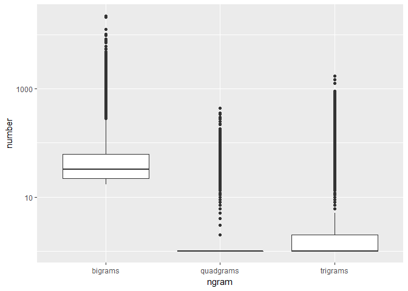

Task 04: Prediction Model
================
Mark Blackmore
2017-11-10

Load the Data
-------------

English Repository Files

``` r
blogs_file   <- "./data/final/en_US/en_US.blogs.txt"
news_file    <- "./data/final/en_US/en_US.news.txt"
twitter_file <- "./data/final/en_US/en_US.twitter.txt"  
```

Read the data files

``` r
blogs   <- readLines(blogs_file, skipNul = TRUE)
news    <- readLines(news_file,  skipNul = TRUE)
twitter <- readLines(twitter_file, skipNul = TRUE)
```

Read the data files into dataframes

``` r
blogs   <- data_frame(text = blogs)
news    <- data_frame(text = news)
twitter <- data_frame(text = twitter)
```

Sample the data
---------------

``` r
set.seed(1001)
sample_pct <- 0.05

blogs_sample <- blogs %>%
  sample_n(., nrow(blogs)*sample_pct)
news_sample <- news %>%
  sample_n(., nrow(news)*sample_pct)
twitter_sample <- twitter %>%
  sample_n(., nrow(twitter)*sample_pct)
```

Create tidy repository

``` r
repo_sample <- bind_rows(mutate(blogs_sample, source = "blogs"),
                         mutate(news_sample,  source = "news"),
                         mutate(twitter_sample, source = "twitter")) 
repo_sample$source <- as.factor(repo_sample$source)
```

Clean the data
--------------

Create filters: stopwords, profanity, non-alphanumeric's, url's, repeated letters(+3x)

``` r
data("stop_words")
swear_words <- read_delim("./data/final/en_US/en_US.swearWords.csv", delim = "\n", col_names = FALSE)
```

    ## Parsed with column specification:
    ## cols(
    ##   X1 = col_character()
    ## )

``` r
swear_words <- unnest_tokens(swear_words, word, X1)
replace_reg <- "[^[:alpha:][:space:]]*"
replace_url <- "http[^[:space:]]*"
replace_aaa <- "\\b(?=\\w*(\\w)\\1)\\w+\\b"  
```

Clean the sample. Cleaning is separted from tidying so `unnest_tokens` function can be used for words, and ngrams.

``` r
clean_sample <-  repo_sample %>%
  mutate(text = str_replace_all(text, replace_reg, "")) %>%
  mutate(text = str_replace_all(text, replace_url, "")) %>%
  mutate(text = str_replace_all(text, replace_aaa, "")) %>% 
  mutate(text = iconv(text, "ASCII//TRANSLIT"))
```

Create all n-grams
------------------

Unigrams

``` r
tidy_repo <- clean_sample %>%
  unnest_tokens(word, text) %>%
  anti_join(swear_words) %>%
  anti_join(stop_words)
```

    ## Joining, by = "word"
    ## Joining, by = "word"

Bigrams

``` r
bigram_repo <- clean_sample  %>%
  unnest_tokens(bigram, text, token = "ngrams", n = 2)
```

Trigrams

``` r
trigram_repo <- clean_sample  %>%
  unnest_tokens(trigram, text, token = "ngrams", n = 3)
```

Quadgrams

``` r
quadgram_repo <- clean_sample  %>%
  unnest_tokens(quadgram, text, token = "ngrams", n = 4)
```

Reduce n-grams to top 50% of CDF
--------------------------------

Unigram upper half

``` r
cover_50 <- tidy_repo %>%
  count(word) %>%  
  mutate(proportion = n / sum(n)) %>%
  arrange(desc(proportion)) %>%  
  mutate(coverage = cumsum(proportion)) %>%
  filter(coverage <= 0.5)
```

Bigram upper half

``` r
bigram_cover_50 <- bigram_repo %>%
  count(bigram) %>%  
  mutate(proportion = n / sum(n)) %>%
  arrange(desc(proportion)) %>%  
  mutate(coverage = cumsum(proportion)) %>%
  filter(coverage <= 0.5)
```

Trigram upper half

``` r
trigram_cover_50 <- trigram_repo %>%
  count(trigram) %>%  
  mutate(proportion = n / sum(n)) %>%
  arrange(desc(proportion)) %>%  
  mutate(coverage = cumsum(proportion)) %>%
  filter(coverage <= 0.5)
```

Quadgram upper half

``` r
quadgram_cover_50 <- quadgram_repo %>%
  count(quadgram) %>%  
  mutate(proportion = n / sum(n)) %>%
  arrange(desc(proportion)) %>%  
  mutate(coverage = cumsum(proportion)) %>%
  filter(coverage <= 0.5)
```

Separate words
--------------

``` r
bi_words <- bigram_cover_50 %>%
  separate(bigram, c("word1", "word2"), sep = " ")
bi_words
```

    ## # A tibble: 28,104 x 5
    ##    word1 word2     n  proportion    coverage
    ##  * <chr> <chr> <int>       <dbl>       <dbl>
    ##  1    of   the 21934 0.004874968 0.004874968
    ##  2    in   the 20787 0.004620040 0.009495007
    ##  3    to   the 12556 0.002790649 0.012285656
    ##  4   for   the 10294 0.002287905 0.014573561
    ##  5    on   the  9776 0.002172777 0.016746338
    ##  6     c     e  8238 0.001830947 0.018577285
    ##  7    to    be  8073 0.001794274 0.020371559
    ##  8    at   the  7427 0.001650697 0.022022256
    ##  9   and   the  7119 0.001582242 0.023604498
    ## 10    in     a  6048 0.001344206 0.024948703
    ## # ... with 28,094 more rows

``` r
tri_words <- trigram_cover_50 %>%
  separate(trigram, c("word1", "word2", "word3"), sep = " ")
tri_words
```

    ## # A tibble: 1,023,301 x 6
    ##     word1 word2 word3     n   proportion     coverage
    ##  *  <chr> <chr> <chr> <int>        <dbl>        <dbl>
    ##  1    one    of   the  1734 0.0003853925 0.0003853925
    ##  2      a   lot    of  1471 0.0003269391 0.0007123316
    ##  3 thanks   for   the  1247 0.0002771537 0.0009894853
    ##  4     to    be     a   907 0.0002015865 0.0011910718
    ##  5  going    to    be   855 0.0001900292 0.0013811010
    ##  6    the    of   the   841 0.0001869176 0.0015680186
    ##  7    the   end    of   782 0.0001738045 0.0017418230
    ##  8      i  want    to   776 0.0001724709 0.0019142940
    ##  9    out    of   the   742 0.0001649142 0.0020792082
    ## 10     it   was     a   739 0.0001642474 0.0022434556
    ## # ... with 1,023,291 more rows

``` r
quad_words <- quadgram_cover_50 %>%
  separate(quadgram, c("word1", "word2", "word3", "word4"), sep = " ")
quad_words
```

    ## # A tibble: 1,961,891 x 7
    ##     word1 word2 word3 word4     n   proportion     coverage
    ##  *  <chr> <chr> <chr> <chr> <int>        <dbl>        <dbl>
    ##  1    the   end    of   the   434 9.645932e-05 9.645932e-05
    ##  2     at   the   end    of   356 7.912331e-05 1.755826e-04
    ##  3    the  rest    of   the   339 7.534495e-05 2.509276e-04
    ##  4    for   the first  time   295 6.556567e-05 3.164933e-04
    ##  5     at   the  same  time   272 6.045377e-05 3.769470e-04
    ##  6     is   one    of   the   248 5.511961e-05 4.320666e-04
    ##  7     is going    to    be   224 4.978546e-05 4.818521e-04
    ##  8    one    of   the  most   216 4.800740e-05 5.298595e-04
    ##  9   when    it comes    to   184 4.089520e-05 5.707547e-04
    ## 10 thanks   for   the    rt   182 4.045068e-05 6.112054e-04
    ## # ... with 1,961,881 more rows

Save separated words for prediction

``` r
saveRDS(bi_words, "./clean_repos/bi_words.rds")
saveRDS(tri_words, "./clean_repos/tri_words.rds")
saveRDS(quad_words, "./clean_repos/quad_words.rds")
```

Clear workspace, time load
--------------------------

``` r
# rm(list= ls())

go <- Sys.time()
library(tidyverse)
library(stringr)
bi_words <- readRDS("./clean_repos/bi_words.rds")
tri_words  <- readRDS("./clean_repos/tri_words.rds")
quad_words <- readRDS("./clean_repos/quad_words.rds")

stop <- Sys.time()
(how_long <- stop - go)
```

    ## Time difference of 6.940233 secs

What does the distribution on ngrams look like?
-----------------------------------------------

Suggests there may be a better way. See `04A_Task_Script.R`

``` r
disty = data_frame(ngram = c(rep("bigrams",   nrow(bigram_cover_50)),
                             rep("trigrams",  nrow(trigram_cover_50)),
                             rep("quadgrams", nrow(quadgram_cover_50))), 
                   number = c(bigram_cover_50$n, trigram_cover_50$n, quadgram_cover_50$n))
disty
```

    ## # A tibble: 3,013,296 x 2
    ##      ngram number
    ##      <chr>  <int>
    ##  1 bigrams  21934
    ##  2 bigrams  20787
    ##  3 bigrams  12556
    ##  4 bigrams  10294
    ##  5 bigrams   9776
    ##  6 bigrams   8238
    ##  7 bigrams   8073
    ##  8 bigrams   7427
    ##  9 bigrams   7119
    ## 10 bigrams   6048
    ## # ... with 3,013,286 more rows

``` r
disty$ngram <- as.factor(disty$ngram)

ggplot(data = disty, aes(y = number, x = ngram)) + geom_boxplot() + scale_y_log10()
```



Start ngram matching script
---------------------------

User Input

``` r
input <- data_frame(text = c("in case of"))
```

Process input

``` r
input_count <- str_count(input, boundary("word"))
input_words <- unlist(str_split(input, boundary("word")))
```

Logic to Predict

``` r
if (input_count == 1) {
  filter(bi_words, 
         word1==input_words[1]) %>% 
    top_n(1, n) %>%
    filter(row_number() == 1L) %>%
    select(num_range("word", input_count+1)) %>%
    as.character()
} else {
    
  if (input_count == 2){
    filter(tri_words, 
           word1==input_words[1], 
           word2==input_words[2])  %>% 
      top_n(1, n) %>%
      filter(row_number() == 1L) %>%
      select(num_range("word", input_count+1)) %>%
      as.character()
    
  } else {    
  filter(quad_words, 
        word1==input_words[input_count-2], 
        word2==input_words[input_count-1], 
        word3==input_words[input_count])  %>% 
    top_n(1, n) %>%
    filter(row_number() == 1L) %>%
    select(num_range("word", input_count+1)) %>%
    as.character()
  }
}
```

    ## [1] "emergency"

Program output end
