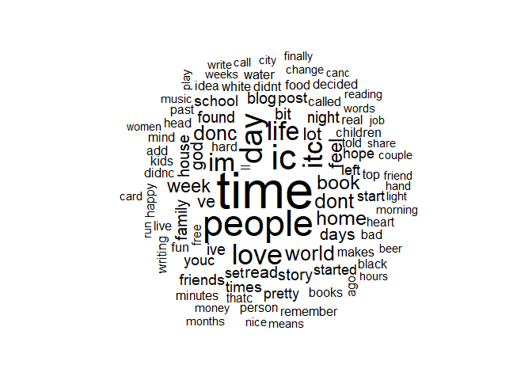
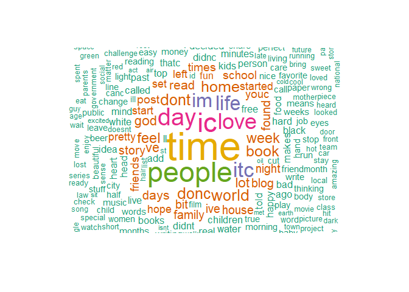

Task 2: Exploratory Data Analysis
================
Mark Blackmore
2017-10-17

``` r
library(tidytext)
library(tidyverse)
```

    ## Loading tidyverse: ggplot2
    ## Loading tidyverse: tibble
    ## Loading tidyverse: tidyr
    ## Loading tidyverse: readr
    ## Loading tidyverse: purrr
    ## Loading tidyverse: dplyr

    ## Conflicts with tidy packages ----------------------------------------------

    ## filter(): dplyr, stats
    ## lag():    dplyr, stats

``` r
library(stringr)
library(knitr)
library(wordcloud)
```

    ## Loading required package: RColorBrewer

``` r
data("stop_words")
```

English Repository Files

``` r
blogs_file   <- "./data/final/en_US/en_US.blogs.txt"
news_file    <- "./data/final/en_US/en_US.news.txt"
twitter_file <- "./data/final/en_US/en_US.twitter.txt"  
```

Read the data files

``` r
blogs   <- readLines(blogs_file,   skipNul = TRUE)
news    <- readLines(news_file,    skipNul = TRUE)
```

    ## Warning in readLines(news_file, skipNul = TRUE): incomplete final line
    ## found on './data/final/en_US/en_US.news.txt'

``` r
twitter <- readLines(twitter_file, skipNul = TRUE) 

profanity <- read.table("./data/final/en_US/profanity.txt", header = FALSE, sep ="\n")
profanity <- data.frame(text = profanity)
replace_reg <- "[^[:alpha:][:space:]]*"
replace_url <- "http[^[:space:]]*"


tidy_blogs <- data_frame(text = blogs) %>%
  mutate(text = str_replace_all(text, replace_reg, "")) %>%
  mutate(text = str_replace_all(text, replace_url, "")) %>%
  mutate(text = iconv(text, "ASCII//TRANSLIT")) %>%
  unnest_tokens(word, text) %>%
  anti_join(stop_words)
```

    ## Joining, by = "word"

``` r
tidy_news <- data_frame(text = news) %>%
  mutate(text = str_replace_all(text, replace_reg, "")) %>%
  mutate(text = str_replace_all(text, replace_url, "")) %>%
  mutate(text = iconv(text, "ASCII//TRANSLIT")) %>%
  unnest_tokens(word, text) %>%
  anti_join(stop_words)
```

    ## Joining, by = "word"

``` r
tidy_twitter <- data_frame(text = twitter) %>%
  mutate(text = str_replace_all(text, replace_reg, "")) %>%
  mutate(text = str_replace_all(text, replace_url, "")) %>%
  mutate(text = iconv(text, "ASCII//TRANSLIT")) %>%
  unnest_tokens(word, text) %>%
  anti_join(stop_words) 
```

    ## Joining, by = "word"

``` r
tidy_repo <- bind_rows(mutate(tidy_blogs, source = "blogs"),
                       mutate(tidy_news,  source = "news"),
                       mutate(tidy_twitter, source = "twitter")) 

freq <- tidy_repo %>%
  mutate(word = str_extract(word, "[a-z']+")) %>%
  count(source, word) %>%
  group_by(source) %>%
  mutate(proportion = n / sum(n)) %>%
  #select(-n) %>%
  spread(source, proportion) %>%
  gather(source, proportion, `blogs`:`twitter`) %>%
  arrange(desc(proportion), desc(n))

kable(head(freq, 10))
```

| word   |       n| source  |  proportion|
|:-------|-------:|:--------|-----------:|
| im     |  157949| twitter |   0.0127218|
| love   |  105476| twitter |   0.0084955|
| day    |   89821| twitter |   0.0072345|
| dont   |   88732| twitter |   0.0071468|
| rt     |   88203| twitter |   0.0071042|
| time   |   87530| blogs   |   0.0061234|
| time   |   74547| twitter |   0.0060043|
| lol    |   66397| twitter |   0.0053479|
| people |   51422| twitter |   0.0041417|
| people |   58843| blogs   |   0.0041165|

``` r
freq_low <- freq %>% 
  arrange(proportion, n)

kable(head(freq_low, 10)) 
```

| word                                                                  |    n| source |  proportion|
|:----------------------------------------------------------------------|----:|:-------|-----------:|
| aaaaa                                                                 |    1| blogs  |       1e-07|
| aaaaaaaaa                                                             |    1| blogs  |       1e-07|
| aaaaaaaaaaaaaaa                                                       |    1| blogs  |       1e-07|
| aaaaaaaaaaaaaaaaa                                                     |    1| blogs  |       1e-07|
| aaaaaaaaaaaaaaaaaaaaaaaarrrrrrrrrrrrrrrrggggggggghhhhhhhhhh           |    1| blogs  |       1e-07|
| aaaaaaaaaaaaaaaaaiiiiiiiiiiiiiiiiiiiiiiiiiiiiiiiiiiiaaaaaaaaaaaaaaeee |    1| blogs  |       1e-07|
| aaaaaaaaaaaaac                                                        |    1| blogs  |       1e-07|
| aaaaaaaaaaaaandflat                                                   |    1| blogs  |       1e-07|
| aaaaaaaaaaaargh                                                       |    1| blogs  |       1e-07|
| aaaaaaaaaahhhhhhhhhhhhhhhhh                                           |    1| blogs  |       1e-07|

``` r
# Word cloud
tidy_blogs %>%
  count(word) %>%
  with(wordcloud(word, n, max.words = 100, random.order = FALSE))
```



``` r
tidy_blogs %>%
  count(word) %>%
  with(wordcloud(word, n, min.freq = 5000, 
                 colors = brewer.pal(6, 'Dark2'), random.order = FALSE) ) 
```

    ## Warning in wordcloud(word, n, min.freq = 5000, colors = brewer.pal(6,
    ## "Dark2"), : husband could not be fit on page. It will not be plotted.

    ## Warning in wordcloud(word, n, min.freq = 5000, colors = brewer.pal(6,
    ## "Dark2"), : happened could not be fit on page. It will not be plotted.

    ## Warning in wordcloud(word, n, min.freq = 5000, colors = brewer.pal(6,
    ## "Dark2"), : recently could not be fit on page. It will not be plotted.

    ## Warning in wordcloud(word, n, min.freq = 5000, colors = brewer.pal(6,
    ## "Dark2"), : john could not be fit on page. It will not be plotted.

    ## Warning in wordcloud(word, n, min.freq = 5000, colors = brewer.pal(6,
    ## "Dark2"), : playing could not be fit on page. It will not be plotted.

    ## Warning in wordcloud(word, n, min.freq = 5000, colors = brewer.pal(6,
    ## "Dark2"), : community could not be fit on page. It will not be plotted.

    ## Warning in wordcloud(word, n, min.freq = 5000, colors = brewer.pal(6,
    ## "Dark2"), : written could not be fit on page. It will not be plotted.

    ## Warning in wordcloud(word, n, min.freq = 5000, colors = brewer.pal(6,
    ## "Dark2"), : personal could not be fit on page. It will not be plotted.

    ## Warning in wordcloud(word, n, min.freq = 5000, colors = brewer.pal(6,
    ## "Dark2"), : street could not be fit on page. It will not be plotted.

    ## Warning in wordcloud(word, n, min.freq = 5000, colors = brewer.pal(6,
    ## "Dark2"), : forward could not be fit on page. It will not be plotted.

    ## Warning in wordcloud(word, n, min.freq = 5000, colors = brewer.pal(6,
    ## "Dark2"), : happen could not be fit on page. It will not be plotted.

    ## Warning in wordcloud(word, n, min.freq = 5000, colors = brewer.pal(6,
    ## "Dark2"), : media could not be fit on page. It will not be plotted.

    ## Warning in wordcloud(word, n, min.freq = 5000, colors = brewer.pal(6,
    ## "Dark2"), : hour could not be fit on page. It will not be plotted.

    ## Warning in wordcloud(word, n, min.freq = 5000, colors = brewer.pal(6,
    ## "Dark2"), : wasnt could not be fit on page. It will not be plotted.

    ## Warning in wordcloud(word, n, min.freq = 5000, colors = brewer.pal(6,
    ## "Dark2"), : color could not be fit on page. It will not be plotted.

    ## Warning in wordcloud(word, n, min.freq = 5000, colors = brewer.pal(6,
    ## "Dark2"), : online could not be fit on page. It will not be plotted.

    ## Warning in wordcloud(word, n, min.freq = 5000, colors = brewer.pal(6,
    ## "Dark2"), : design could not be fit on page. It will not be plotted.

    ## Warning in wordcloud(word, n, min.freq = 5000, colors = brewer.pal(6,
    ## "Dark2"), : wasnc could not be fit on page. It will not be plotted.

    ## Warning in wordcloud(word, n, min.freq = 5000, colors = brewer.pal(6,
    ## "Dark2"), : level could not be fit on page. It will not be plotted.

    ## Warning in wordcloud(word, n, min.freq = 5000, colors = brewer.pal(6,
    ## "Dark2"), : students could not be fit on page. It will not be plotted.

    ## Warning in wordcloud(word, n, min.freq = 5000, colors = brewer.pal(6,
    ## "Dark2"), : characters could not be fit on page. It will not be plotted.

    ## Warning in wordcloud(word, n, min.freq = 5000, colors = brewer.pal(6,
    ## "Dark2"), : chance could not be fit on page. It will not be plotted.

    ## Warning in wordcloud(word, n, min.freq = 5000, colors = brewer.pal(6,
    ## "Dark2"), : due could not be fit on page. It will not be plotted.

    ## Warning in wordcloud(word, n, min.freq = 5000, colors = brewer.pal(6,
    ## "Dark2"), : based could not be fit on page. It will not be plotted.

    ## Warning in wordcloud(word, n, min.freq = 5000, colors = brewer.pal(6,
    ## "Dark2"), : cover could not be fit on page. It will not be plotted.

    ## Warning in wordcloud(word, n, min.freq = 5000, colors = brewer.pal(6,
    ## "Dark2"), : lord could not be fit on page. It will not be plotted.

    ## Warning in wordcloud(word, n, min.freq = 5000, colors = brewer.pal(6,
    ## "Dark2"), : south could not be fit on page. It will not be plotted.

    ## Warning in wordcloud(word, n, min.freq = 5000, colors = brewer.pal(6,
    ## "Dark2"), : isnc could not be fit on page. It will not be plotted.

    ## Warning in wordcloud(word, n, min.freq = 5000, colors = brewer.pal(6,
    ## "Dark2"), : health could not be fit on page. It will not be plotted.

    ## Warning in wordcloud(word, n, min.freq = 5000, colors = brewer.pal(6,
    ## "Dark2"), : entire could not be fit on page. It will not be plotted.

    ## Warning in wordcloud(word, n, min.freq = 5000, colors = brewer.pal(6,
    ## "Dark2"), : blue could not be fit on page. It will not be plotted.

    ## Warning in wordcloud(word, n, min.freq = 5000, colors = brewer.pal(6,
    ## "Dark2"), : yesterday could not be fit on page. It will not be plotted.

    ## Warning in wordcloud(word, n, min.freq = 5000, colors = brewer.pal(6,
    ## "Dark2"), : road could not be fit on page. It will not be plotted.

    ## Warning in wordcloud(word, n, min.freq = 5000, colors = brewer.pal(6,
    ## "Dark2"), : watching could not be fit on page. It will not be plotted.

    ## Warning in wordcloud(word, n, min.freq = 5000, colors = brewer.pal(6,
    ## "Dark2"), : sound could not be fit on page. It will not be plotted.

    ## Warning in wordcloud(word, n, min.freq = 5000, colors = brewer.pal(6,
    ## "Dark2"), : strong could not be fit on page. It will not be plotted.

    ## Warning in wordcloud(word, n, min.freq = 5000, colors = brewer.pal(6,
    ## "Dark2"), : giving could not be fit on page. It will not be plotted.

    ## Warning in wordcloud(word, n, min.freq = 5000, colors = brewer.pal(6,
    ## "Dark2"), : brought could not be fit on page. It will not be plotted.

    ## Warning in wordcloud(word, n, min.freq = 5000, colors = brewer.pal(6,
    ## "Dark2"), : office could not be fit on page. It will not be plotted.

    ## Warning in wordcloud(word, n, min.freq = 5000, colors = brewer.pal(6,
    ## "Dark2"), : dinner could not be fit on page. It will not be plotted.

    ## Warning in wordcloud(word, n, min.freq = 5000, colors = brewer.pal(6,
    ## "Dark2"), : questions could not be fit on page. It will not be plotted.

    ## Warning in wordcloud(word, n, min.freq = 5000, colors = brewer.pal(6,
    ## "Dark2"), : lovely could not be fit on page. It will not be plotted.

    ## Warning in wordcloud(word, n, min.freq = 5000, colors = brewer.pal(6,
    ## "Dark2"), : continue could not be fit on page. It will not be plotted.

    ## Warning in wordcloud(word, n, min.freq = 5000, colors = brewer.pal(6,
    ## "Dark2"), : pm could not be fit on page. It will not be plotted.

    ## Warning in wordcloud(word, n, min.freq = 5000, colors = brewer.pal(6,
    ## "Dark2"), : middle could not be fit on page. It will not be plotted.

    ## Warning in wordcloud(word, n, min.freq = 5000, colors = brewer.pal(6,
    ## "Dark2"), : note could not be fit on page. It will not be plotted.

    ## Warning in wordcloud(word, n, min.freq = 5000, colors = brewer.pal(6,
    ## "Dark2"), : phone could not be fit on page. It will not be plotted.

    ## Warning in wordcloud(word, n, min.freq = 5000, colors = brewer.pal(6,
    ## "Dark2"), : recipe could not be fit on page. It will not be plotted.

    ## Warning in wordcloud(word, n, min.freq = 5000, colors = brewer.pal(6,
    ## "Dark2"), : spend could not be fit on page. It will not be plotted.

    ## Warning in wordcloud(word, n, min.freq = 5000, colors = brewer.pal(6,
    ## "Dark2"), : style could not be fit on page. It will not be plotted.

    ## Warning in wordcloud(word, n, min.freq = 5000, colors = brewer.pal(6,
    ## "Dark2"), : image could not be fit on page. It will not be plotted.

    ## Warning in wordcloud(word, n, min.freq = 5000, colors = brewer.pal(6,
    ## "Dark2"), : table could not be fit on page. It will not be plotted.

    ## Warning in wordcloud(word, n, min.freq = 5000, colors = brewer.pal(6,
    ## "Dark2"), : ideas could not be fit on page. It will not be plotted.

    ## Warning in wordcloud(word, n, min.freq = 5000, colors = brewer.pal(6,
    ## "Dark2"), : market could not be fit on page. It will not be plotted.

    ## Warning in wordcloud(word, n, min.freq = 5000, colors = brewer.pal(6,
    ## "Dark2"), : meet could not be fit on page. It will not be plotted.

    ## Warning in wordcloud(word, n, min.freq = 5000, colors = brewer.pal(6,
    ## "Dark2"), : break could not be fit on page. It will not be plotted.

    ## Warning in wordcloud(word, n, min.freq = 5000, colors = brewer.pal(6,
    ## "Dark2"), : waiting could not be fit on page. It will not be plotted.

    ## Warning in wordcloud(word, n, min.freq = 5000, colors = brewer.pal(6,
    ## "Dark2"), : answer could not be fit on page. It will not be plotted.

    ## Warning in wordcloud(word, n, min.freq = 5000, colors = brewer.pal(6,
    ## "Dark2"), : event could not be fit on page. It will not be plotted.

    ## Warning in wordcloud(word, n, min.freq = 5000, colors = brewer.pal(6,
    ## "Dark2"), : follow could not be fit on page. It will not be plotted.

    ## Warning in wordcloud(word, n, min.freq = 5000, colors = brewer.pal(6,
    ## "Dark2"), : service could not be fit on page. It will not be plotted.

    ## Warning in wordcloud(word, n, min.freq = 5000, colors = brewer.pal(6,
    ## "Dark2"), : quickly could not be fit on page. It will not be plotted.

    ## Warning in wordcloud(word, n, min.freq = 5000, colors = brewer.pal(6,
    ## "Dark2"), : main could not be fit on page. It will not be plotted.

    ## Warning in wordcloud(word, n, min.freq = 5000, colors = brewer.pal(6,
    ## "Dark2"), : photos could not be fit on page. It will not be plotted.

    ## Warning in wordcloud(word, n, min.freq = 5000, colors = brewer.pal(6,
    ## "Dark2"), : created could not be fit on page. It will not be plotted.

    ## Warning in wordcloud(word, n, min.freq = 5000, colors = brewer.pal(6,
    ## "Dark2"), : truth could not be fit on page. It will not be plotted.

    ## Warning in wordcloud(word, n, min.freq = 5000, colors = brewer.pal(6,
    ## "Dark2"), : difficult could not be fit on page. It will not be plotted.

    ## Warning in wordcloud(word, n, min.freq = 5000, colors = brewer.pal(6,
    ## "Dark2"), : cup could not be fit on page. It will not be plotted.

    ## Warning in wordcloud(word, n, min.freq = 5000, colors = brewer.pal(6,
    ## "Dark2"), : fine could not be fit on page. It will not be plotted.

    ## Warning in wordcloud(word, n, min.freq = 5000, colors = brewer.pal(6,
    ## "Dark2"), : friday could not be fit on page. It will not be plotted.

    ## Warning in wordcloud(word, n, min.freq = 5000, colors = brewer.pal(6,
    ## "Dark2"), : pick could not be fit on page. It will not be plotted.

    ## Warning in wordcloud(word, n, min.freq = 5000, colors = brewer.pal(6,
    ## "Dark2"), : bought could not be fit on page. It will not be plotted.

    ## Warning in wordcloud(word, n, min.freq = 5000, colors = brewer.pal(6,
    ## "Dark2"), : issue could not be fit on page. It will not be plotted.

    ## Warning in wordcloud(word, n, min.freq = 5000, colors = brewer.pal(6,
    ## "Dark2"), : photo could not be fit on page. It will not be plotted.

    ## Warning in wordcloud(word, n, min.freq = 5000, colors = brewer.pal(6,
    ## "Dark2"), : birthday could not be fit on page. It will not be plotted.

    ## Warning in wordcloud(word, n, min.freq = 5000, colors = brewer.pal(6,
    ## "Dark2"), : step could not be fit on page. It will not be plotted.

    ## Warning in wordcloud(word, n, min.freq = 5000, colors = brewer.pal(6,
    ## "Dark2"), : view could not be fit on page. It will not be plotted.

    ## Warning in wordcloud(word, n, min.freq = 5000, colors = brewer.pal(6,
    ## "Dark2"), : attention could not be fit on page. It will not be plotted.

    ## Warning in wordcloud(word, n, min.freq = 5000, colors = brewer.pal(6,
    ## "Dark2"), : learned could not be fit on page. It will not be plotted.

    ## Warning in wordcloud(word, n, min.freq = 5000, colors = brewer.pal(6,
    ## "Dark2"), : building could not be fit on page. It will not be plotted.

    ## Warning in wordcloud(word, n, min.freq = 5000, colors = brewer.pal(6,
    ## "Dark2"), : spring could not be fit on page. It will not be plotted.

    ## Warning in wordcloud(word, n, min.freq = 5000, colors = brewer.pal(6,
    ## "Dark2"), : stand could not be fit on page. It will not be plotted.

    ## Warning in wordcloud(word, n, min.freq = 5000, colors = brewer.pal(6,
    ## "Dark2"), : political could not be fit on page. It will not be plotted.

    ## Warning in wordcloud(word, n, min.freq = 5000, colors = brewer.pal(6,
    ## "Dark2"), : video could not be fit on page. It will not be plotted.

    ## Warning in wordcloud(word, n, min.freq = 5000, colors = brewer.pal(6,
    ## "Dark2"), : york could not be fit on page. It will not be plotted.

    ## Warning in wordcloud(word, n, min.freq = 5000, colors = brewer.pal(6,
    ## "Dark2"), : original could not be fit on page. It will not be plotted.

    ## Warning in wordcloud(word, n, min.freq = 5000, colors = brewer.pal(6,
    ## "Dark2"), : voice could not be fit on page. It will not be plotted.

    ## Warning in wordcloud(word, n, min.freq = 5000, colors = brewer.pal(6,
    ## "Dark2"), : complete could not be fit on page. It will not be plotted.

    ## Warning in wordcloud(word, n, min.freq = 5000, colors = brewer.pal(6,
    ## "Dark2"), : hes could not be fit on page. It will not be plotted.

    ## Warning in wordcloud(word, n, min.freq = 5000, colors = brewer.pal(6,
    ## "Dark2"), : sunday could not be fit on page. It will not be plotted.

    ## Warning in wordcloud(word, n, min.freq = 5000, colors = brewer.pal(6,
    ## "Dark2"), : energy could not be fit on page. It will not be plotted.

    ## Warning in wordcloud(word, n, min.freq = 5000, colors = brewer.pal(6,
    ## "Dark2"), : choice could not be fit on page. It will not be plotted.

    ## Warning in wordcloud(word, n, min.freq = 5000, colors = brewer.pal(6,
    ## "Dark2"), : chocolate could not be fit on page. It will not be plotted.


